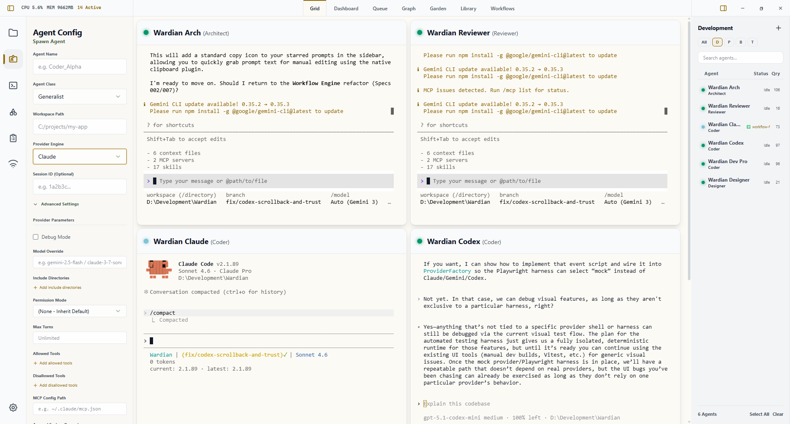

# Wardian

<div align="center">


**Integrated Agent Environment** — A high-performance habitat for spawning, orchestrating, and monitoring multiple autonomous AI agents.

[](https://codecov.io/gh/tangemicioglu/Wardian)
[](https://codecov.io/gh/tangemicioglu/Wardian)

[](public/screenshot.png)

</div>

---

Wardian is a governance layer for AI orchestration. It centralizes PTY management, telemetry, and shared context into a unified Command Center, designed for developers who need to manage multiple long-running agent sessions across multiple projects.

---

## Download

Pre-built binaries for Windows, macOS (Apple Silicon + Intel), and Linux are available from the [Releases page](https://github.com/tangemicioglu/Wardian/releases).

> **Note:** Wardian binaries are currently unsigned. On first launch:
> - **Windows:** SmartScreen will show a warning. Click "More info" → "Run anyway."
> - **macOS:** Gatekeeper will refuse to open the app. Right-click the app and choose "Open," or run `xattr -cr /Applications/Wardian.app` from Terminal.
> - **Linux:** `.AppImage` is portable (`chmod +x` and run); `.deb` installs via `sudo dpkg -i wardian_*.deb`.

---

## Table of Contents

- [Quick Start](#quick-start)
- [Documentation](#documentation)
- [Supported Providers](#supported-providers)
- [Why Wardian?](#why-wardian)
- [Core Features](#core-features)
- [Platform Support](#platform-support)
- [Project Roadmap](#project-roadmap)
- [Tech Stack](#tech-stack)
- [Architecture](#architecture)
- [Development Setup](#development-setup)
- [License](#license)

---

## Quick Start

Ensure you have Rust, Node.js (v18+), and at least one supported provider CLI installed, such as `@google/gemini-cli`, `@anthropic-ai/claude-code`, `@openai/codex`, or `opencode`.

```bash
git clone https://github.com/tangemicioglu/Wardian.git
cd Wardian
npm install
npm run dev
```

---

## Documentation

For complete user and developer docs, start here:

- [Documentation Index](docs/index.md)
- [User Guide Index](docs/guide/index.md)
- [Workflow Reference](docs/workflows/index.md)
- [Developer Index](docs/developer/index.md)

---

## Supported Providers

Wardian abstracts the differences between varied agent runtimes into a unified interface.

| Provider        | Status     | Implementation Nuance                                    |
| :-------------- | :--------- | :------------------------------------------------------- |
| **Gemini CLI**  | ✅ Stable  | Patched skill discovery; stream-based turn detection.    |
| **Claude Code** | ✅ Stable  | Custom permission hooks; explicit session ID management. |
| **Codex**       | 🧪 Beta    | Habitat-based state migration; bootstrap isolation.      |
| **OpenCode**    | 🧪 Beta    | Real-workspace runtime config injection.                |
| **OpenClaw**    | 📅 Planned | TBD.                                                     |

> See [Provider Runtime Notes](docs/providers.md) for a deep dive into provider-specific discovery and lifecycle management.

---

## Why Wardian?

Unlike generic terminal wrappers or monolithic prompt orchestrators, Wardian focuses on the **physicality of agent operations**.

- **Scoped Skill Management**: Wardian doesn't just send system prompts. It uses filesystem-based junctions to inject or strip real capabilities (scripts, tools, configs) from an agent's workspace in real-time.
- **Deterministic-Agentic Hybrid**: Wardian's pulse-based workflow engine pairs strict, deterministic execution with agentic flexibility. Instead of opaque, API-driven chains, you build complex automation **locally**—retaining full control over the execution flow while allowing agents to handle the creative problem-solving within each node.
- **High-Fidelity Status Tracking**: Wardian actively parses raw PTY streams to detect complex occupancy states (`Idle`, `Processing`, `Action Needed`) while monitoring per-process CPU and memory usage.

> Explore our [Key Features guide](docs/features.md) for more technical comparisons.

---

## Core Features

### The Command Center

Wardian provides a dense, tactile desktop interface designed for high-bandwidth orchestration.

- **Dual-Sidebar Layout**: The Left Rail houses fast-access controls for Agent Configuration, Command Broadcasting, and Library Management. The Right Sidebar provides a searchable, collapsible agent roster with custom watchlists and drag-and-drop prioritization.
- **Context-Aware Dashboard**: A primary view displaying high-level telemetry (CPU, Memory, Uptime) alongside an action matrix that allows for surgical agent control (Pause, Restart, Query, Delete).
- **Dynamic Terminal Grid**: For deeper debugging, switch to the multi-slot PTY grid to monitor live raw outputs from your agents. Support includes 1x1, 2x2, or focused 1+2 layouts.

### Multi-Agent Orchestration

Scale your workflows by coordinating independent, specialized agents rather than relying on a single monolithic prompt.

- **Persona Class System**: Spawn new agents from pre-configured default classes (e.g., Coder, Architect, Researcher) or define custom personas tailored exactly to your repository's conventions.
- **Broadcast & Bulk Actions**: Dispatch unified instructions, project context, or terminal commands to all agents or a filtered subset simultaneously via the global Command Panel.

---

## Platform Support

Wardian leverages native OS capabilities for high-performance terminal emulation.

| OS          | Level     | Backend Implementation                                |
| :---------- | :-------- | :---------------------------------------------------- |
| **Windows** | 🏆 Native | Full **ConPTY** integration via `portable-pty`.       |
| **macOS**   | ✅ Stable | Standard Unix PTY via `portable-pty`.                 |
| **Linux**   | ✅ Stable | Standard Unix PTY via `portable-pty`.                 |

> Detailed platform-specific notes and troubleshooting can be found in [OS Support](docs/os-support.md).

---

## Project Roadmap

Wardian is evolving toward a fully autonomous home for your agents.

- **Phase 1-2**: Dual-Sidebar UI, PTY Grid, Shared Habitat, CLI Utility. [ALMOST-DONE]
- **Phase 3-4**: Agent-to-Agent IPC, Human-in-the-loop Queue, and Cross-Platform Hardening. [ACTIVE]
- **Phase 5**: Swarm Visualization, Plugins, and File-System Watcher Hooks. [PLANNED]

Full details available in [ROADMAP.md](ROADMAP.md).

---

## Tech Stack

| Layer       | Technology                                   |
| ----------- | -------------------------------------------- |
| Framework   | [Tauri v2](https://tauri.app/)               |
| Backend     | Rust, `portable-pty` (**ConPTY** on Windows) |
| Frontend    | React 19, TypeScript 5.8, Vite 6             |
| Terminal    | xterm.js 6 + FitAddon                        |
| Styling     | Tailwind CSS v4                              |
| Persistence | `serde_json` (AppData local storage)         |

---

## Architecture

Wardian is built with a focus on modularity, thread safety, and separation of concerns.

### Backend (Rust / Tauri v2)

- **Modular Domain Design**: Specialized modules organized cleanly into `commands`, `models`, `state`, and `utils`.
- **PTY Management**: Leveraging `portable-pty` with native **ConPTY** support ensures robust, true-to-life terminal emulation across operating systems.
- **State Sovereignty**: A centralized `AppState` utilizing async-aware locking (`tokio`) to safely coordinate fast-moving metrics and UI IPC signals.

### Frontend (React 19 / TypeScript)

- **Infrastructure vs. Feature Split**:
  - **Layout**: Persistent structural components (Sidebars, Roster, Titlebars).
  - **Features**: Domain-driven logical boundaries (Agent lifecycle, Terminal implementation).
  - **Views**: Page-level containers for switching display modes (Dashboard, Grid).
- **Type Safety**: Strictly typed interfaces for agent telemetry, system configurations, and data transport models located in `src/types/`.

---

## Development Setup

1. **Rust**: Install [rustup.rs](https://rustup.rs/) (latest stable).
2. **Node.js**: Ensure Node.js (v18+) is installed.
3. **Agent CLIs**: Install supported providers globally (e.g., `npm install -g @google/gemini-cli @anthropic-ai/claude-code @openai/codex`) and install the OpenCode CLI separately if you plan to use that beta provider. Ensure each provider is successfully authenticated in your terminal first.
4. **Clone & Install**:
   ```bash
   git clone https://github.com/tangemicioglu/Wardian.git
   cd Wardian
   npm install
   ```

To run the application in development mode with live reloading:

```bash
npm run dev
```

To generate a production-ready release executable for your platform:

```bash
npm run tauri build
```

---

## License

[MIT](LICENSE) — Created by Tan Gemicioglu.
