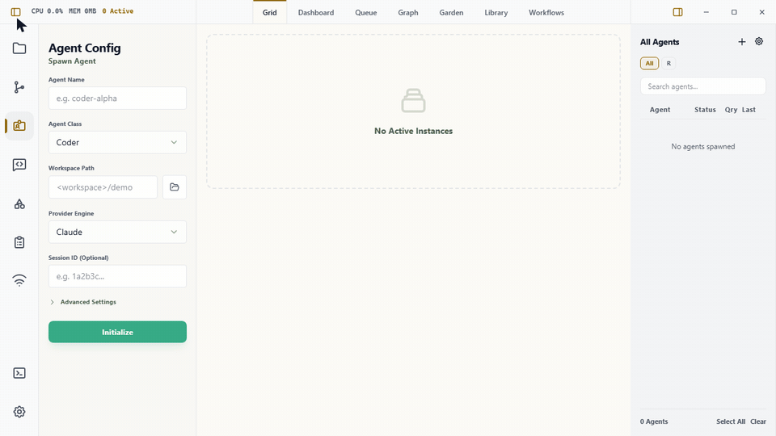

# Wardian

<div align="center">


**Local command center for multi-agent CLI workflows** — see every session, collect completed work in a queue, and give agents a CLI surface for coordinating and controlling Wardian.

[](https://github.com/wardian-app/Wardian/actions/workflows/ci.yml)
[](https://codecov.io/gh/wardian-app/Wardian)
[](https://codecov.io/gh/wardian-app/Wardian)
[](https://github.com/wardian-app/Wardian/releases/latest)
[](https://github.com/wardian-app/Wardian/releases)


[](public/demo.gif)

</div>

---

> 🚧 **Early development.** Wardian is under active construction. Expect rough edges: APIs, on-disk formats, and UI layouts can change between releases without notice. Pin a version if you depend on it, and please [file an issue](https://github.com/wardian-app/Wardian/issues) when something breaks.

Wardian is an **Integrated Agent Environment** — a local, app-first governance layer for AI orchestration. It centralizes PTY management, live telemetry, completion queues, workflow execution, and shared context into a unified desktop Command Center for developers managing many long-running agent sessions across multiple projects. The bundled `wardian` CLI gives agents a textual control surface for discovering their own identity, coordinating peers, and controlling Wardian without driving the graphical app.

---

## Download

Pre-built binaries for Windows, macOS (Apple Silicon + Intel), and Linux are available from the [Releases page](https://github.com/wardian-app/Wardian/releases).

Choose the asset for your operating system and CPU:

| System | Download asset | Notes |
| :--- | :--- | :--- |
| Windows x64 | `Wardian_X.Y.Z_x64-setup.exe` | Standard Windows installer. |
| macOS Apple Silicon | `Wardian_X.Y.Z_aarch64.dmg` | For M-series Macs such as M1, M2, M3, or M4. |
| macOS Intel | `Wardian_X.Y.Z_x64.dmg` | For older Intel Macs. |
| Linux Debian/Ubuntu x64 | `Wardian_X.Y.Z_amd64.deb` | Installable Debian package. |
| Linux other x64 | `Wardian_X.Y.Z_amd64.AppImage` | Portable Linux app. |

`x64` and `amd64` both mean 64-bit Intel/AMD CPUs. On macOS, Apple Silicon uses `aarch64`, not `x64`. Ignore updater-only assets such as `latest.json`, `.app.tar.gz`, or `.sig` files when installing manually.

> **Note:** Wardian binaries are currently unsigned. On first launch:
> - **Windows:** SmartScreen will show a warning. Click "More info" → "Run anyway."
> - **macOS:** Gatekeeper will refuse to open the app. Right-click the app and choose "Open," or run `xattr -cr /Applications/Wardian.app` from Terminal.
> - **Linux:** `.AppImage` is portable (`chmod +x` and run); `.deb` installs via `sudo apt install ./Wardian_*.deb`.

---

## Table of Contents

- [Quick Start](#quick-start)
- [Documentation](#documentation)
- [Supported Providers](#supported-providers)
- [Why Wardian?](#why-wardian)
- [Core Features](#core-features)
- [Platform Support](#platform-support)
- [Project Roadmap](#project-roadmap)
- [Tech Stack](#tech-stack)
- [Architecture](#architecture)
- [Development Setup](#development-setup)
- [License](#license)

---

## Quick Start

New users should start with the public first-run guide:

- [First-Time Install and First Run](https://docs.wardian.org/guide/getting-started)

That guide covers download, launch, provider CLI setup, authentication, the first agent spawn, and Queue review.

For local development, clone the repository and run the dev app:

```bash
git clone https://github.com/wardian-app/Wardian.git
cd Wardian
npm install
npm run dev
```

---

## Documentation

For complete user and developer docs, start here:

- [Public Documentation](https://docs.wardian.org/)
- [User Guide Index](https://docs.wardian.org/guide/)
- [Wardian CLI](https://docs.wardian.org/guide/cli)
- [Queue](https://docs.wardian.org/guide/queue)
- [Workflow Reference](https://docs.wardian.org/workflows/)
- [Developer Index](https://docs.wardian.org/developer/)

---

## Supported Providers

Wardian supports five provider CLIs today and adapts each runtime into the same agent lifecycle, telemetry, skill, and workflow model.

| Provider        | Support       | Runtime Model                                              |
| :-------------- | :------------ | :--------------------------------------------------------- |
| **[Gemini CLI](https://github.com/google-gemini/gemini-cli)**  | ✅ Supported  | Real-workspace runtime with patched skill discovery and stream-based turn detection. |
| **[Antigravity](https://www.antigravity.google/docs/cli-overview)** | ✅ Supported | Real-workspace runtime with native `AGENTS.md` discovery, `agy` conversations, and transcript-based turn detection. |
| **[Claude Code](https://github.com/anthropics/claude-code)** | ✅ Supported  | Real-workspace runtime with explicit session IDs and permission hooks. |
| **[Codex](https://github.com/openai/codex)**       | ✅ Supported  | Real-workspace execution via `--cd` with per-agent `CODEX_HOME` habitat state. |
| **[OpenCode](https://github.com/anomalyco/opencode)**    | ✅ Supported  | Real-workspace runtime with native `AGENTS.md` discovery and injected config for Wardian scope. |

> See [Provider Runtime Notes](docs/providers.md) for a deep dive into provider-specific discovery and lifecycle management.

---

## Why Wardian?

Unlike generic terminal wrappers or monolithic prompt orchestrators, Wardian focuses on the **physicality of agent operations**.

- **Scoped Skill Management**: Wardian doesn't just send system prompts. It uses filesystem-based junctions to inject or strip real capabilities (scripts, tools, configs) from an agent's workspace in real-time.
- **Deterministic-Agentic Hybrid**: Wardian's pulse-based workflow engine pairs strict, deterministic execution with agentic flexibility. Instead of opaque, API-driven chains, you build complex automation **locally**—retaining full control over the execution flow while allowing agents to handle the creative problem-solving within each node.
- **Agent-Facing Control Plane**: The `wardian` CLI shares state and live-control protocols with the desktop app, so agents can inspect rosters, spawn reviewers, send prompts, wait for status changes, watch output, and run workflows without scraping or automating the GUI.
- **Completion Queue**: Wardian captures agent completions and workflow outcomes into a durable Queue view so finished work does not disappear into terminal scrollback.
- **High-Fidelity Status Tracking**: Wardian actively parses raw PTY streams to detect complex occupancy states (`Idle`, `Processing`, `Action Needed`) while monitoring per-process CPU and memory usage.

> Explore our [Key Features guide](docs/features.md) for more technical comparisons.

---

## Core Features

### The Command Center

Wardian provides a dense, tactile desktop interface designed for high-bandwidth orchestration.

- **Dual-Sidebar Layout**: The Left Rail houses fast-access controls for Agent Configuration, Command Broadcasting, and Library Management. The Right Sidebar provides a searchable, collapsible agent roster with custom watchlists and drag-and-drop prioritization.
- **Context-Aware Dashboard**: A primary view displaying high-level telemetry (CPU, Memory, Uptime) alongside an action matrix that allows for surgical agent control (Pause, Restart, Query, Delete).
- **Dynamic Terminal Grid**: For deeper debugging, switch to the multi-slot PTY grid to monitor live raw outputs from your agents. Support includes 1x1, 2x2, or focused 1+2 layouts.

### Multi-Agent Orchestration

Scale your workflows by coordinating independent, specialized agents rather than relying on a single monolithic prompt.

- **Persona Class System**: Spawn new agents from pre-configured default classes (e.g., Coder, Architect, Researcher) or define custom personas tailored exactly to your repository's conventions.
- **Broadcast & Bulk Actions**: Dispatch unified instructions, project context, or terminal commands to all agents or a filtered subset simultaneously via the global Command Panel.
- **Queue View**: Review unread completions from agents and workflow runs, expand long summaries, and clear completed items after triage.

### Wardian CLI

The desktop app installs a `wardian` command into the user Wardian bin directory for agents and automation. Agents use it to inspect active or persisted peers, spawn and clone sessions, manage Wardian worktrees, send prompts, wait for status transitions, watch retained output, and run saved workflows through the app-owned backend. See the [CLI guide](docs/guide/cli.md) for command examples, output fields, filters, environment variables, live-control requirements, and exit codes.

### Workflow Engine

Wardian workflows combine a visual builder with a Rust execution engine. Manual triggers, scheduled triggers, file listeners, agent nodes, branch/loop/wait control, shared storage, and run telemetry all flow through the same deterministic runtime model.

---

## Platform Support

Wardian leverages native OS capabilities for high-performance terminal emulation.

| OS          | Level     | Backend Implementation                                |
| :---------- | :-------- | :---------------------------------------------------- |
| **Windows** | 🏆 Native | Full **ConPTY** integration via `portable-pty`.       |
| **macOS**   | ✅ Stable | Standard Unix PTY via `portable-pty`.                 |
| **Linux**   | ✅ Stable | Standard Unix PTY via `portable-pty`.                 |

> Detailed platform-specific notes and troubleshooting can be found in [OS Support](docs/os-support.md).

---

## Project Roadmap

Wardian is evolving toward a fully autonomous home for your agents.

- **Phase 1-2**: Dual-Sidebar UI, PTY Grid, Shared Habitat, CLI Utility, live CLI control, agent cloning, worktrees, and scheduled workflow foundations. [DONE]
- **Phase 3-4**: Agent-to-Agent IPC, HITL approval queue expansion, workflow hardening, and cross-platform runtime polish. [ACTIVE]
- **Phase 5**: Swarm Visualization, Plugins, and File-System Watcher Hooks. [PLANNED]

Full details available in [ROADMAP.md](ROADMAP.md).

---

## Tech Stack

| Layer       | Technology                                   |
| ----------- | -------------------------------------------- |
| Framework   | [Tauri v2](https://tauri.app/)               |
| Backend     | Rust, `portable-pty` (**ConPTY** on Windows) |
| Frontend    | React 19, TypeScript 5.8, Vite 6             |
| CLI         | Rust, `clap`, shared `wardian-core` state    |
| Terminal    | xterm.js 6 + FitAddon                        |
| Styling     | Tailwind CSS v4                              |
| Persistence | SQLite `state.db` and JSON app settings      |

---

## Architecture

Wardian is built with a focus on modularity, thread safety, and separation of concerns.

### Backend (Rust / Tauri v2)

- **Modular Domain Design**: Specialized modules organized cleanly into `commands`, `models`, `state`, and `utils`.
- **PTY Management**: Leveraging `portable-pty` with native **ConPTY** support ensures robust, true-to-life terminal emulation across operating systems.
- **State Sovereignty**: A centralized `AppState` utilizing async-aware locking (`tokio`) to safely coordinate fast-moving metrics and UI IPC signals.

### Frontend (React 19 / TypeScript)

- **Infrastructure vs. Feature Split**:
  - **Layout**: Persistent structural components (Sidebars, Roster, Titlebars).
  - **Features**: Domain-driven logical boundaries (Agent lifecycle, Terminal implementation).
  - **Views**: Page-level containers for switching display modes (Dashboard, Grid).
- **Type Safety**: Strictly typed interfaces for agent telemetry, system configurations, and data transport models located in `src/types/`.

---

## Development Setup

1. **Rust**: Install [rustup.rs](https://rustup.rs/) (latest stable).
2. **Node.js**: Ensure Node.js (v18+) is installed.
3. **Agent CLIs**: Install at least one supported provider CLI before spawning agents: [Gemini CLI](https://github.com/google-gemini/gemini-cli) (`@google/gemini-cli`), [Antigravity](https://www.antigravity.google/docs/cli-overview) (`agy`), [Claude Code](https://github.com/anthropics/claude-code) (`@anthropic-ai/claude-code`), [Codex](https://github.com/openai/codex) (`@openai/codex`), or [OpenCode](https://github.com/anomalyco/opencode) (`opencode` command, commonly installed from `opencode-ai`). Ensure each provider is authenticated successfully in your terminal first.
4. **Clone & Install**:
   ```bash
   git clone https://github.com/wardian-app/Wardian.git
   cd Wardian
   npm install
   ```

To run the application in development mode with live reloading:

```bash
npm run dev
```

To generate a production-ready release executable for your platform:

```bash
npm run tauri build
```

---

## License

[MIT](LICENSE) — Created by Tan Gemicioglu.
