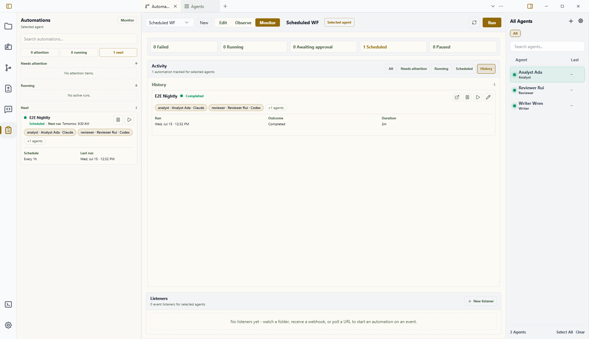

# Automation View

The Automation view is Wardian's canvas for building and testing automations.

Use this page as a quick manual for the view itself. For the full automation reference, start at [Automations](../automations/index.md).

Use it when a repeated multi-step agent process needs a saved visual flow instead of a one-off prompt or broadcast.

Before creating an automation from scratch, see [Automation Samples](../automations/samples.md)
for editable, generic examples of a code-change review, scheduled brief,
research brief, incident triage, and conversation pattern review flow.


## When to Use It

- Chain multiple agent, command, wait, or branch steps.
- Reuse a process that should run manually, on a schedule, or from a listener trigger.
- Inspect upstream values before passing them into later nodes.
- Compare automation outcomes in [Inbox](./inbox.md).

## What You Can Do Here

- open an existing automation
- create a new automation
- add nodes from the block library
- wire nodes together on the canvas
- edit node settings
- save changes
- launch the automation according to its trigger type

## Main Areas

- **Edit**: build the graph, add nodes, wire edges, edit node settings, and inspect upstream values.
- **Observe**: inspect a selected run's graph state, event timeline, node outputs, and approval controls.
- **Monitor**: manage scheduled automation invokers and open active or recent runs.
- **Left automation rail**: glance at active runs and upcoming schedules, then open Monitor when you need full controls.

## Running From This View

The **Run** button opens a launch dialog for the current blueprint. Use **Run now** for an immediate run, or switch to **Schedule** to create a persisted schedule with the same provider, workspace, and input parameters.

Manual input parameters appear in the dialog when the blueprint's entry trigger defines an input schema.
When an automation has many input parameters or schedule controls, the dialog stays within the Automations view and scrolls the form body so the action buttons remain reachable.


## Running From The CLI

`wardian automation exec <path>` launches a live automation through the running
Wardian app. Use the same `WARDIAN_HOME` for the app and CLI so both processes
share the control endpoint and run logs.
Pass `--workspace <absolute-workspace-path>` when headless automation tasks should
run against a specific project checkout.

Scheduled automations always require an existing workspace directory. The
Schedule launch form validates this value before saving, and the CLI uses the
same rule for `automation schedule add` and `automation schedule update`. Use the
CLI update command to change cadence, assignments, provider, input, or pause
state without replacing the schedule identity.

For a weekly schedule, use `--weekly <days@HH:MM>`; it defaults to one-week
recurrence. Use `--repeat-every <positive-integer>` for a longer weekly
interval from 1 through 520 weeks, such as
`--weekly Sun@12:00 --repeat-every 2`. The separate
`--every` option remains interval-only and is expressed in minutes. Monthly,
daily, and specific-date schedules do not currently support a repeat interval
in the shared schedule model.

Bash:

```bash
export WARDIAN_HOME="$PWD/.tmp/wardian-automation"
wardian automation exec "$WARDIAN_HOME/library/automations/autoreview.md"
wardian automation exec "$WARDIAN_HOME/library/automations/autoreview.md" \
  --workspace "<absolute-workspace-path>" \
  --input '{"target":"PR #123","max_cycles":1}'
```

PowerShell:

```powershell
$env:WARDIAN_HOME = "$PWD\.tmp\wardian-automation"
wardian automation exec "$env:WARDIAN_HOME\library\automations\autoreview.md"
wardian automation exec "$env:WARDIAN_HOME\library\automations\autoreview.md" `
  --workspace "<absolute-workspace-path>" `
  --input '{"target":"PR #123","max_cycles":1}'
```

The live/default path requires the app because active-agent routing, PTY input,
automation shell/script execution, and automation task reply tracking are app-owned.
The `mock` executor exists only for automation-engine fixture tests.

## Monitoring Automation Activity

Automations opens in **Monitor** by default. Choose **Edit** when you want to
author a workflow; opening a blueprint for editing or a run for observation
also switches to the appropriate view explicitly.

Monitor shows a unified activity feed for automation schedules and runs. Use the
tabs to switch between all activity, items needing attention, running work,
scheduled work, and history.

Agent selection also scopes this view. With no agents selected, Monitor and the
left automation rail show all automation activity. With one or more agents
selected in the roster or an agent surface, they show schedules, listeners, and
runs whose saved role assignments include any selected agent. The automation
picker follows the same deployed-workflow scope; an already open blueprint stays
available so changing selection cannot hide an editing context.

This is a lens over saved invoker assignments, not a second ownership record.
Blueprint roles remain reusable and do not identify an agent until a schedule or
listener binds them. A manual run without its own schedule appears in an agent
scope only when that blueprint has a saved assignment for the selected agent.



Each section uses a card hierarchy suited to the operator's question:

- **Scheduled** leads with assigned agents, then **Next run**, **Schedule**, and
  **Last run**.
- **History** leads with assigned agents, then **Ran**, **Outcome**, and the run
  duration when available. Historical cards do not show a future next-run time.
- **Running** leads with ownership and live state, including when the run
  started and was last updated.
- **Needs attention** leads with ownership, the action required, and the latest
  status update. It includes approval gates, unsuperseded failed runs, and
  schedule launch failures that do not have a newer retained run.
- **All** preserves those section-specific priorities instead of forcing every
  activity into one universal row layout.

Cards show up to two role-aware assignment chips when an automation actually has
agent assignments. Pure script automations do not show an invented default
assignment. When an automation has more assignments, the accessible **+N agents**
control expands the complete role map without making every collapsed card
taller. Stored agent ids remain visible if an assigned agent is no longer in the
roster.

Run and schedule times use local, calendar-aware labels such as **Today**,
**Tomorrow**, a nearby weekday and date, or a full date for more distant
activity. Explicit fallbacks distinguish **Paused**, **Not scheduled**, and
**Never run** states, while exact local date, time, and timezone remain
available as supporting detail.

The top counters summarize failed, running, awaiting, scheduled, and paused
activity. Scheduled cards retain the current Monitor actions:

In a narrow or restored Automations pane, the responsive card grid stays within
the pane while its summary and filters remain fixed. The card list scrolls
independently without widening or collapsing the surrounding workbench layout.

- **Pause** or **Resume** changes whether the schedule fires on its saved recurrence.
- **Run now** launches the scheduled invoker immediately.
- **Edit** reopens the schedule form.

**All** aggregates the **Needs attention**, **Running**, and **Scheduled**
sections into one operational view. **History** is the chronological run stream,
paged 10 entries at a time so you can move through earlier activity.

The left automation rail uses a compact Scheduled-style card at normal sidebar
widths. It keeps the automation name, next run, two assigned agents with the same
**+N agents** expansion, schedule, previous run, and pause or resume and run-now
actions readable without repeating raw blueprint ids in the primary layout.
Sidebar search also matches resolved agent names so you can find the automation
owned by a particular agent. Selecting that agent applies the scope before the
search, status counts, and upcoming list are calculated.

## Important Limits

- The visual view is for building and launching automations. Detailed node semantics live in the automation reference.
- Real provider behavior still depends on the selected agent class, provider CLI, workspace, and runtime settings.
- Scheduled and listener automations require the app runtime to be available when they are expected to run.
- Inbox records final automation outcomes and automation approval decisions, not every intermediate node state.

## Related Links

- [Getting Started](./getting-started.md)
- [Automations](../automations/index.md)
- [Building Automations](../automations/building-automations.md)
- [Triggers](../automations/triggers.md)
- [Scheduled Runs](../automations/scheduled-runs.md)
- [Node Reference](../automations/node-reference.md)
