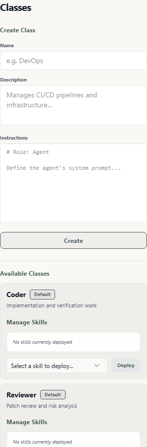

# Class Management

In Wardian, a **Class** is more than just a label—it is a functional blueprint that defines the core identity, intelligence, and equipment of your agents.

Use Class Management when you want future agents to start with consistent instructions, provider-ready skills, and a recognizable role.

## When to Use It

- Create a repeatable role such as `Coder`, `Reviewer`, or `Researcher`.
- Tune an existing role before spawning more agents from it.
- Assign skills at the class level so every new instance starts with the same capabilities.

## Basic Workflow

Class management lives in the **Classes** tab on the left control rail.

1. Click the **Classes** icon in the left control rail.
2. Browse the list of available classes or create a new class.
3. Enter the class name, description, and instructions.
4. Assign class-level skills from the class card.
5. Spawn a new agent from the class in the left **Agent Configuration** tab.

## Configuring a Blueprint

### 1. Instruction Set (AGENTS.md)
Each class is governed by a markdown file. This is where you define:
- **Role & Personality**: Who the agent is (e.g., "A skeptical security auditor").
- **Constraints**: What the agent cannot do (e.g., "Never overwrite existing .env files").
- **Standard Procedures**: How the agent should approach tasks (e.g., "Always draft a plan before executing").

### 2. Pre-Assigned Skills
You can pre-load a class with specific modular skills. 
- When you assign a skill to a class, every agent spawned from that blueprint receives the skill through its provider's discovery path. Wardian may use directory links, provider home projection, generated config, or provider-native include roots depending on the selected CLI.
- This ensures your `Coder` class always starts with `github-cli` and `typescript-tools` ready to go.

### 3. Registry Persistence
All your custom classes are stored in `<wardian-home>/classes.json`. This single file is the source of truth for the Rust backend when spawning new sessions.

## Spawning from a Class
To use your blueprint:
1. Navigate to the **Agent Configuration** tab in the Left Sidebar.
2. Select your class from the dropdown.
3. Click **Initialize**.
The agent will inherit the selected class instructions and class-level skill assignments.

## Important Limits

- Editing a class changes future spawns; it does not rewrite instructions inside already-running provider sessions.
- Class skills are adapted to each provider's discovery model. Check [Provider Runtimes](../providers.md) when a provider does not expose a skill as expected.
- Keep class instructions durable and general. Put task-specific instructions in prompts, broadcasts, workflows, or direct terminal messages.

## Related Links

- [Getting Started](./getting-started.md)
- [Library](./library.md)
- [Grid](./grid.md)
- [Provider Runtimes](../providers.md)
