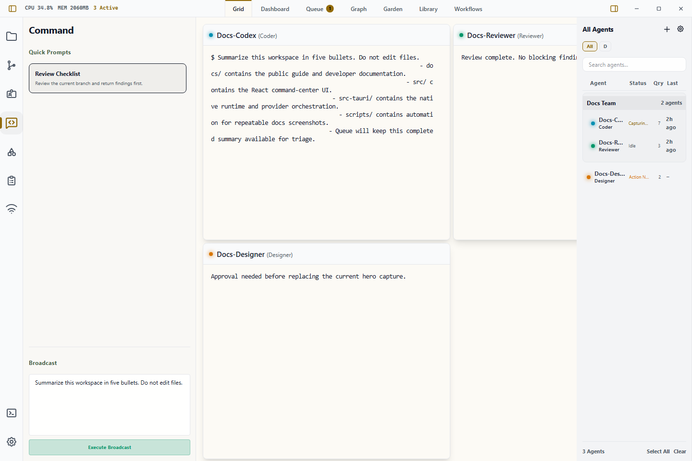

# Command Panel

The Command panel is the left-sidebar surface for fast message delivery and prompt execution across one or many agents.

Use it when you need to send the same instruction to selected agents, run a starred Library prompt, or coordinate a group without switching into each terminal.

## Two Modes in One Panel

1. **Quick Prompts**
2. **Broadcast**

Both modes operate on your current agent selection in the right roster.

## When to Use It

- Send a one-off coordination message to selected agents.
- Reuse a starred prompt from the [Library](./library.md).
- Ask a whole role group to report status after selecting that group in [Watchlists](./watchlists.md).
- Broadcast after [Getting Started](./getting-started.md) when you have more than one active agent.

## Basic Workflow

1. Select the target agents in the right roster.
2. Open the **Command** tab in the left sidebar.
3. Click a starred quick prompt or type a broadcast message.
4. Confirm the all-agent fallback when no agents are selected.
5. Watch responses in [Grid](./grid.md), [Dashboard](./dashboard.md), or [Queue](./queue.md).

## Quick Prompts

Quick Prompts are starred prompt files from the Library (`<wardian-home>/library/prompts`).

What happens when you click a quick prompt:

- Wardian reads the prompt content
- flattens multiline content into terminal-safe input
- sends it to selected agents
- if no agents are selected, asks for confirmation before sending to all agents

Tips:

- Star prompts in the Library to make them appear here
- Use short prompt names so they are easy to scan under pressure
- Use this path for repeatable operational tasks (tests, diagnostics, common instructions)

## Broadcast

Broadcast sends freeform text from the textarea to:

- selected agents, or
- all agents (after confirmation if nothing is selected)

Behavior:

- the text is submitted as terminal input through the same backend path used by direct terminal interaction
- one submission fan-outs to all chosen agent sessions

## Selection Rules

- **Single selected agent**: command goes to that one agent
- **Multi-select**: command goes to all selected agents
- **No selection**: confirmation prompt appears before sending to all active agents

## Common Patterns

- Use **Quick Prompts** for curated, repeatable instructions.
- Use **Broadcast** for ad-hoc coordination messages.
- Combine with watchlists to target only the relevant squad of agents.

## Important Limits

- Broadcasts are delivered as terminal input. They do not guarantee that a provider accepts or completes the instruction.
- No selection means "all active agents" only after confirmation.
- Quick Prompts only lists prompts starred in the Library.
- Use [Wardian CLI](./cli.md) for scriptable waits, marker watching, or structured peer asks.

## Related Links

- [Library](./library.md)
- [Watchlists](./watchlists.md)
- [Grid](./grid.md)
- [Wardian CLI](./cli.md)
