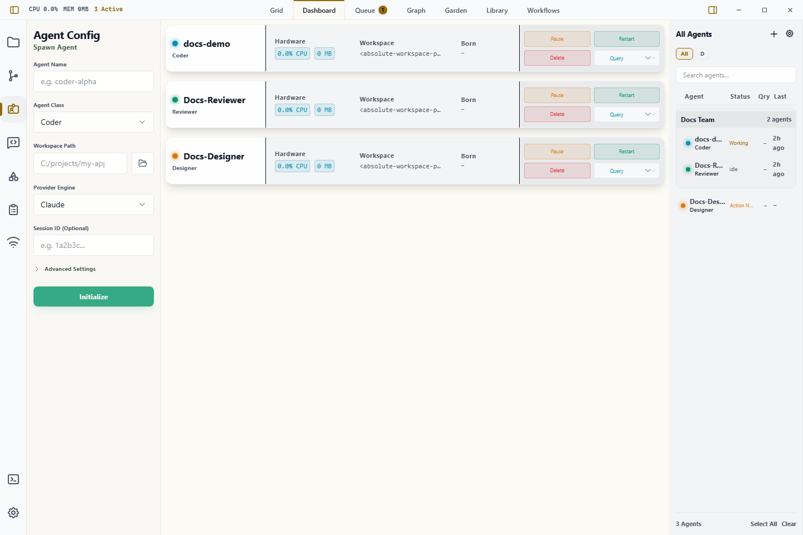

# Dashboard

Dashboard is a Workbench surface that shows what every agent in your habitat is doing right now, one row per agent, over a trailing window you choose.

Think of it as a process viewer for the fleet rather than a usage report. It is meant to be left open beside your work so that something wrong becomes visible, not opened once a day to read totals.

## When to Use It

- Spot an agent burning far more than the rest of the fleet.
- See which provider your habitat is actually running on, and where its work went.
- See which agents are idle and could take the next piece of work.
- Check live state across several agents without reading every terminal.
- Decide whether to open an agent session or place Inbox, Agents, or another surface beside it.

For "exactly how much did this agent do between Tuesday and Friday", use [Analytics](./analytics.md) instead. Dashboard answers *is anything wrong right now*; Analytics answers *what happened*.

## Basic Automation

1. Spawn one or more agents from the [Getting Started](./getting-started.md) flow.
2. Press `Ctrl+P` / `Cmd+P`, select a pane's **+** button, or use an empty-pane Home state, then choose **Dashboard**. `Ctrl+Alt+D` opens it directly.
3. Scan the rows. Each quantitative cell carries an inline bar or sparkline beside its number.
4. Set the trailing **window** from the header when the default 24 hours is the wrong span for what you are watching.
5. Use **Columns** to add or remove measures *in the table*. Your choice is remembered per Dashboard, so two Dashboards can watch different things. The provider strip above is not affected; it always carries the same six figures.
6. Click any agent row, including an idle row, to inspect the same combined, own-work, and subagent breakdown used by Analytics. Use **Open agent** inside the detail view to preserve the usual agent navigation.

Dashboard is a singleton surface. Opening it again focuses its existing tab instead of creating a duplicate.

## The Provider Strip

Above the table is a row of cards, one per provider, covering the same window and
carrying the same trend measure as the table below. The window control sits above
both, because it governs both — change it and every figure on the strip moves
with the rows.

The table answers *which agent is doing what*. The strip answers *which provider
am I running on* — a question you cannot get from the rows, because with a dozen
agents across four providers you would be adding them up in your head.

**`All` comes first**, and it is the habitat rather than a provider. Its agent
and file counts are distinct counts, not sums: an agent that ran on two providers
is one agent, and a file edited from two providers is one file, so `All` will
often read lower than adding the cards up would suggest.

**Providers are ordered by how often you configure them** — how many of your
agents name each one — and that order does not change when you change the window.
It is stable so you can find a provider by position rather than by reading.

**A provider you have configured but not used stays listed**, dimmed, at the end.
That is deliberate: an unused provider is part of the answer to "where can I spend
what is left".

The strip scrolls sideways when you run more providers than fit. Its height never
changes with how many providers you have.

Each card's sparkline is scaled against the other **provider** cards. The `All`
card is scaled against itself, because it is the sum of the others and would
otherwise flatten every one of them; hovering it says so.

> Account limits and remaining quota are **not** shown here. Only Codex publishes
> a usage limit that Wardian can read from local logs, so a quota gauge would
> exist for one vendor and be blank for the rest. See
> [Analytics](./analytics.md) for historical totals.

## Reading the Table

**Bars are scaled to the fleet, not to the row.** The busiest agent in the table sets full width and everything else is drawn against it. This is what makes a runaway visible at a glance: you are looking for the outlier, not for an absolute number.

**Colour means state and nothing else.** Status dots use the standard palette — emerald idle, cyan processing, amber action required, gray off, red error. Bars and sparklines take the accent colour regardless of size. A busy agent is drawn tall, never red, because "large" is not the same as "wrong".

**A dash means unmeasured, not zero.** Gemini and antigravity publish no token accounting at all. Where a provider reports nothing, the cell shows `—` rather than `0`, so an unmeasured agent is never mistaken for an idle one.

**Idle agents stay on screen** under available capacity. Who could take the next task is one of the questions the surface exists to answer.

### Columns

Shown by default:

| Column | Meaning |
|---|---|
| State | Live status dot |
| Agent | Name and class |
| Trend | Sparkline of the measure across the window |
| Active | Time the agent was actually working in the window |
| Turns | Completed turns in the window |
| Tokens | New content processed in the window: fresh input, cache writes, and output. Cache reads are excluded — see [Analytics](./analytics.md#reading-the-matrix). |
| Files | Distinct files touched |
| Lines | Lines added against removed, as a diverging bar |

Available but off by default: **Tokens/hr** and **Turns/hr** (the same measures denominated by time), plus **CPU** and **Memory**, which are live process metrics rather than telemetry.

### Window

The window is a *setting*, not a filter: it says how far back "now" reaches. It defaults to 24 hours, accepts 15 minutes to 30 days, and is remembered per Dashboard.

## Important Limits

- Dashboard summarizes; it does not replace terminal inspection for detailed provider output.
- Closing its tab closes only the Dashboard presentation. It does not alter any agent runtime.
- Telemetry is derived from provider logs. A provider that reports nothing is shown as unmeasured, and CPU and memory remain best-effort and vary by platform.
- Figures cover the selected window only. For arbitrary date ranges, use [Analytics](./analytics.md).
- The provider strip shows activity, not remaining quota. Wardian does not read provider account limits.
- Completion summaries belong in [Inbox](./inbox.md); Dashboard is for live agent state.

## Related Links

- [Analytics](./analytics.md)
- [Workbench](./workbench.md)
- [Agents](./agents-overview.md)
- [Watchlists](./watchlists.md)
- [Inbox](./inbox.md)
- [Settings](./settings.md)
