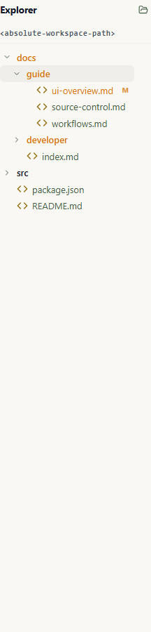
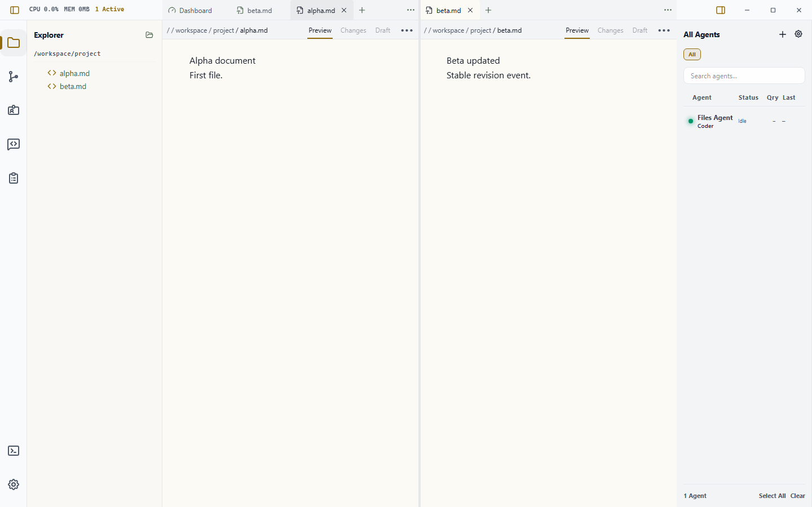

# The File Explorer

The Explorer is a specialized tab in the Left Sidebar that provides a tactile interface for browsing the physical files created and managed by your agents.

Use it when you need to inspect generated files, logs, prompt assets, or the selected agent's workspace without leaving Wardian.

## When to Use It

- Browse the workspace for the agent selected in [Watchlists](./watchlists.md).
- Inspect files after an agent reports completion in [Queue](./queue.md).
- Open a quick preview in a Workbench tab before deciding whether to keep it.
- Open a file or folder in your configured local app or editor.
- Reveal a file in the system file manager when you need native OS actions.

## Basic Workflow

1. Select an agent in the right roster, or clear selection for global Wardian home browsing.
2. Open the **Explorer** tab in the left sidebar.
3. Expand folders to inspect files.
4. Click a file to open a transient Files preview, or change the click behavior in [Settings](./settings.md).
5. Use the Explorer title actions to reveal the current root in your system file manager or open the entire root in your configured external app.
6. Use preview, open externally, reveal, copy path, or delete from the file context menu.
7. Move to [Source Control](./source-control.md) when the selected root is a Git workspace and you need to review changes.

## Root Behavior

The Explorer is context-aware and automatically re-roots itself based on your selection:

### 1. Agent Selected
When you select an agent in the **Roster** (Right Sidebar), the Explorer roots
itself in that agent's configured primary workspace or assigned Git worktree.
That primary workspace and the agent's explicit additional directories are the
content roots that the Files backend trusts. Wardian-managed
`system_include_directories` contain instructions and skills; they are not
content grants and cannot be opened through Files.

### 2. No Selection (Global Mode)
When no agent is selected, the Explorer roots itself in the main Wardian home directory:
`<wardian-home>/`
This allows you to manually browse common data, shared lineages, and global configuration files.

## 🖱️ File Interactions

Clicking a folder expands or collapses it. Clicking a file uses the configured
**File click action** from Settings:

- **Preview in Wardian** opens a read-only Files tab. This is the default.
  A single click creates or replaces the current pane's transient preview.
  Double-clicking or pressing `Enter` makes that file a permanent tab.
- **Open in external app** opens editor-friendly files through the configured
  Explorer external editor preference. Binary, media, archive, executable, and
  document files use the operating system's default handler.

The Explorer also supports standard right-click actions for rapid file
management:

- **Open**: Opens a permanent Files tab, or pins the matching transient preview.
- **Open to Side**: Opens a permanent Files tab in an adjacent pane when the
  Workbench can admit the split.
- **Open in External App**: Opens the selected folder, or an editor-friendly file, using the configured Explorer editor preference. Binary, media, archive, executable, and document files use the operating system's default handler. You can switch editor-friendly paths to VS Code or a custom executable in [Settings](./settings.md).
- **Reveal in System Explorer**: Opens your OS file manager (Windows Explorer or macOS Finder) directly to the selected file or folder.
- **Copy Path**: Copies the absolute path of the file to your clipboard.
- **Delete**: Permanently removes the file or directory from your disk (requires confirmation).

The example below shows an Explorer-driven transient preview beside a permanent
file tab. The second pane has already reloaded its stable backend revision.

## Preview Controls

Rendered Markdown includes a compact presentation icon beside the file actions.
The reading icon indicates rendered Markdown; activating it switches the current
Preview presentation to the read-only Monaco source view. The pencil indicates
source; activating it switches back to rendered Markdown. The tooltip and
accessible label describe that action. This does not create another tab or file
subscription. Plain text is already source, while images and PDFs keep their
media-specific controls.

Windows paths are shown without the internal `\\?\` extended-length prefix.
Wardian still retains and authorizes the original canonical path behind the
displayed breadcrumb.

Image and PDF previews keep their controls inside the pane. The PDF toolbar
wraps at narrow split widths, and its search field shrinks without clipping the
zoom controls. Zooming keeps the visible page anchored while the virtual page
window is recalculated, including when the pane is resized. Focus the labeled
PDF document viewport to use the browser's native arrow and page scrolling.

The **File actions** menu supports pointer use as well as `Arrow Up`,
`Arrow Down`, `Home`, and `End`. `Escape` closes the menu and returns focus to
its trigger. Markdown links to authorized local files stay inside Wardian's
Files routing, including UNC `file://server/share/...` links; the backend still
performs the final root/capability check before opening the target.

Agent terminals and the bottom user terminal also make recognized file paths and
URLs clickable, including links that wrap across terminal rows. File paths use
the same type-sensitive behavior as **Open in External App**; URLs open as URLs.
Wardian validates terminal file links before showing them, so slash-looking
command names or prose fragments are ignored unless they resolve to a real file
or folder.

## Git Status Markers

When the selected root is a Git repository, the Explorer uses status colors and markers to identify changed, staged, deleted, and untracked paths. Parent folders are highlighted when they contain changed files.

## Important Limits

- Delete removes files from disk after confirmation; it is not a soft-hide operation.
- Explorer context follows selection. If the tree is not showing the workspace you expect, check the selected agent in the roster.
- Current in-app previews support validated UTF-8 text and Markdown, images,
  and PDFs. Complete text models are limited to 16 MiB and 200,000 lines;
  images to 64 MiB and 64 million decoded pixels; PDFs to 256 MiB. Oversized or
  unsupported content shows metadata and **Open With** instead of allocating an
  unsafe renderer. PDF search is bounded to 128 pages or two seconds per query;
  partial results show how much of the document was searched.
- Active HTML and SVG are deliberately unavailable in this foundation. They
  will not render live until the capability-free, networkless artifact host and
  artifact review lifecycle ship.
- A native picker grant applies only to the exact selected canonical file. It
  never grants the parent directory or a sibling file. The picker capability is
  backend-owned and is not stored in the Workbench document.
- **Files** is not offered in the New Surface launcher yet. Open ordinary files
  from Explorer. The launcher remains reserved until artifact presentation,
  review, and active-content isolation are complete.

## Related Links

- [Getting Started](./getting-started.md)
- [Watchlists](./watchlists.md)
- [Source Control](./source-control.md)
- [Queue](./queue.md)
