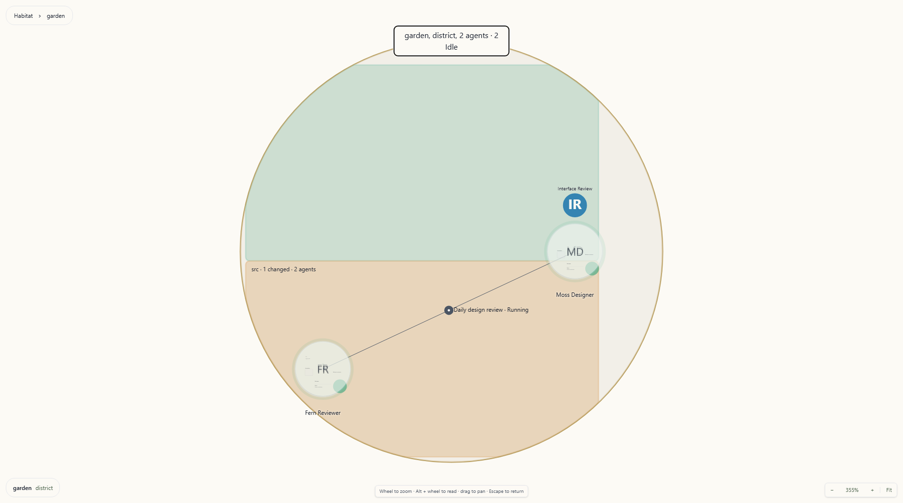
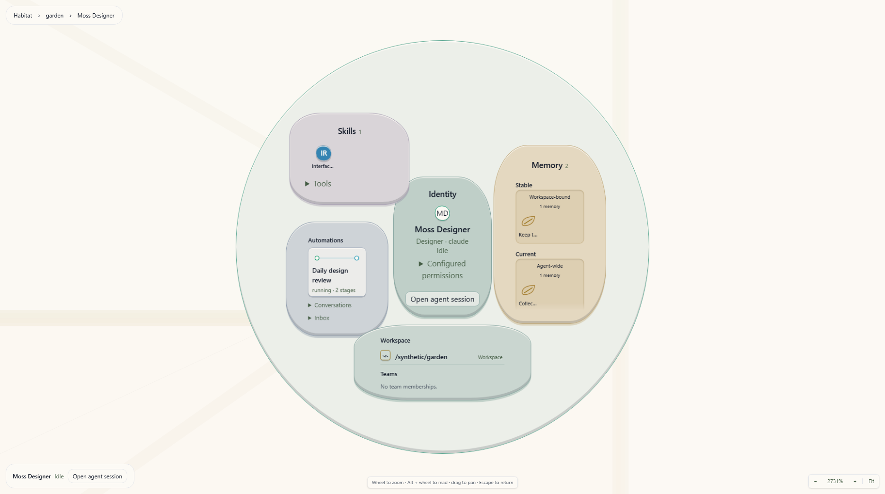

# Garden

The Garden is a hierarchical habitat for exploring Wardian's work. Districts
contain cell-like agents and workspace ground; entering an agent, workspace,
or situated automation reveals its composition, then readable records.
Position reflects shared teams, workspaces, worktrees, and concrete assignments.
Skills appear on their carriers and inside Skills, not as independent
map units. Unassigned Library blueprints and completed one-off automation runs
do not populate the map.

Use the Garden when you want to see the shape of your setup: which agents
cluster around a repository, which agents participate in a routine, what files
they changed, and what evidence supports a memory or run stage.

*Agent cells share stable workstream geography with workspace ground and
situated routines.*

## How Position Is Decided

Each unit is described by **facets** taken from records Wardian already keeps —
a workspace path and every directory above it, team membership, agent class,
provider, worktree, the agents a skill is deployed to, the agents an automation is
bound to. Two units are close when they share facets, and a shared facet counts
in proportion to how rare it is. Sharing a provider with twenty other agents
says almost nothing about you; sharing a worktree with one other agent says a
great deal.

Canonical relationships determine district membership. Settled positions and
manual placements are retained so reloading does not shuffle familiar landmarks.
Live status and file activity change emphasis without moving those landmarks.

## Districts

Every unit belongs to a **district**, chosen by the strongest tie it has, in
this order:

1. **Team** — the agent is in a team.
2. **Fallback** — an explicit override recorded for the agent.
3. **Worktree** — the agent runs in a git worktree of a repository.
4. **Workspace** — the agent runs in a folder no other tie describes.
5. **Commons** — nothing ties this unit anywhere in particular.

Districts occupy stable cells in rings sized for their contents. Coordinating
districts can sit nearer the centre; proximity reflects relationships rather
than alphabetical or creation order. Commons is the fallback territory, not
an assertion that every unassigned Library item belongs on the map.

At a distance, agents are status signals. Closer in, they become named
cell-like inhabitants with skill marks. Enter a district to fit its workstream,
then enter an agent or workspace to inspect its contents.

## Compositions and Records

Agents use the same five regions so their contents remain easy to find.

The agent circle and its regions keep their world geometry. Zooming closer
reveals records at their source anchors. Record, workspace, and automation
labels keep their centre and width while their outlines grow smoothly in
height into reading planes. Zooming out reverses the change, keeping the
surrounding geography connected.

*Zoom into an agent cell to reveal contained objects, then approach a record to read it.*

Colored trays, defined rims and shallow raised objects distinguish the five
regions. Their material colors identify regions; status markings still show
Idle, Processing, Action Required, Off and Error. Each region keeps its place
as its collection grows, so a busy agent remains recognizable.

Skills appear as glyphs, memories as individual seeds, routines as execution
nodes, and connections as endpoints. Short labels emerge as you approach;
hovering, focusing or selecting an object reveals its label fully. Memory
seeds keep Stable/Current and scope grouping; enter one for its full text and
evidence. Collections show loaded counts. With more than 48 loaded memories,
**Find memory** searches their text; Enter or **Find next memory** focuses the
next match without rearranging the collection. Enter that object to read its
evidence. **Conversations** exposes every loaded conversation summary, with
dates and expandable excerpts, alongside notification details.
Skill provenance remains in its accessible label and hover description, with
canonical details available through the skill record.

Assigned routine definitions remain part of Garden geography. A manual
automation appears while it is running or awaiting approval, then leaves the
Garden when it completes or fails. Its durable evidence remains available in
Automation Monitor and Observe; recent scheduled execution state stays folded
into the routine it belongs to instead of creating a separate historical cell.

Entering an agent, workspace, automation, or record brings it to a readable
scale. On a small or short viewport, the outer plane or membrane may extend
offscreen while the reading column fits the available width and height. Text
flows inside without moving its anchor. Pan or zoom to explore the surrounding
plane and geography.

| Region | Contents |
| --- | --- |
| Identity | Purpose, class, provider, model, saved permission settings, and **Open agent session** |
| Skills and Tools | Deployed skills with direct, class-inherited, or global provenance; linked or copied state; configured tools |
| Memory | Stable and Current records, grouped by agent-wide or workspace-bound scope |
| Automations, Conversations, and Inbox | Current/recent conversation excerpts, assigned routines, active manual runs, and loaded Inbox items attributed by agent session ID |
| Workspace, Teams, and Agents | Workspace, team membership, and peers sharing a team or workspace |

Saved permission and tool settings describe configuration; runtime application
may require a restart. Related agents share a workspace or team; these links do not imply exclusive ownership.
Following a peer or workspace keeps a breadcrumb back to the originating agent.
Peer links travel to that peer's cell in its own place in the world.

Memory records show full text, scope, evidence, sources, verification time, and
revision history. Skill records expose **Open in Library**. File records show
available content, change evidence, attributed agents, turns, and baseline;
**Open file** opens a changed text file with its comparison, while unchanged or
binary files follow file-opening preferences. Opening the comparison records
review for attributed agents; merely selecting the file does not.

**Open agent session** is an explicit action in the agent selection summary and
Identity region/record. It opens or focuses the canonical **Agent Session**
terminal through contextual Workbench navigation, preserving Garden as its own
surface. This is an exception to Graph and Inbox, which prefer an existing
Agents view. Double-clicking the agent first enters its composition. Workbench
Back or closing the destination returns to Garden's saved spatial context.

## Workspace Activity and Attribution

The map loads immediate workspace-root listings for stable ground. Deeper
activity comes from change ancestry inside workspace composition, which shows
changed files grouped under the ancestors needed to reach them, including
deleted files absent from directory listings. Select
an agent to highlight attributed paths, or a path/group to highlight its
participating agents. Selection reveals attribution threads without drawing
every relationship at once. Attributed and inferred evidence remain distinct;
an inferred write does not establish an agent owner.

Inside a workspace, **File activity → Turn range** controls file recency. The overview always includes all compared changes.

| Turn range | Included activity |
| --- | --- |
| **Latest 2 turns** | Newest two turns of known activity |
| **Latest 16 turns** (default) | Newest sixteen turns of known activity |
| **All compared changes** | All changes in the current workspace comparison, without a recency cutoff |

Unknown or inferred recency is retained, not treated as proof of inactivity.
Turn windows are relative to the change summary's newest turn, not elapsed
minutes. **All compared changes** does not change the comparison baseline: Garden uses the
workspace-wide HEAD or branch-point preference, falling back to branch point
when the preference requires a single agent. Inspect the file record's baseline
when comparing it with an agent-scoped Changes pane.

Enable **Show full tree** inside a workspace to browse unchanged contents. This disables the turn-range control while all folder contents are shown.
Directory listings are paged; use **Next folder page** there or **Load next
page** on the map when offered.

## Situated Automations

An automation projection represents a direct binding, a schedule, or an
unscheduled run. Separate schedules of one blueprint remain separate objects;
scheduled runs contribute to their schedule's projection. A `role:` or `class:`
requirement alone does not locate a blueprint.

- One concrete agent: an attached routine.
- Several concrete agents: a directed route through participants in execution
  order, retaining returns to an earlier agent.
- No concrete agent, but a configured workspace: a workspace routine.
- No concrete agent or workspace: no invented map location; use Automation
  Monitor. Missing map participants can also prevent a route from being drawn.

Running and awaiting-approval runs remain eligible regardless of age. Scheduled
evidence remains recent for **24 hours**, using its update time, then completion
or start time when absent, and stays folded into its routine. Completed and
failed unscheduled runs do not populate the map. This rule is separate from the
file-activity range. An open routine or stage keeps its evidence while its
automation remains in the Garden breadcrumb without putting historical trails
back on the map. Historical evidence also remains available in Automation
Monitor.

Ordinary connections recede at the habitat overview and return as you zoom
closer. A selected route stays visible, as do local attention indicators.

Enter a routine or route to inspect its schedule and separate run lanes. A
stage record shows assignment, state, inputs, and recorded outputs/events;
temporary providers are labelled as temporary assignments. **Open automation
definition** opens the canonical definition. Garden does not edit schedules or
resolve approvals inside the composition.

## Navigating the Map

- **Click or Space** selects and explains without moving the camera or opening
  another surface. **Double-click or Enter** opens the next composition or
  record by animating the same camera. Touch users can select, then use the explicit **Enter/Open record**
  action.
- **Escape** animates the same camera out one level. Use the breadcrumb to
  return to an ancestor or **Habitat** through that camera.
- **Wheel** zooms through every scale, including compositions and records;
  reverse wheel zooms back out. Zoom uses the wheel delta, so high-resolution trackpads
  move continuously while a normal wheel notch remains a small step. It is
  anchored at the pointer, so the point under the cursor stays put.
- **Alt + wheel** explicitly scrolls overflowing record content under the
  pointer. Ordinary wheel over content continues to zoom the world. Use Tab
  to focus a named reading region, then scroll with the keyboard using arrows,
  Page Up/Page Down, and Home/End.
- **Drag the background** to pan.
- **Arrow keys** pan when the canvas has focus; hold Shift for larger steps.
  On a semantic object, arrows move keyboard focus; Home/End reach the first or
  last object. A coarse cell can receive keyboard focus before its inner
  controls become readable; Enter brings it closer. Tab reaches the object
  controls and composition actions.
- **`+` / `-`** to zoom in and out.
- **`0` or `f`** to fit the whole map into view.

The current zoom level is shown in the bottom-right controls, next to buttons
for zooming and for **Fit**. The zoom readout is worth checking first if the
canvas ever looks empty — it usually means the view is scrolled away from the
content rather than that there is nothing to show.

Zooming toward a selected map object can enter its next scale once it is large
enough, continuing into its regions and records in the same world. Empty-space
zoom does not choose an object. Zoom out to retrace the hierarchy, or use Escape
or breadcrumbs. Reduced motion preserves the same camera destinations and
spatial relationships while suppressing travel animation.

## Moving Units by Hand

Drag an agent at workstream scale to place it inside its own district. The position is
saved and survives restarts and re-layouts.

A drag adjusts where a unit sits *within* its neighbourhood; it does not change
which neighbourhood the unit is in. District membership comes from the canonical
records above, so dropping a unit beyond its district's edge places it at the
edge rather than moving it into the district next door.

Use **Reset layout** to discard every hand placement and return to the derived
layout.

Workspace ground, automation routes, and internal records are derived and do
not support manual placement.

## Loading and Unavailable Data

Memory and conversations load independently as an agent approaches inspection
scale. Distant previews do not read every agent's contents. Recently read
snapshots are retained briefly within that Garden surface for reverse travel.
**Refresh contents** retries these reads; a retained snapshot is labelled stale.
Records provide **Retry** when reads fail, including unavailable or restricted
files. Directory and activity failures are reported in workspace composition.
Automation data can be incomplete or stale; its notice provides **Retry** and
details. A failed projection refresh keeps that routine's known snapshot marked
stale while unrelated routines continue updating. Map expiry still applies;
retained evidence for an open composition is separate. Open **Map coverage**
beside navigation to check additional automation definitions, run records or
folder contents. Checking more runs may leave the map unchanged: only active
runs and runs updated within 24 hours appear. Some active or recent runs can
still be beyond the loaded window, so incomplete coverage is named explicitly.

An agent removed from the roster, unavailable routine evidence, or an
unavailable saved stage keeps a return path through the breadcrumb. An empty or
failed read is not evidence that no work exists.

If an older saved trail lacks the position needed to reopen a record, Garden
returns to the nearest available agent or district in that trail. A notice
explains the recovery so you can continue navigating from a known place.

## Where the State Lives

The Garden's derived layout is not a source of truth for anything. Districts,
distances, and clustering are all computed from records that already exist:
the agent roster, `topology.json`, team membership, the automation library, and
schedule records. Change any of those and the map follows.

Garden's scene store retains manual district-relative placements, district
cells, visits, and settled geometry in browser storage. Each Workbench Garden
surface persists its selection, breadcrumb trail (including return cameras),
current camera, and file-activity range in Workbench state. These are view preferences,
not copies of agent configuration, memory, file contents, or automation truth.
Camera saves settle after a zoom or pan gesture; leaving the surface flushes
the latest position.
