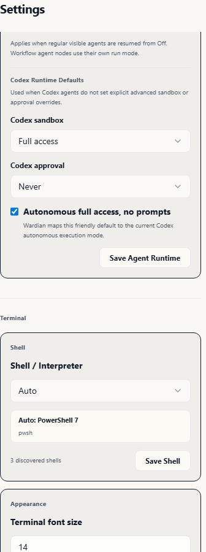

# Getting Started with Wardian

Wardian is an integrated habitat for managing multiple autonomous agents. This guide will help you spawn your first agent, monitor completed work in the Queue, and understand how the `wardian` CLI lets agents coordinate and control Wardian from inside their own terminals.

## 1. Prerequisites
- **Node.js** (v18+)
- **Rust** (v1.75+)
- **At least one supported provider CLI**: [Gemini CLI](https://github.com/google-gemini/gemini-cli) (`@google/gemini-cli`), [Claude Code](https://github.com/anthropics/claude-code) (`@anthropic-ai/claude-code`), [Codex](https://github.com/openai/codex) (`@openai/codex`), or [OpenCode](https://github.com/anomalyco/opencode) (`opencode` command, commonly installed from `opencode-ai`).

Authenticate each provider in a normal terminal before spawning it through Wardian.



## 2. Understanding Blueprints
Before spawning an agent, you must understand **Classes**. A Class is a "Blueprint" that defines an agent's base instructions and capabilities.
1. Click **LIBRARY** in the top bar view-switcher.
2. Select the **Classes** tab.
3. Browse the default classes (e.g., `Architect`, `Coder`, `Researcher`). Each class has its own `AGENTS.md` instruction set.

## 3. Spawning Your First Agent


1. Navigate to the **Left Sidebar (Agent Configuration tab)**.
2. Select an **Agent Class** from the dropdown.
3. Choose the provider CLI that should run the agent: Gemini, Claude, Codex, or OpenCode.
4. Give your agent a unique name (e.g., "Main Researcher").
5. Click **Spawn Instance**.
6. Your new agent will appear in the **Right Sidebar (Roster)** and automatically take up a slot in the **Grid View**.


## 4. Basic Agent Management
From the **Roster (Right Sidebar)**, you can monitor and control your agents:
- **Status Lights**: 
    - **Emerald**: Idle (waiting for input).
    - **Cyan**: Processing (thinking/executing).
    - **Amber**: Action Required (needs your approval or input).
    - **Red**: Error (crashed or encountered a fatal bug).
- **Control Icons**: Hover over an agent in the Roster to reveal icons for **Pause**, **Restart**, or **Delete**.

## 5. Review Completed Work in the Queue

Click **Queue** in the top bar to review completed agent tasks and workflow runs. Wardian adds unread items when an active agent settles back to Idle, or when a workflow reports completion or failure. Use the unread badge to spot new work, expand long summaries when needed, mark items read after triage, and clear read items when they are no longer useful.


## 6. Understand the Wardian CLI

The desktop app installs a `wardian` command into the Wardian bin directory. The app remains the primary human interface; the CLI exists so agents and automation can inspect and control Wardian without manipulating the GUI. From inside a managed agent terminal, `wardian agent` identifies the current session. From other terminals or scripts, use explicit names or UUIDs:

```bash
wardian agent list --scope all --fields name,status,workspace
wardian agent reviewer-a1 --field status
wardian send --file prompt.md --to reviewer-a1 --wait-until idle --timeout 10m
wardian workflow list
```

Live-control commands such as `send`, `spawn`, `pause`, `resume`, `kill`, `workflow run`, and `workflow stop` require the desktop app to be running for the same `WARDIAN_HOME`.

## 7. Interacting with the Grid
Click **GRID** in the top bar to see all active agents in a high-density terminal grid.
- **Direct Input**: Click into any terminal to type directly to that agent.
- **Drag & Drop**: Drag the header of any terminal to reorder your workspace.
- **Focus**: Double-click an agent in the Roster to scroll the grid directly to that terminal.

## Next Steps
- Learn how to manage reusable prompts in the [Library System](./library.md).
- Browse your agent's local files in the [Explorer](./explorer.md).
- Coordinate multi-agent instructions in the [Command Panel](./command-panel.md).
- Let agents and automation control Wardian with the [Wardian CLI](./cli.md).
- Triage completed work in the [Queue](./queue.md).
- Manage per-agent Git operations in [Source Control](./source-control.md).
- Configure runtime behavior and shell defaults in [Settings](./settings.md).
- Compare provider runtime behavior in [Provider Runtimes](../providers.md).
- Automate complex tasks with [Visual Workflows](./workflows.md).
