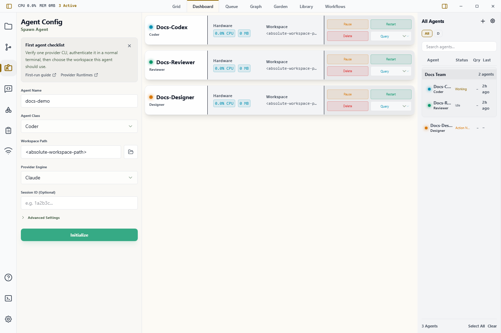
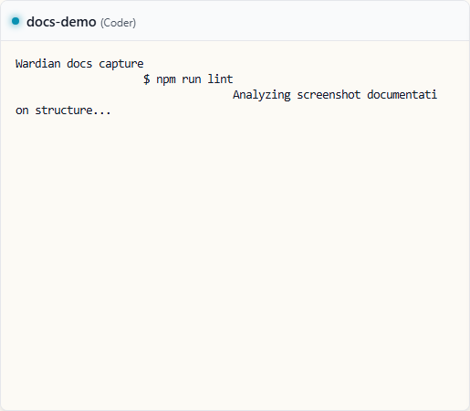
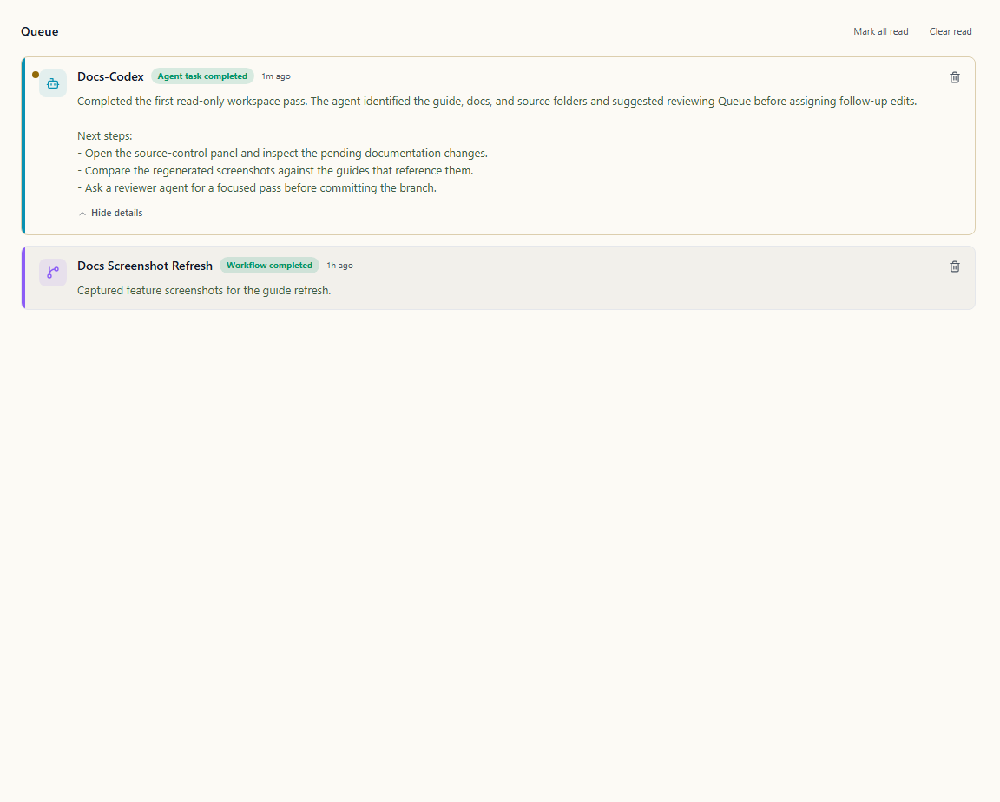

# First-Time Install and First Run

Use this guide to get from a fresh Wardian install to a completed first agent task. It is the canonical beginner path for people who want to run the desktop app rather than develop Wardian itself.

If any first-run step fails, use [First-Run Troubleshooting](./first-run-troubleshooting.md) to recover without switching to developer-only diagnostics.

## 1. Install and Launch Wardian

Use the supported install path for your platform, then launch Wardian from your
operating system.

| System | Install |
| :--- | :--- |
| Windows x64 | `winget install WardianApp.Wardian` |
| macOS Apple Silicon or Intel | `brew install --cask wardian-app/tap/wardian` |
| Linux Debian/Ubuntu x64 | Download `Wardian_X.Y.Z_amd64.deb` from [Releases](https://github.com/wardian-app/Wardian/releases/latest), then run `sudo apt install ./Wardian_X.Y.Z_amd64.deb`. |
| Linux other x64 | Download `Wardian_X.Y.Z_amd64.AppImage` from [Releases](https://github.com/wardian-app/Wardian/releases/latest), then run `chmod +x Wardian_X.Y.Z_amd64.AppImage && ./Wardian_X.Y.Z_amd64.AppImage`. |

Manual downloads are also available from the [Wardian releases page](https://github.com/wardian-app/Wardian/releases/latest).

Choose the asset for your operating system and CPU:

| System | Download asset | Notes |
| :--- | :--- | :--- |
| Windows x64 | `Wardian_X.Y.Z_x64-setup.exe` | Standard Windows installer. |
| macOS Apple Silicon | `Wardian_X.Y.Z_aarch64.dmg` | For M-series Macs such as M1, M2, M3, or M4. |
| macOS Intel | `Wardian_X.Y.Z_x64.dmg` | For older Intel Macs. |
| Linux Debian/Ubuntu x64 | `Wardian_X.Y.Z_amd64.deb` | Installable Debian package. |
| Linux other x64 | `Wardian_X.Y.Z_amd64.AppImage` | Portable Linux app. |

`x64` and `amd64` both mean 64-bit Intel/AMD CPUs. On macOS, Apple Silicon uses `aarch64`, not `x64`. Ignore updater-only assets such as `latest.json`, `.app.tar.gz`, or `.sig` files when installing manually.

Debian/Ubuntu users who want package-manager updates can use the optional
[Wardian APT repository](../developer/package-manager-distribution.md#linux-apt-repository).

### macOS installation details

Official macOS releases built by Wardian's signed release workflow are Developer
ID signed and Apple-notarized. After downloading a DMG:

1. Open the DMG and drag **Wardian** to **Applications**.
2. Eject the DMG.
3. Launch the copy in **Applications**.

Do not launch Wardian directly from the mounted DMG. That location is read-only,
so an in-app update cannot replace the running app. A source-built or older
unsigned app can still show the normal Gatekeeper warning; approve it only when
you built it yourself or otherwise trust its source.

- **Windows:** SmartScreen can show a reputation warning for a new release. Continue only when the installer came from the official Wardian release you intended to install.
- **Linux:** APT installs update through the system package manager. Make the AppImage executable before running it.

```bash
chmod +x Wardian*.AppImage
./Wardian*.AppImage
```

PowerShell:

```powershell
# Windows installer builds normally launch from the Start menu after install.
# Use the downloaded .exe directly only if you intentionally chose a portable build.
.\Wardian*.exe
```

Before the first spawn, verify the provider command, authentication, and shell `PATH` using [Provider Readiness](./provider-readiness.md).

If Wardian will not launch or your provider is not detected after installation, see [First-Run Troubleshooting](./first-run-troubleshooting.md).

## 2. Install One Supported Provider CLI

Wardian runs local provider CLIs inside managed terminals. Install and authenticate at least one provider before spawning an agent:

| Provider | Install command | Basic check |
| :--- | :--- | :--- |
| Antigravity | See the [Antigravity CLI overview](https://www.antigravity.google/docs/cli-overview) | `agy --version` |
| Claude Code | `npm install -g @anthropic-ai/claude-code` | `claude --version` |
| Codex | `npm install -g @openai/codex` | `codex --version` |
| OpenCode | Provider package that exposes `opencode` | `opencode --version` |
| Gemini CLI *(unmaintained)* | `npm install -g @google/gemini-cli` | `gemini --version` |

Run the check from a normal terminal first. If the command is not found there, Wardian usually will not find it either.

## 3. Authenticate Outside Wardian

Start the provider directly once and complete any sign-in prompt before launching it through Wardian.

```bash
agy
claude
codex
opencode
gemini
```

Use only the provider you installed. Exit the provider after it reaches its normal ready state.

PowerShell uses the same provider commands:

```powershell
agy
claude
codex
opencode
gemini
```

If a provider asks you to sign in again inside Wardian, finish that prompt in the agent terminal. For provider-specific runtime details, see [Provider Runtimes](../providers.md).

## 4. Confirm Runtime Settings

Open the **Settings** rail item and confirm Wardian has a usable shell. **Auto** is the right default for most first runs.


If your provider works in one shell but not another, select the shell where the provider command is visible, save the setting, and spawn the agent again. See [Settings](./settings.md) for shell and provider runtime notes.

## 5. Choose a Workspace

Pick the project or folder the agent should work in. Use an absolute path.

```bash
cd <absolute-workspace-path>
pwd
```

PowerShell:

```powershell
Set-Location <absolute-workspace-path>
Get-Location
```

Use the resulting absolute path in the spawn form. Do not use a private credential folder or a provider configuration directory as the workspace.

## 6. Spawn the First Agent

Open the **Agent Configuration** rail item and fill in the spawn form:



1. Choose an agent class, such as **Coder** or **Researcher**. Classes are reusable blueprints; see [Class Management](./class-management.md) for the model and the [Library](./library.md#3-classes) when you want to inspect or customize them.
2. Select the provider you installed and authenticated.
3. Enter a short agent name.
4. Set the workspace to `<absolute-workspace-path>`.
5. Click **Initialize**.

The new agent appears in the right roster and in Agents. If Agents is not open, press `Ctrl+P` / `Cmd+P` and choose **Agents**, or use **Open** on the agent in the roster to create an agent-session tab.



Status colors help you read the first launch:

- **Emerald / Idle:** the agent is ready for an instruction.
- **Cyan / Processing:** the provider is starting or responding.
- **Amber / Action Required:** the provider needs approval or sign-in input.
- **Red / Error:** the provider or shell failed to start.

If the terminal stays blank, exits immediately, or the agent remains stuck in Processing, Off, or Action Required, use the [first-run terminal checklist](./first-run-troubleshooting.md#terminal-does-not-start).

## 7. Send the First Instruction

Click inside the agent terminal to explicitly activate that presentation, then send a small, low-risk instruction:

```text
Summarize this workspace in five bullets. Do not edit files.
```

Use a read-only prompt for the first run. After you trust the provider, you can ask it to inspect files, make changes, run commands, or coordinate with other Wardian agents. If the terminal shows **Mirror** or **Read only**, click inside it before typing to request interaction ownership. Visible renderers restore and fit automatically.

## 8. Review the Result in Queue

When an active agent finishes and returns to Idle, Wardian adds a completion item to **Queue**. Press `Ctrl+P` / `Cmd+P`, or select the **+** button in a Workbench pane, and choose **Queue**. To keep the agent beside Queue, leave Queue active and choose **Open to Side** for that agent in the right roster.



Use Queue to keep completed work from disappearing into terminal scrollback:

- Open unread items first.
- Expand long summaries when needed.
- Mark reviewed items read.
- Clear read items after triage.

See [Queue](./queue.md) for the full triage workflow.

## 9. Check the Wardian CLI

Wardian installs a `wardian` command for agents and automation. With the desktop app running, use a normal terminal to confirm Wardian can list sessions:

```bash
wardian agent list --scope all --fields name,status,workspace
```

PowerShell:

```powershell
wardian agent list --scope all --fields name,status,workspace
```

If the command is not visible in your normal terminal, restart the terminal after installing Wardian. Managed agent terminals receive Wardian's CLI path automatically.

## If the First Run Fails

Start with the visible failure point:

- Provider command not found: verify the provider command works in a normal terminal and that Wardian is using the same shell.
- Provider asks for authentication: complete the provider sign-in flow, then restart the agent.
- Agent stays Off or Error: check the agent terminal output and provider runtime notes.
- Queue stays empty: confirm the agent actually returned from Processing to Idle after producing output.

Related docs:

- [First-Run Troubleshooting](./first-run-troubleshooting.md)
- [Provider Runtimes](../providers.md)
- [Settings](./settings.md)
- [Queue](./queue.md)
- [OS Support](../os-support.md)

## Next Steps

- Learn tabs, splits, restore, and terminal ownership in [Workbench](./workbench.md).
- Monitor several agents with [Agents](./agents-overview.md).
- Learn the persistent shell in [UI Overview](./ui-overview.md).
- Recover from first-run launch, provider, terminal, Queue, and CLI failures in [First-Run Troubleshooting](./first-run-troubleshooting.md).
- Manage reusable prompts, skills, classes, and workflow blueprints in [Library](./library.md).
- Use [Class Management](./class-management.md) for class concepts; edit class instructions and class-level skills from the Library's Classes section.
- Browse your agent's local files in [Explorer](./explorer.md).
- Send one instruction to multiple agents with [Command Panel](./command-panel.md).
- Use the agent-facing [Wardian CLI](./cli.md) for scripted coordination.
- Triage completed work in the [Queue](./queue.md).
- Manage per-agent Git operations in [Source Control](./source-control.md).
- Configure runtime behavior and shell defaults in [Settings](./settings.md).
- Verify provider commands and authentication in [Provider Readiness](./provider-readiness.md).
- Compare provider runtime behavior in [Provider Runtimes](../providers.md).
- Automate complex tasks with [Visual Workflows](./workflows.md).
