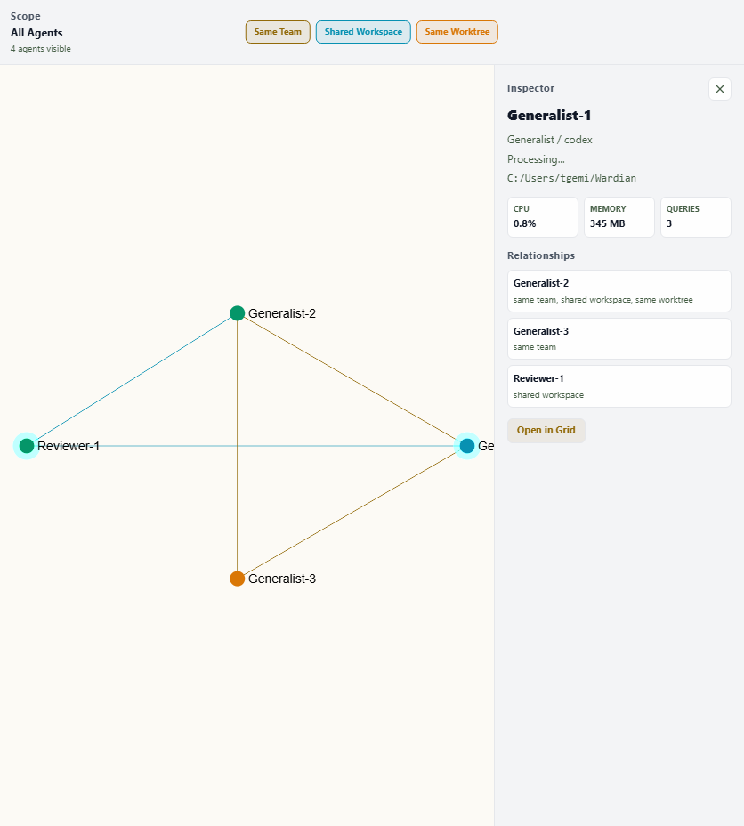

# Graph

The Graph view is the control surface for the communication topology. Use it to build and inspect your agent network: create and delete manual connections between agents, visualize communication activity, and understand the default communication boundaries that shape CLI behavior and agent visibility.



## What the Graph Shows

Each node is an agent. Nodes use status colors (Idle=Emerald, Processing=Cyan, Error=Red, etc.). Edges represent relationships in the communication topology:

**Edge types and textures:**
- **Solid edges**: manual connections (you created them or they were seeded by team membership).
- **Sparse dashed edges**: unmapped ghost connections (recent communication traffic between agents with no manual connection).

**Communication activity (color + motion):**
- **Cyan + directed particles**: ongoing active ask (time-bounded, within the last hour).
- **Light cyan fading**: recent activity that has completed (fades over the hour window).
- **Neutral gray**: dormant edges (full legibility; structure is always visible).

Particles flow in message direction; during a pending ask, the stream drifts toward the agent that owes the reply — direction is the pending-ask indicator.

## Topology & Workspace Fallback

An agent with **no manual edges** automatically sees its workspace-mates (workspace-fallback rule). This ensures fresh agents aren't isolated and newly created teams aren't disconnected. The moment you draw an agent's first manual edge, workspace-fallback disengages — its neighbors become exactly what the graph shows.

The inspector's neighbors panel lists every agent visible through the topology. Persisted connections carry no extra label (they are all manual edges); ghost pairs are badged "Unmapped" until you formalize or dismiss them. The CLI's `--verbose` output still reports the underlying visibility reason (`manual` or `rule:workspace-fallback`).

## Editing: Create and Delete Edges

**Create a connection:**
- Hold Shift and drag from agent A to agent B to draw a manual edge. A rubber-band feedback line appears while dragging.
- Or use **Add connection…** in the inspector's neighbors panel to pick an agent from a searchable list.
- The edge appears immediately and is saved to `<WARDIAN_HOME>/topology.json`.

**Delete a connection:**
- Click an edge to select it, then press Delete — or use the disconnect (×) button on the edge's row in the inspector.
- All edges are manual and deletable. Deleting a team-seeded edge is a permanent delete; reconnecting requires drawing the edge again.

**Ghost edges (unmapped traffic):**
- Recent communication between agents with no manual connection appears as a sparse-dashed edge, and the inspector's neighbors panel labels the pair as "Unmapped communication".
- **Formalize**: write a manual edge to make it a permanent connection.
- **Ignore**: dismiss the ghost so the suggestion stops appearing (dismissals are durable in `topology.json`).

## Inspector and Actions

Select any node to open the inspector with:
- Agent identity, current status, workspace, and telemetry.
- **Neighbors panel**: all agents you see through the topology (manual, team-seeded, workspace fallback); ghost pairs are badged "Unmapped".
- **Add connection…**: searchable picker to create new manual edges.
- Right-click to access the same context menu as the roster and other views.

## Topology Source of Truth

The graph is backed by `<WARDIAN_HOME>/topology.json` (default: `~/.wardian/topology.json`), an inspectable JSON file:

```json
{
  "version": 2,
  "edges": [
    { "a": "agent-uuid-1", "b": "agent-uuid-2", "created_at": "2026-07-02T14:30:00Z" }
  ],
  "ignored_pairs": [
    { "a": "agent-uuid-3", "b": "agent-uuid-4" }
  ]
}
```

Manual edges include connections you created by dragging plus edges seeded when you created or modified teams. You can edit this file directly — the backend watches it and an open Graph view refreshes live — or use the UI, or use the CLI (`wardian graph link/unlink/ignore`, see the [CLI guide](./cli.md#graph)). Edges are undirected and canonicalized (`a < b` lexicographically). When you first launch Wardian after upgrading, existing team memberships are automatically seeded into topology.json, and the version advances to 2.

## Teams and Topology Seeding

When you create a team or add a member to an existing team, Wardian automatically draws manual edges connecting all members of that team (a clique). These are real edges saved to `topology.json` — after seeding, you're free to delete any team-born edge, and it stays deleted even if the team persists. Removing an agent from a team does not delete the edges; connections persist until you explicitly delete them.

On first launch, Wardian seeds all existing team memberships as edges and upgrades `topology.json` to version 2. The CLI sees the same edges without needing the app to run first.

## Graph Layout

The graph positions agents using force-directed layout over communication edges: connected agents settle closer together, while disconnected subgraphs are laid out independently and placed side by side, so unrelated clusters never overlap. Agents with no edges at all form an evenly spaced ring around the connected core. To keep editing calm, node positions are **frozen while you work** — drawing or deleting edges updates the edges immediately but never moves nodes. Press the **Re-run layout** button in the toolbar (next to Reset view) when you're done linking to apply your edits to node positions. The layout also re-runs automatically when agents enter or leave the visible scope. Dormant edges remain fully visible so topology structure is always inspectable — only the *activity* state (recency, particles) varies.

## Legacy Lenses

The three legacy relationship overlays (Same Team, Same Project, Same Folder) remain as read-only lenses in the toolbar, off by default. Toggle them to see derived signals without affecting the topology.

- **Same Project** is the general relation: agents working on the same repository, following git worktrees back to their source — an agent in the main checkout and agents in spawned worktrees of that repo all share a project.
- **Same Folder** is the narrow relation: agents running in the same physical checkout directory (the main checkout is itself a worktree that several agents can share).
