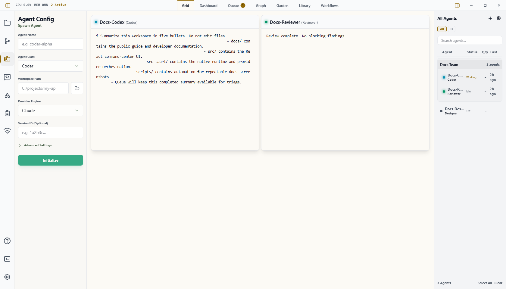
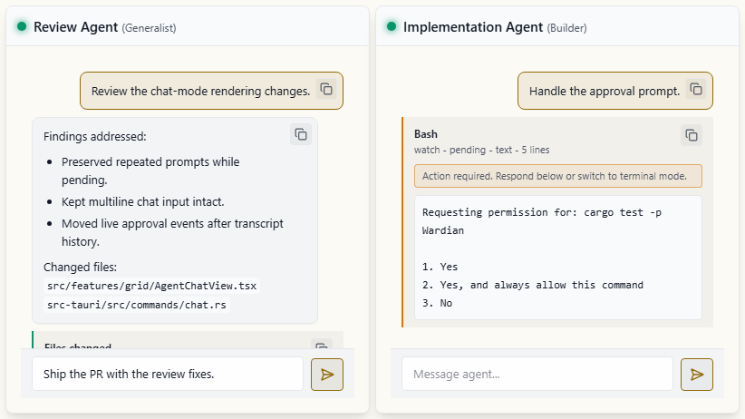

# Grid

The Grid is Wardian's primary live workspace for interacting with active agent cards.

Use it when you need to watch multiple agents at once, type directly into a specific agent, scan normalized agent activity, or keep terminal state visible while agents run.

## When to Use It

- Watch active terminals side by side.
- Scan chat transcripts and activity blocks side by side.
- Type directly into one provider session.
- Reorder agent cards to match the work you are supervising.
- Jump from the roster to the matching terminal.

## Basic Workflow

1. Start with [Getting Started](./getting-started.md) if you have not spawned an agent yet.
2. Click **Grid** in the top workspace tabs.
3. Select one or more agents in the roster when you want sidebar tools to target them.
4. Click inside an agent terminal to type directly to that session.
5. Drag agent cards to reorder the workspace when you need a different visual priority.
6. Double-click an agent in the roster to bring that agent into view.

## Display Modes

Grid cards can render either:

- **Terminal**: the provider terminal/TUI, including raw keyboard control, approvals, and raw output.
- **Chat**: normalized user, assistant, status, tool, approval, and terminal-output events for faster scanning, plus a compact prompt composer for standard text input.

Change this globally in **Settings > Grid > Grid card display**. The setting applies to the entire main Grid view. Card-level overrides are not available yet.

Chat mode sends ordinary text through the same provider submit path used by Wardian's command tools. Use **Enter** to send and **Shift+Enter** for a newline in the composer. Switch back to Terminal mode when you need raw TUI controls, provider-specific keybindings, or detailed terminal behavior.

## Important Limits

- Grid only shows agents that have active or restorable Wardian sessions.
- Chat mode depends on provider transcript/watch data. If a provider does not expose structured activity, Wardian falls back to retained terminal output where possible.
- Action-required prompts can be answered from the chat composer when the provider accepts text input. Terminal mode remains the fallback for provider-specific approval screens.
- Terminal state is preserved across common remounts, but provider TUIs can still repaint after resize or reconnect events.
- Use [Command Panel](./command-panel.md) for repeatable fan-out messages instead of typing the same text into each terminal.

## Related Links

- [Dashboard](./dashboard.md)
- [Watchlists](./watchlists.md)
- [Command Panel](./command-panel.md)
- [Queue](./queue.md)
