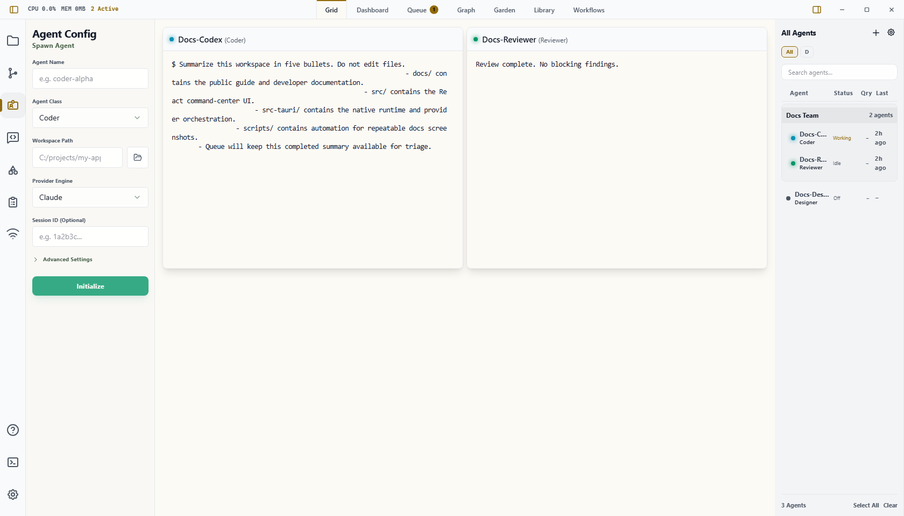

# Grid

Grid is a display mode inside the [Agents](./agents-overview.md) Workbench surface. It is no longer a global page or a title-bar destination.

This compatibility guide preserves the familiar Grid automations and points older instructions to their current location.

## Open Grid Mode

1. Press `Ctrl+P` / `Cmd+P`, or select a pane's **+** button.
2. Open **Agents**.
3. Select **Grid** in the surface header.

Use **Auto** when Wardian should switch between a multi-card grid and a focused single card based on available space. Use **Single** when one focused agent should fill the surface.

## What Grid Mode Keeps

- Live terminal cards side by side.
- Normalized Chat cards with per-agent prompt drafts.
- Drag-to-reorder card headers.
- Manual row and column resizing.
- Per-card **Terminal** / **Chat** switches.
- **Maximize** to focus one agent in Single mode.
- **Reset Grid Layout** in the background context menu.

The default card display comes from **Settings > Agents > Agent card display**. Per-agent overrides remain temporary to the Agents surface.

## What Changed

- To open another app area, open a Workbench surface instead of switching a global view.
- The right roster separates targeting from navigation. Selecting an agent targets auxiliary tools; **Open** or **Open to Side** opens its session.
- Closing the Agents tab closes only the presentation. It does not stop any agent.
- Workbench **Zoom pane** expands one pane. Card **Maximize** changes Agents to Single mode. Neither action maximizes the native application window.

## Terminal and Chat Behavior

Terminal mode uses the provider's real PTY, including raw keys, approvals, TUIs, scrollback, and clickable supported links. Click inside a terminal to explicitly activate that presentation before typing. A mirrored presentation stays read-only until activated.

Chat mode shows normalized user, assistant, status, tool, approval, and terminal-output events. Command-only tool calls with provider lifecycle labels use a compact one-line command summary by default, including labels such as `exec_command_begin`, `exec starting`, `exec running`, and `exec`; command-less lifecycle keepalives are hidden, while named tool titles remain available when they add useful context. Provider boilerplate such as `output` and `Script completed` is merged into its command or hidden when unpaired, even when success metadata is absent, without discarding meaningful output. Expand the surrounding work log or activity details when you need output, diffs, or structured evidence. Use `Enter` to send and `Shift+Enter` for a newline. The composer accepts file-picker selections, native file drops, and filesystem-backed file pastes. Changing its model persists the selection. For a live Codex agent, Wardian applies both model and effort through the interactive `/model` pickers step by step. Other providers and off agents use the saved choice after their next start or restart. Model and effort controls remain unavailable until the operation finishes, so each change is applied in order. Terminal keystrokes received during the Codex picker wait until that transaction finishes instead of changing a picker choice. Switch back to Terminal when you need provider-specific keys or a raw approval screen.

Chat text and attachments remain editable while an agent is processing. With content in the composer, the action submits a queueable message and is labeled **Queue message**; with an empty composer, it remains **Interrupt agent**.

Wardian preserves terminal state across tab changes, pane moves, Agents layout changes, and remote handoff. Reclaimed renderers restore and fit automatically when their presentation becomes visible.

Restoring a live terminal keeps the broker's retained scrollback above the current
screen, including short histories that fit within one viewport. This history is
bounded runtime state; restarting the provider does not restore a terminated
terminal's screen.

## Related Links

- [Agents](./agents-overview.md)
- [Workbench](./workbench.md)
- [Watchlists](./watchlists.md)
- [Command Panel](./command-panel.md)
