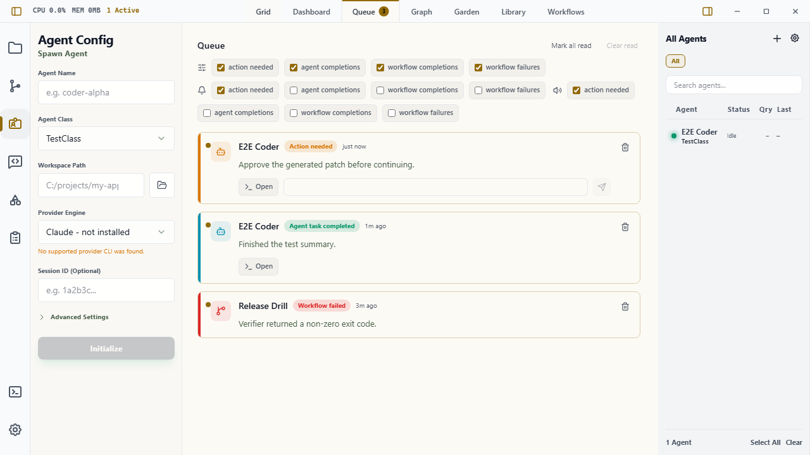

# Inbox

Inbox is Wardian's user-facing space for finished work, important agent updates, and decisions that need your input. It is separate from an agent's **Mailbox**: a Mailbox delivers work to an agent; Inbox brings consequential information back to you.

Use Inbox to review finished work, catch failed automation runs, read an important update, respond to a provider prompt, or decide whether an agent may take a consequential action.



## What Appears in Inbox

Wardian records these items:

- **Work finished**: an agent or automation reached a terminal outcome. For agents, Wardian creates the card only for an explicit provider turn-completed event from a named configured agent, and shows that turn's final provider response. It never turns generic Idle transitions, terminal output, provider control commands, or an unconfigured session ID into a completion card. If Wardian cannot identify a canonical final response, it skips the automatic card.
- **Important update**: an agent explicitly sends a concise user-facing update with `wardian notify update`. Use this for a material result, a significant limitation, or a change that affects the user's next decision.
- **Approval request**: an agent explicitly sends a structured request with `wardian notify approval`. It names the proposed action, why it is risky, the available choices, and an expiry. Provider-native permission prompts remain provider-sourced **Action needed** items.
- **Automation outcome**: an automation completed or failed. Automation approval nodes also project their waiting decision into Inbox; the automation engine remains authoritative for its state and resolution.
- **Action needed**: provider runtime evidence says an agent needs input, such as a provider permission, authentication, selection prompt, or structured question. Structured provider questions show the provider's question text and options as read-only context; use **Open agent** to answer in the provider UI.

Manual approval is intentionally exceptional. Agents should request it only for irreversible, external, security-sensitive, or materially costly actions, or when you explicitly asked for approval. A request must name the action and risk, offers explicit choices, allows only one unresolved request per agent, and expires without proceeding automatically.

## Reading Inbox

Press `Ctrl+P` / `Cmd+P`, select a pane's **+** button, or use the empty-pane Home state, then choose **Inbox**. Unread items appear first and increment the Inbox tab badge. Inbox is a singleton surface, so opening it again focuses the existing tab.

Each item shows its source, agent or automation, time, and summary. Long text is collapsed by default; use **Show details** to expand it.

To keep large histories responsive, desktop and mobile Inbox initially show the
newest cards and load older cards in batches as you scroll to the end of the
list. This only limits what is mounted on screen; it does not discard Inbox
history or change filters, read state, or triage actions.

Use the **Filter** dropdown to choose visible event types:

- Action needed
- Agent completions
- Automation completions
- Automation failures

Inbox preferences persist under the active Wardian home.

## Triage Actions

- Click an item to mark it read.
- Use **Open** on an agent card to open or focus the related agent-session surface.
- Use recognized provider choices only on a provider-sourced **Action needed** card. Structured provider questions are informational Inbox projections: their options do not submit a response, and reading or dismissing the card does not resolve the provider request. Use **Open agent** to answer it in the original provider UI.
- Use the explicit choices on a manual **Approval request** card. Wardian records the decision durably and returns it to the requesting agent; it does not send a free-text response to the provider terminal.
- Use **Approve** or **Reject** on an automation approval card to resolve its waiting gate from Inbox. Wardian records the decision before it continues an approved automation in the background.
- Use **Mark all read**, **Clear read**, or the item trash control for reviewed, non-pending items.

When you choose a provider response, Wardian first sends the response to the
agent and then acknowledges the Inbox card. If the response is sent but the
acknowledgement fails, the card says **Response sent** and offers **Retry Inbox
status**. Retrying the status does not send the provider response again. The
sent choice is recorded with the Inbox item, so reloading the mobile Inbox also
keeps that response disabled and exposes the status retry.

If the host cannot confirm whether the provider received the choice, the card
shows **Response delivery is uncertain** and keeps the choice disabled. Check
the agent session before taking any further action; Wardian does not resend a
potentially consequential response automatically, and the item cannot be
dismissed while its recovery state is unresolved.

The mobile Inbox includes the same triage actions: choose an event filter, tap
an item to acknowledge it, mark all eligible items read, clear reviewed legacy
items, or dismiss an individual legacy item. Agent action choices and pending
approval choices remain available on their cards. Use **Open agent** to jump to
the related mobile agent session without leaving Inbox.

An unresolved approval cannot be cleared or dismissed. When it expires, the agent must not treat the absence of a response as approval.

If the desktop Inbox saves before its load baseline is available, Wardian keeps
the latest persisted projection authoritative. This prevents a stale desktop
snapshot from resurrecting an item dismissed from another surface.

**Clear read** removes read completion items, including automation outcomes. A
cleared automation run keeps a small local triage marker so the durable automation
history remains intact without recreating the Inbox card on the next refresh.
Durable notification history and read **Action needed** prompts remain visible,
and the control is disabled when there are no completion items to clear.

## Agent Read and Write Paths

Agents have a read path and a write path. Read the shared Inbox projection
before deciding whether another update or action is needed:

```bash
wardian inbox list
wardian inbox list --unread --type action_needed,approval_request \
  --source provider_runtime,interaction_store
```

PowerShell:

```powershell
wardian inbox list
wardian inbox list --unread --type action_needed,approval_request `
  --source provider_runtime,interaction_store
```

The result is newest first and includes a schema, item type, read state,
timestamp, and evidence source. Use `--limit` and `--offset` for bounded
polling. The read command is side-effect-free; it does not mark, dismiss, or
resolve an item. If the desktop app is unavailable, the CLI uses persisted
queue items, durable notification records, and workflow-run checkpoints for
awaiting approvals and terminal outcomes.

From a Wardian-managed agent session, use the write path rather than writing a
terminal message that looks like a request:

```bash
wardian notify update "Implemented the migration and found one compatibility risk" \
  --title "Inbox refactor"

wardian notify approval "Deploy the release" \
  --title "Deploy production" \
  --action "Run the production deployment" \
  --risk "This changes live traffic and may require rollback" \
  --choice "Deploy" \
  --choice "Do not deploy" \
  --wait
```

PowerShell:

```powershell
wardian notify update "Implemented the migration and found one compatibility risk" --title "Inbox refactor"

wardian notify approval "Deploy the release" --title "Deploy production" --action "Run the production deployment" --risk "This changes live traffic and may require rollback" --choice "Deploy" --choice "Do not deploy" --wait
```

`notify update` is for a concise, important human summary; ordinary progress remains in the agent transcript. `notify approval --wait` blocks until your decision or expiry, then reports the structured outcome to the calling agent. See the [CLI guide](./cli.md) for the full command reference.

## Evidence and Persistence

Inbox cards are projections of canonical runtime, automation, and interaction evidence. Completion and provider action-needed projections can carry stable `evidence_id` and `evidence_source` values to avoid duplicates during refreshes or terminal repaint. Durable `notify` updates and approvals use Wardian's interaction store, not the frontend completion cache.

Startup hydration can restore existing Inbox records, statuses, interactions, and provider input state, but must not create new completion or action-needed evidence. Existing Queue preferences and cards migrate to Inbox when Wardian loads them.

## Alerts and Limits

Inbox alert preferences live in **Settings > Inbox** and are per event type. Desktop and sound alerts are enabled by default only for **Action needed**; passive completions and updates stay quiet unless you opt in.

- Items older than seven days are ignored by the legacy completion projection when it loads.
- CLI Inbox reads use the same seven-day cutoff and a bounded 200-item source page; a `truncated` result includes `next_offset` for older data.
- Automatic completion cards use only a canonical final provider response. Open the source session or ask the agent for a summary when no automatic card appears.
- Provider approval-looking text does not create generic manual choices. Wardian shows buttons only for explicit provider choices or a structured `notify approval` request.
- Clearing read items removes the completion projection for the active Wardian home. Durable notify history and automation state retain their own lifecycle; cleared automation run identities are retained only as Inbox triage markers.

## Related Links

- [Getting Started](./getting-started.md)
- [Workbench](./workbench.md)
- [Agents](./agents-overview.md)
- [Wardian CLI](./cli.md)
- [Automations](../automations/index.md)
