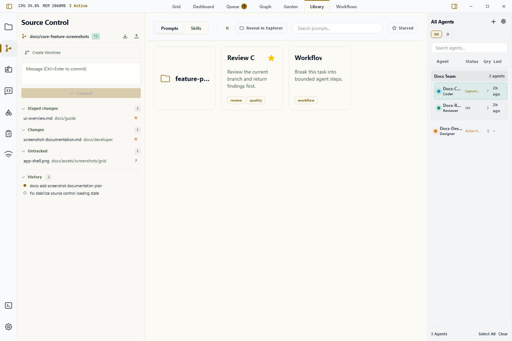

# The Library System

The Library is the centralized repository for reusable prompts and skills in Wardian. It stores the actions and capabilities you want agents to reuse across sessions.

Use it when you want to save repeatable prompts, manage reusable skills, or prepare assets that classes and agents can reuse.

The Library is also the first step on Wardian's gentle slope from use to
creation. A one-off instruction can become a saved prompt; a repeated procedure
can become a skill; a skill can be deployed globally, by class, or to one agent
without turning the whole app into a custom plugin project.

## When to Use It

- Turn a repeated instruction into a prompt instead of rewriting it in terminals.
- Star operational prompts so they appear in the [Command Panel](./command-panel.md).
- Deploy skills globally, by class, or to a specific active agent.
- Prepare prompts or skills before spawning a new agent from [Getting Started](./getting-started.md).

## Basic Workflow

1. Click **Library** in the top workspace tabs.
2. Choose **Prompts** or **Skills**.
3. Create or edit the asset you need.
4. Star prompts that should appear in Command.
5. Deploy skills to the right scope, or select a prompt and run it against selected agents.

## Library Sections

### 1. Prompts

Prompts are reusable text injections that you can send directly to an agent's terminal.

- **Organization**: Prompts are stored as `.md` files in `<wardian-home>/library/prompts/`. You can organize them into physical folders on your disk.
- **Quick Injection**: "Star" your favorite prompts to make them appear in the **Command** sidebar tab for one-click execution.
- **Dynamic Context**: Use prompts to quickly set up environments, run test suites, or provide complex task instructions.

### 2. Skills

Skills are modular capabilities (extensions) that can be deployed to your agents or classes.

- **Physical Deployment**: Unlike a simple configuration toggle, skills in Wardian use **Windows Junction Points** or Unix symlinks. If link creation fails, Wardian falls back to a recursive copy.
- **Live Sync**: When you edit a skill's source code in the Library, every agent or class that has that skill linked will receive the update instantly unless that deployment used the fallback copy path.
- **Target Scopes**:
  - **Global**: Deploys the skill to all agents.
  - **Class**: Deploys the skill to a specific blueprint (e.g., all future `Coder` agents).
  - **Instance**: Deploys the skill only to one specific, active agent session.

These scopes let you reshape Wardian incrementally. Keep an experimental skill
on one agent, promote it to a class when it becomes routine, or deploy it
globally only when it is ready for every agent.

### Class Relationship

Classes are managed from the separate [Class Management](./class-management.md) panel. Use the Library to maintain the skills that classes can receive, then assign those skills from the Classes panel.

## Key Interactions

### Managing Assets

- **Right-Click**: Use the context menu on any item to **Delete**, **Rename**, or **Reveal in System Explorer**.
- **Metadata Editor**: Click an item to open the editor. Here you can add **Tags** for easy searching and toggle the **Star** status for favorite items.

### Running Prompts

To run a prompt from the Library:

1. Select one or more agents in the **Roster** (Right Sidebar).
2. Find the prompt in the **Library**.
3. Click the **Run** icon (Play button). The prompt text will be flattened into a single line and sent to the selected terminals automatically.

## Important Limits

- Prompt runs are terminal input, not a background job system. Check the target agent selection before running them.
- Skill deployments may use links or fallback copies depending on platform support and filesystem permissions.
- Class editing happens in [Class Management](./class-management.md), not in the Library view.
- Use [Provider Runtimes](../providers.md) when skill visibility differs by CLI provider.

## Provider Skill Discovery

Wardian adapts the same assigned skills to each provider's native discovery model:

- Gemini uses Wardian's Gemini patch so `--include-directories` can expose common, class, and agent skill roots.
- Claude uses additional instruction roots and `.claude/skills` links where provider-native discovery requires them.
- Codex receives scoped skills in the agent-specific `CODEX_HOME/skills` habitat.
- OpenCode receives scoped skills through Wardian's generated OpenCode config directory.

If Gemini skills are missing, ensure **Auto-patch Gemini CLI** is enabled in the **Settings** panel or run the patch manually. For other providers, start with the provider comparison in [Provider Runtimes](../providers.md).

## Related Links

- [Class Management](./class-management.md)
- [Command Panel](./command-panel.md)
- [Watchlists](./watchlists.md)
- [Provider Runtimes](../providers.md)
