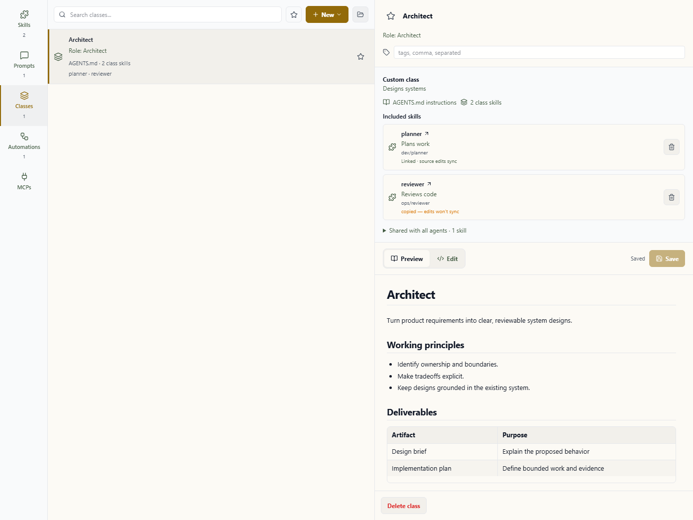

# The Library System

The Library is the single home for everything reusable in Wardian: skills,
prompts, classes, and automation blueprints. It stores the capabilities and
context you want agents to reuse across sessions, and it is where you deploy
those capabilities into the scopes that need them.

Use it when you want to save a repeatable prompt, manage a deployable skill,
edit a class's `AGENTS.md`, or find an automation blueprint before launching a
run.

The Library lets you start small and reuse what proves useful. A one-off
instruction can become a saved prompt; a repeated procedure can become a
skill; and a skill can be shared with every agent, a class, or one agent.

For a visual map of how prompts, skills, classes, and automations relate, see
[Key Concepts](./key-concepts.md#reusable-work).

## When to Use It

- Turn a repeated instruction into a prompt instead of rewriting it in terminals.
- Star operational prompts so they appear in the [Command Panel](./command-panel.md).
- Deploy skills globally, by class, or to a specific active agent, and see at a
  glance which items are already deployed.
- Edit a class's instructions and manage its deployed skills in one place.
- Find an automation blueprint before launching a run from the [Automations view](./automations.md).

## Layout: Rail, List, Detail

Open **Library** from a pane's **+** menu or Quick Open palette. It is a
self-contained three-pane surface that does not replace the global left sidebar:

- **Section rail** — a slim vertical strip on the left with one icon-and-label
  button per section (Skills, Prompts, Classes, Automations, MCPs) and a count
  badge showing how many entries live in each. Click a section to switch to it.
- **List** — the middle pane. It shows the active section's contents as
  collapsible folder groups (browsing) or a flattened, ranked list of matches
  (searching). Its toolbar has a search box, a starred-only filter, a **New**
  menu (new item / new folder), and a reveal-in-file-manager shortcut.
- **Detail pane** — the right pane. Selecting a row opens a Markdown preview and
  a panel specific to that entry's kind (skill, prompt, class, or automation).
  There are no more modals: everything you need to inspect or change an entry
  happens in this pane.

## Library Sections

### 1. Skills

Skills are modular capabilities (extensions) that can be deployed to your
agents or classes.

- **Organization**: skills are stored as `SKILL.md` files under
  `<wardian-home>/library/skills/`, organized into folders. Folders in the
  list are collapsible; a skill's description comes from its YAML
  frontmatter (`description:`), falling back to the first line of content
  when frontmatter is missing or malformed.
- **Physical deployment**: skills are deployed using native directory links
  (Windows junctions, Unix symlinks) rather than a configuration toggle. If
  link creation fails, Wardian falls back to a recursive copy plus a source
  marker file so the deployment is still tracked.
- **Live sync**: when you edit a skill's source in the Library, every linked
  deployment picks up the change instantly. A deployment created via the copy
  fallback does not — see the copied-badge note below.

### 2. Prompts

Prompts are reusable text injections that you send directly to one or more
agents' terminals.

- **Organization**: prompts are stored as `.md` files in
  `<wardian-home>/library/prompts/`, and can be organized into folders the
  same way skills are.
- **Quick injection**: star a prompt to make it appear in the **Command**
  sidebar tab for one-click execution.
- **Running a prompt**: select one or more agents in the **Roster** (right
  sidebar), open the prompt in the Library, and click **Run** in the detail
  pane. The prompt body is flattened to a single line and sent to every
  selected agent's terminal. The Run button is disabled with a tooltip if no
  agent is selected.

### 3. Classes

Classes — Wardian's reusable starting setups for agents — are now edited from inside
the Library instead of a separate sidebar panel.

- **Organization**: classes are flat (no folder nesting) and appear under
  `<wardian-home>/classes/<Name>/`.
- **Class workbench**: opening a class shows its `AGENTS.md` in the same
  inline editor every other section uses, plus:
  - the list of skills currently deployed to the class, with the same
    linked/copied indication skills show elsewhere, and a per-skill remove
    control;
  - provider defaults (default vs. custom class, and its description);
  - **Reset to default** for built-in classes, or **Delete class** for custom
    ones.
- Spawning an agent from a class still happens from the agent spawn flow, not
  from the Library.

### 4. Automations

Automation **blueprints** live in the Library; automation **runs** do not.

- **Organization**: blueprints are stored as `.md` files under
  `<wardian-home>/library/automations/`.
- **Editing**: the detail pane opens the same inline markdown editor as other
  sections, plus a **Launch Run** button that resolves the blueprint on disk
  and opens the run-launch dialog.
- **Observation stays in Automations**: monitoring an in-progress or completed
  run, history, and scheduling still live in the [Automations view](./automations.md).
  Use **Open in Automations view** from a blueprint's detail pane to jump there.

### 5. MCPs (stub)

The MCPs section exists in the rail today as a placeholder for a future
feature: defining an MCP server once and deploying it to agents and classes
with the same scoping skills use. It ships empty and read-only in this
release — selecting it shows an explanatory stub instead of a list or editor.
No `library/mcps` directory is created until the real feature lands.

## Agent CLI Access

Agents can use `wardian library` to inspect and edit reusable Library assets
from a terminal without opening the desktop app:

```bash
wardian library list --flat
wardian library list skills --flat
wardian library show prompts/review.md --content
wardian library read classes/Reviewer
wardian library create skills/review/planner --stdin
wardian library write prompts/review.md --file <prompt-file.md>
wardian library tags prompts/review.md --set review --set daily
wardian library deploy skills/review/planner --targets user:global,class:Reviewer,agent:<agent-id>
wardian library deploy skills/review/planner --clear
wardian library orphans
wardian library restore-default classes/Reviewer
```

`read` emits raw markdown for the entry. `show` emits JSON metadata and
resolved paths, with optional content via `--content`. `list --flat` emits only
entry rows; without a section it combines every section. Prompt and automation
refs must end in `.md`, and a skill cannot contain another skill.

`deploy --targets` deduplicates and reconciles the supplied non-empty target
list as the complete desired deployment set for that skill; class and agent
targets must already exist. Use explicit `deploy --clear` to remove every
deployment. Empty `--targets` remains invalid. Default class definitions and
instruction files initialize automatically on first CLI class access.

Library class commands author class definitions; they do not assign a class to
an existing agent. With the desktop app running, use
`wardian agent update <name-or-uuid> --class <ClassName>` to update live and
persisted agent state.
The response tells you whether the provider process must be restarted before it
uses the new instructions. The same command accepts
`--workspace <absolute-workspace-path>` when an ordinary agent's workspace
folder was moved or renamed. Managed worktrees remain on the
`wardian agent worktree` surface.

Library automation commands author blueprint files only. Use the `wardian
automation` namespace to validate, parse, normalize, execute, schedule, or
inspect automation runs.

## Folder Organization and Drag-to-Move

Skills, prompts, and automations can be organized into folders on disk:

- Use **New → New folder** in the list toolbar to create one.
- Drag a row onto a folder's header to move that entry into the folder. A
  drop onto the entry's current folder is a no-op.
- Browsing shows folders collapsed by default; click a folder header to
  expand or collapse it.
- Searching flattens the section into ranked matches (name, then
  description, then tags, then content) and shows each match's folder path
  as a subtitle instead of grouping by folder.

Classes do not have folders — the classes list is always flat.

## Deploying Skills from the Detail Pane

Opening a skill shows its deployment targets below the document. Choose
**Add target…** to search the global user profile, classes, and persisted agents.
Select a target to deploy the skill, or use a target chip's remove control to
remove that deployment.

- **Deployed and healthy** — the list row shows an emerald `●<n>` badge with
  the deployment count once a skill has at least one target.
- **Copied — edits won't sync** — if a target's link could not be created
  (for example, restricted filesystem permissions) Wardian fell back to a
  recursive copy. That target's row in the deploy-targets checklist shows an
  amber "copied — edits won't sync" note, because further edits to the
  skill's source will not propagate to that target.
- **Orphaned deployments** — a deployment whose source skill can no longer be
  resolved (renamed away, deleted, or otherwise unmatched) shows up as drift:
  an amber warning badge appears next to any skill in the list whose name
  matches an unresolved deployment, so the mismatch stays visible instead of
  silently rotting.

You can also drag a skill row directly onto another skill's open
deploy-targets control to jump straight to configuring that skill's
deployments.

## Editing and Saving

Documents open in **Preview**, using the same Markdown presentation as Files:
headings, tables, task lists, expandable sections, and code blocks with copy
controls. Frontmatter stays available under **Document metadata**. Local file
references are shown as text; use **Open in local file system** to inspect their
files. External links open in your browser.

Choose **Edit** to work on the full Markdown source, including frontmatter.
Switch back to **Preview** to inspect the current draft without saving it.

- **Save**, **Ctrl+S** (or **Cmd+S** on macOS) saves. There is no autosave — skills are
  live-linked into running agent sessions, so a half-typed autosave could
  propagate instantly to a deployed target.
- A dirty indicator and "Unsaved changes" label show while the draft differs
  from the last saved/loaded content.
- Switching to a different entry while the draft is dirty prompts to discard;
  declining keeps you on the dirty entry.
- If the file changes on disk while you have unsaved edits, a conflict bar
  offers **Reload** (discard your draft, adopt the on-disk content) or **Keep
  mine** (dismiss the warning and keep editing; a fresh external change will
  show the warning again).

## Managing Entries

Class rows show their instruction file, class skill count, and a summary of
included skill names. Opening a class shows **Included skills** above its
instructions, with descriptions, source paths, and linked/copied status. Select
a skill name to inspect it. **Shared with all agents** lists global deployments
separately; unresolved class deployments remain visible as warnings. This view
reflects the Library deployment index; class instructions remain owned by the
class's `AGENTS.md` file on disk.



- **Rename**: the detail header's rename control also moves the entry (a
  rename to a different folder path is the same underlying operation as a
  drag-to-move). Classes cannot be renamed from here since their name is
  referenced elsewhere in the app.
- **Delete**: the detail header's delete control removes the entry after
  confirmation. Classes are deleted from the class workbench's own
  **Delete class** control instead, so the class's directory and its
  `reset-to-default` behavior stay consistent.
- **Tags and star**: every entry has a tag editor and a star toggle in the
  detail header, and a matching star toggle on its list row.
- **Reveal**: use the toolbar's reveal shortcut to open the active section's
  folder in your system file manager.

Deleting or renaming a deployed skill cleans up (or re-creates) its
deployments as part of the same operation, so links never dangle.

## Important Limits

- Prompt runs are terminal input, not a background job system. Check the
  target agent selection before running one.
- Skill deployments may use links or fallback copies depending on platform
  support and filesystem permissions; check the copied-badge note if edits
  stop propagating to a target.
- Automation runs, history, and scheduling live in the
  [Automations view](./automations.md), not the Library.
- The MCPs section is a stub in this release; there is nothing to configure yet.
- Use [Provider Runtimes](../providers.md) when skill visibility differs by CLI provider.

## Provider Skill Discovery

Wardian adapts the same assigned skills to each provider's native discovery model:

- Antigravity receives Wardian skill and instruction roots through repeated `--add-dir` arguments.
- Claude uses additional instruction roots and `.claude/skills` links where provider-native discovery requires them.
- Codex receives scoped skills in the agent-specific `CODEX_HOME/skills` habitat.
- OpenCode receives scoped skills through Wardian's generated OpenCode config directory.
- Pi receives common, class, and agent skill roots through repeated `--skill` arguments.
- Gemini uses Wardian's Gemini patch so `--include-directories` can expose common, class, and agent skill roots.

If Gemini skills are missing, ensure **Auto-patch Gemini CLI** is enabled in the **Settings** panel or run the patch manually. For other providers, start with the provider comparison in [Provider Runtimes](../providers.md).

## Related Links

- [Command Panel](./command-panel.md)
- [Automations](./automations.md)
- [Watchlists](./watchlists.md)
- [Provider Runtimes](../providers.md)
