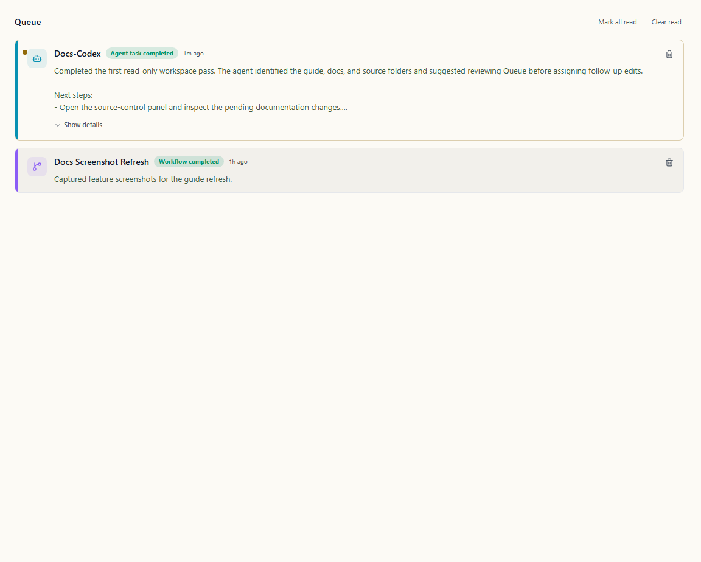

# Queue

The Queue is Wardian's app-level triage surface for completed work. It is separate from the workflow engine: agents and workflows can produce outcomes, and the Queue keeps those outcomes visible after the originating terminal or workflow run has moved on.

Use it when you need to review finished work, catch failed workflow runs, or return to unread outcomes after switching away from the originating agent.

## When to Use It

- Review agent completions after working in [Grid](./grid.md), [Command Panel](./command-panel.md), or the [Wardian CLI](./cli.md).
- Triage workflow completions and failures from the [Workflow View](./workflows.md).
- Keep unread outcomes visible while you inspect files, source control, or follow-up terminals.

## What Appears in the Queue

Wardian currently records two item types:

- **Agent task completed**: added when an agent that was active returns to Idle. Wardian uses captured provider or terminal output when available; otherwise it records a generic completion summary.
- **Workflow completed** or **Workflow failed**: added when the app receives a final workflow run status. If the workflow produced text output, Wardian can use that as the queue summary.

The Queue is not yet the full human-in-the-loop approval system from the roadmap. Provider approval prompts still surface through agent status and provider-specific UI behavior. The current Queue is for completion review and failure triage.

## Reading Queue Items

Open **Queue** from the top workspace tabs. Unread items appear at the top and increment the Queue tab badge.

Each item shows:

- source type and status
- agent name or workflow name
- relative completion time
- summary text or failure details

Long summaries are collapsed by default. Use **Show details** to expand them, or **Hide details** to collapse them again.

## Triage Actions

- Click an item to mark it read.
- Use **Mark all read** when the full queue has been reviewed.
- Use **Clear read** to remove reviewed items.
- Use the trash icon on an individual item to dismiss it immediately.

Queue items are persisted under the active Wardian home, so unread work survives app restarts. Items older than seven days are ignored when the Queue loads.

## Practical Workflow

1. Let agents or workflows run from the Grid, Command Panel, CLI, or Workflow view.
2. Watch the Queue badge for new completions.
3. Open Queue, review summaries, and expand details when the summary was truncated.
4. Follow up in the source agent terminal, workflow run, or repository if the item needs action.
5. Mark reviewed items read and clear them when they are no longer needed.

## Important Limits

- Queue is for completed outcomes, not live provider approvals or interactive prompts.
- Items older than seven days are ignored on load.
- A generic "Completed" summary means Wardian did not capture a provider-specific final answer for that transition.
- Clearing read items removes them from the visible queue for the active Wardian home.

## Related Links

- [Getting Started](./getting-started.md)
- [Grid](./grid.md)
- [Command Panel](./command-panel.md)
- [Wardian CLI](./cli.md)
- [Workflows](../workflows/index.md)
