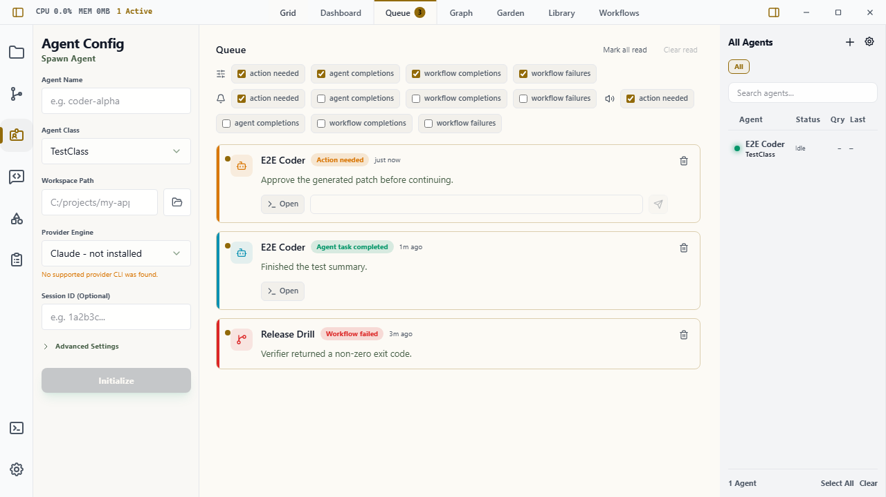

# Queue

The Queue is Wardian's app-level triage surface for completed work. It is separate from the workflow engine: agents and workflows can produce outcomes, and the Queue keeps those outcomes visible after the originating terminal or workflow run has moved on.

Use it when you need to review finished work, catch failed workflow runs, respond to agents that need input, or return to unread outcomes after switching away from the originating agent.

## When to Use It

- Review agent completions after working in [Grid](./grid.md), [Command Panel](./command-panel.md), or the [Wardian CLI](./cli.md).
- Triage workflow completions and failures from the [Workflow View](./workflows.md).
- Keep unread outcomes visible while you inspect files, source control, or follow-up terminals.

## What Appears in the Queue

Wardian records these item types:

- **Agent task completed**: added when an agent that was active returns to Idle. Wardian uses captured provider or terminal output when available; otherwise it records a generic completion summary.
- **Workflow completed** or **Workflow failed**: added when the app receives a final workflow run status. If the workflow produced text output, Wardian can use that as the queue summary.
- **Action needed**: added when an agent moves from another known status into Action Needed. Use it for approval prompts, blocked tasks, or provider requests that need a human response.

Workflow failures are filterable separately from successful workflow completions, even though both are workflow outcome cards.

## Reading Queue Items

Open **Queue** from the top workspace tabs. Unread items appear at the top and increment the Queue tab badge.

Each item shows:

- source type and status
- agent name or workflow name
- relative completion time
- summary text or failure details

Long summaries are collapsed by default. Use **Show details** to expand them, or **Hide details** to collapse them again.

Use the **Filter** dropdown in the Queue header to choose which event types are visible:

- Action needed
- Agent completions
- Workflow completions
- Workflow failures

These preferences persist under the active Wardian home.

## Triage Actions

- Click an item to mark it read.
- Use **Open** on an agent card to focus the related agent terminal when the session still exists.
- Use the response buttons on an **Action needed** card when Wardian recognizes provider choices such as `1. Yes` or `2. No`.
- Use **Open** when the action request needs context, editing, or a response format Wardian cannot infer safely.
- Use **Mark all read** when the full queue has been reviewed.
- Use **Clear read** to remove reviewed items.
- Use the trash icon on an individual item to dismiss it immediately.

Queue items are persisted under the active Wardian home, so unread work survives app restarts. Items older than seven days are ignored when the Queue loads.

## Alerts

Queue alert preferences live in **Settings > Queue** and are per event type:

- Desktop alert
- Sound alert

By default, desktop and sound alerts are enabled only for **Action needed**. Passive completions and workflow outcomes stay quiet unless you opt in.

Desktop alerts use the operating system notification surface when the WebView has notification permission. Sound alerts play a short local tone. If either capability is blocked by system policy, the Queue still records the item.

## Practical Workflow

1. Let agents or workflows run from the Grid, Command Panel, CLI, or Workflow view.
2. Watch the Queue badge for new completions.
3. Open Queue, review summaries, and expand details when the summary was truncated.
4. Open the source agent terminal or choose a visible response button when an Action needed card appears.
5. Mark reviewed items read and clear them when they are no longer needed.

## Important Limits

- Items older than seven days are ignored on load.
- A generic "Completed" summary means Wardian did not capture a provider-specific final answer for that transition.
- Generic approval-looking text does not create response buttons. Queue only shows buttons when it can read explicit choices from the provider text.
- Clearing read items removes them from the visible queue for the active Wardian home.
- Desktop and sound alerts depend on operating system and WebView permissions.

## Related Links

- [Getting Started](./getting-started.md)
- [Grid](./grid.md)
- [Command Panel](./command-panel.md)
- [Wardian CLI](./cli.md)
- [Workflows](../workflows/index.md)
