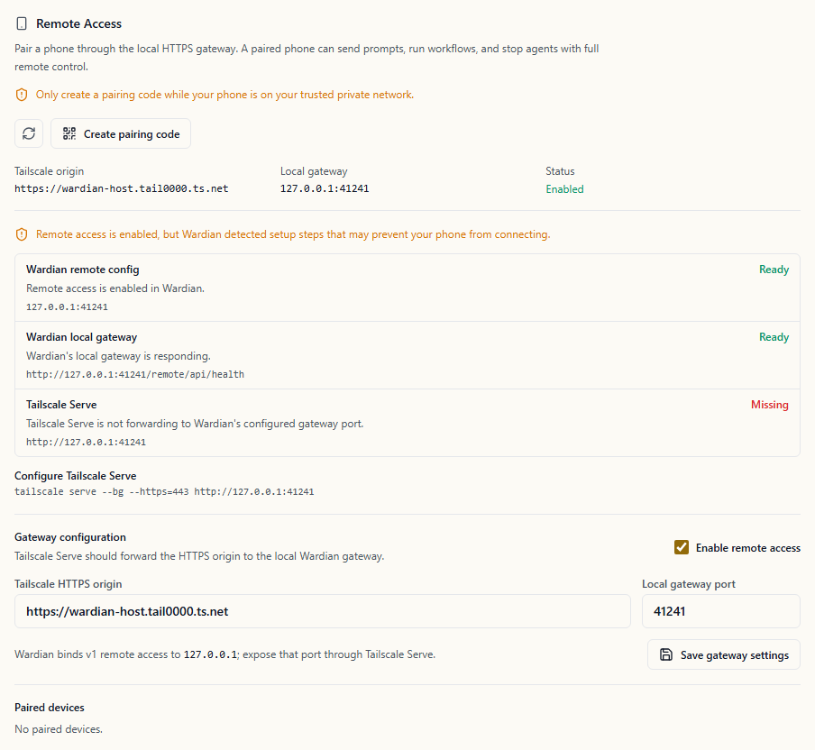
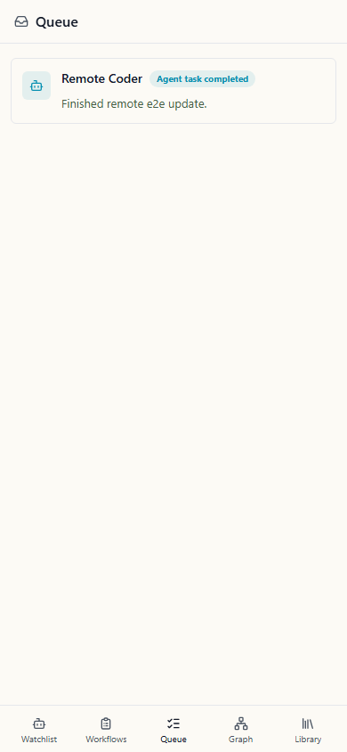

# Remote Control

Wardian Remote lets a paired phone control the Wardian desktop app over a
trusted private-network HTTPS origin. The desktop remains the host for agents,
workflows, filesystem access, provider CLIs, PTYs, and telemetry.

## Requirements

- Wardian desktop running on the host computer.
- Tailscale installed and signed in on the Wardian host and the phone.
- MagicDNS and HTTPS certificates enabled for the tailnet.
- A trusted HTTPS origin such as `https://<machine>.<tailnet>.ts.net`.
- Remote access configured to bind only to the Wardian loopback gateway.

Use Tailscale Serve, not Tailscale Funnel, for the v1 remote-control path.
Serve keeps Wardian private to devices in the tailnet. Funnel publishes a
service to the public internet and is outside the v1 security model.

## Set Up Tailscale

1. Install Tailscale on the computer running Wardian.
2. Install Tailscale on the phone that will become the remote control.
3. Sign both devices in to the same tailnet.
4. Confirm both devices are online in the Tailscale admin console or from the
   Wardian host:

   ```bash
   tailscale status
   ```

   PowerShell:

   ```powershell
   tailscale status
   ```

5. Open the Tailscale admin console and enable HTTPS certificates for the
   tailnet. Follow Tailscale's current guide:
   [Set up HTTPS certificates](https://tailscale.com/docs/how-to/set-up-https-certificates).

Tailscale requires MagicDNS for tailnet HTTPS names. Tailscale's HTTPS
certificate setup also notes that issued certificate names are recorded in
Certificate Transparency logs, so rename the Wardian host first if the machine
name reveals anything sensitive.

## Get the HTTPS Origin

Wardian needs the canonical HTTPS origin for the host computer, not the local
loopback URL. The origin usually has this form:

```text
https://<machine>.<tailnet>.ts.net
```

You can get the DNS name from the Tailscale admin console by opening the
Wardian host on the Machines page. You can also read it from the host CLI:

```bash
tailscale status --json | jq -r '.Self.DNSName' | sed 's/\.$//'
```

PowerShell:

```powershell
((tailscale status --json | ConvertFrom-Json).Self.DNSName).TrimEnd(".")
```

Prefix the resulting DNS name with `https://` before entering it in Wardian.
For example, if the DNS name is `desktop.tailb6e29a.ts.net`, the Wardian origin
is:

```text
https://desktop.tailb6e29a.ts.net
```

If you expose Wardian on a non-default Tailscale HTTPS port, include that port
in the origin, such as `https://desktop.tailb6e29a.ts.net:8443`. Use port 443
unless you have a specific reason to expose another HTTPS port.

## Forward Wardian Through Tailscale Serve

1. Open Wardian on the host computer.
2. Open Settings, then Remote Access.
3. Enter the Tailscale HTTPS origin.
4. Leave the local gateway host as `127.0.0.1`.
5. Use the displayed local gateway port as `<wardian-gateway-port>`.
6. Enable remote access and save the gateway settings.
7. On the Wardian host, forward the local gateway through Tailscale Serve:

   ```bash
   tailscale serve --bg --https=443 http://127.0.0.1:<wardian-gateway-port>
   ```

   PowerShell:

   ```powershell
   tailscale serve --bg --https=443 http://127.0.0.1:<wardian-gateway-port>
   ```

8. Verify the Serve configuration:

   ```bash
   tailscale serve status
   ```

   PowerShell:

   ```powershell
   tailscale serve status
   ```

9. From another device signed in to the same tailnet, open
   `https://<machine>.<tailnet>.ts.net/remote`.

If Tailscale Serve prompts you to enable HTTPS or approve Serve capabilities,
complete that browser flow and rerun the command. Tailscale Serve forwards the
HTTPS origin to Wardian's loopback gateway; Wardian itself must still bind only
to `127.0.0.1`.

To remove the forwarding rule later:

```bash
tailscale serve --https=443 off
```

PowerShell:

```powershell
tailscale serve --https=443 off
```

## Pair the Phone

1. Open Settings.
2. Open Remote Access.
3. Confirm the Tailscale HTTPS origin and local gateway port are saved.
4. Create a pairing code.
5. On the phone, open the camera or browser while Tailscale is connected.
6. Scan the pairing code or open the pairing URL.
7. Confirm that the phone opened the expected
   `https://<machine>.<tailnet>.ts.net/remote` origin.
8. Approve the pending device in Wardian on the desktop.
9. Keep Tailscale connected on the phone and use the remote app from the
   browser.

The pairing code is short-lived and single use. The phone generates its own
device key during pairing, then waits for explicit desktop approval before it
can create a remote session.

Wardian starts the local remote gateway after remote access is enabled. The
Remote Access settings panel also checks the parts Wardian can safely inspect:
whether the local gateway responds, whether the Tailscale CLI is available,
whether this desktop appears signed into Tailscale, whether Tailscale Serve
forwards the HTTPS origin to Wardian's loopback port, and whether the HTTPS
gateway responds.

Wardian does not automatically change Tailscale Serve, Funnel, certificate,
firewall, or admin-console settings. If the checklist reports a missing
forwarding rule, review the suggested command before running it.



When the origin field contains a bare hostname, Wardian saves it as HTTPS. For
example, `<machine>.<tailnet>.ts.net` becomes
`https://<machine>.<tailnet>.ts.net`. Enter the scheme explicitly only when you
need to correct or replace it. The saved origin must still be HTTPS and must
match the gateway origin used by the phone.

Only create a pairing code while the phone is on a trusted private network path
to the host. In v1, a paired phone receives full remote control for the exposed
mobile surface.

## Install the Phone PWA

After pairing succeeds, install the remote app from the phone browser so it
opens like a normal mobile app.

On iPhone or iPad:

1. Open the paired Wardian remote URL in Safari.
2. Tap Share.
3. Tap Add to Home Screen.
4. Confirm the Wardian name and tap Add.

On Android:

1. Open the paired Wardian remote URL in Chrome.
2. Open the browser menu.
3. Tap Install app or Add to Home screen.
4. Confirm the install prompt.

The PWA still reaches the Wardian desktop through Tailscale. If the phone is
offline, disconnected from Tailscale, revoked in Wardian, or outside the
tailnet access rules, the installed app cannot send commands.

## Troubleshooting Setup

- **The phone cannot open `/remote`:** confirm Tailscale is connected on both
  devices, the phone can see the host in the Tailscale app, and
  `tailscale serve status` on the host shows the Wardian gateway forwarding
  rule.
- **The browser warns about the certificate:** confirm MagicDNS and HTTPS
  certificates are enabled for the tailnet, then rerun the Tailscale Serve
  command. The Wardian origin must be the full
  `https://<machine>.<tailnet>.ts.net` name, not `http://127.0.0.1`.
- **Wardian rejects the origin:** use only the scheme and host, plus an
  optional port. Do not include `/remote`, query strings, fragments, IP
  literals, or alternate hostnames in the origin field.
- **The pairing code expires:** create a fresh code from the desktop. Pairing
  offers are single use and intentionally short lived.
- **The installed PWA opens but cannot control agents:** reopen Tailscale on
  the phone, refresh the PWA, and confirm the device is still listed as paired
  in Wardian Remote Access settings.

## Security Model

The Wardian desktop is the host. The phone is only a remote control surface, and
paired devices have full control of the v1 mobile surface. Treat a paired phone
like an unlocked desktop session.

Wardian rejects remote-control HTTP access, wildcard origins, non-loopback
gateway binding, reused pairing offers, reused WebSocket tickets, missing CSRF
nonces, and revoked devices.

The default remote roster does not include transcript or output text. Remote
workflow runs also reject arbitrary phone-provided payloads until Wardian has
workflow-specific input schemas.

Revoke a lost or untrusted phone immediately from Settings. Revocation ends the
device's active remote sessions and prevents future gateway calls from that
device.

## Mobile Surface

The v1 mobile shell opens to a monitoring-only watchlist for small screens. It
is focused on:

- Viewing active agent status in a compact list.
- Mirroring desktop watchlist and team organization.
- Collapsing noisy team sections locally on the phone.
- Opening an agent into a terminal-first detail view with chat one tap away.
- Running lifecycle and prompt actions from the agent detail view.

The watchlist itself does not expose inline actions. Tap an agent row to open
the detail view before sending prompts, pausing, resuming, clearing, or killing
an agent.

Use the send icon in the watchlist header to open the broadcast prompt. Mobile
broadcasts require confirmation before Wardian sends the prompt to every
visible target. The prompt stays collapsed until you open it, so the first
screen remains focused on triage.

When you tap an agent, Wardian opens a read-only terminal transcript by
default. This transcript is a sanitized snapshot from the desktop-owned agent
watch state; it does not drain the desktop PTY renderer. Use the Terminal and
Chat buttons in the agent detail view to switch between the terminal transcript
and the normalized chat transcript.

The agent detail composer sends ordinary chat messages by default. Turn on
command mode when you need to submit a provider slash command or another input
that must reach the provider command channel without chat attribution. Command
mode resets after a successful send.

The mobile action strip includes lifecycle controls for the selected agent.
Clone remains a desktop-only operation so the phone does not create new agent
sessions accidentally from a compact remote surface.

The mobile Queue tab shows completion cards derived from live remote terminal
output and status transitions that the phone has observed in the current
browser session. These cards help review recent mobile work, but they are not
the durable desktop Queue. Restarting the PWA, using another phone, or opening
the desktop Queue may show different history until a future remote queue
endpoint hydrates the mobile surface from desktop-owned queue storage.



The service worker caches only the remote app shell and static assets. It does
not queue agent, workflow, PTY, or revocation actions while offline. If the
desktop is unreachable, reconnect before sending commands.

## Boundaries

Public relay access is not part of v1. Device scopes are not part of v1. Raw PTY
streaming is not part of v1 by default; remote views use sanitized status,
terminal snapshots, or transcript summaries unless a later design explicitly
expands that surface.
