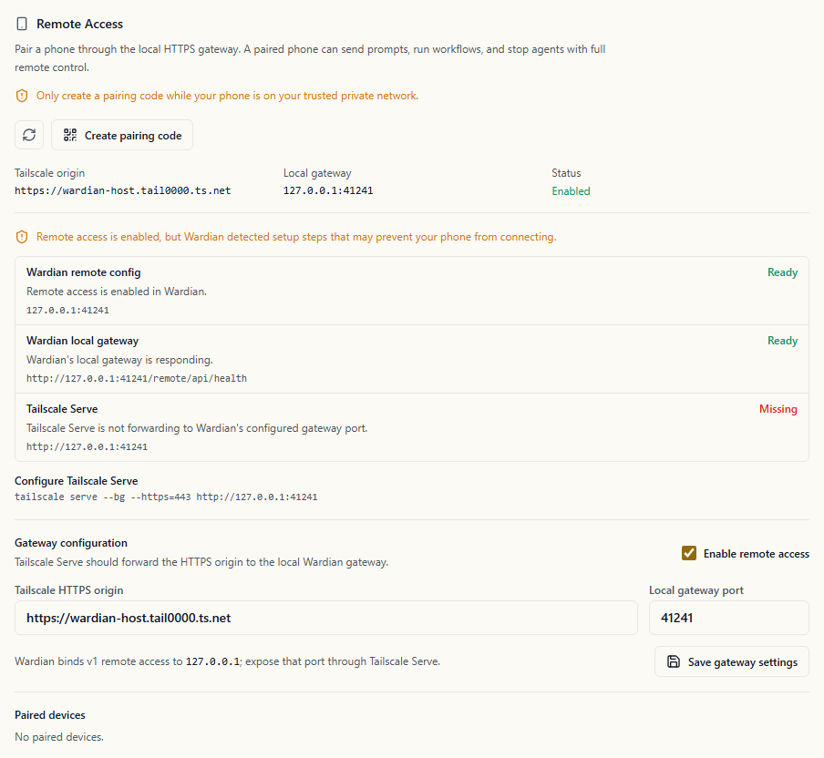
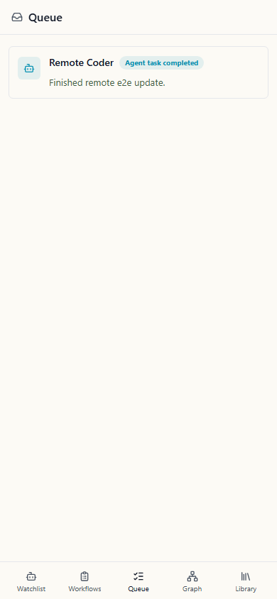

# Remote Control

Wardian Remote lets a paired phone control the Wardian desktop app over a
trusted private-network HTTPS origin. The desktop remains the host for agents,
automations, filesystem access, provider CLIs, PTYs, and telemetry.

## Requirements

- Wardian desktop running on the host computer.
- Tailscale installed and signed in on the Wardian host and the phone.
- MagicDNS and HTTPS certificates enabled for the tailnet.
- A trusted HTTPS origin such as `https://<machine>.<tailnet>.ts.net`.
- Remote access configured to bind only to the Wardian loopback gateway.

Use Tailscale Serve, not Tailscale Funnel, for the v1 remote-control path.
Serve keeps Wardian private to devices in the tailnet. Funnel publishes a
service to the public internet and is outside the v1 security model.

## Set Up Tailscale

1. Install Tailscale on the computer running Wardian.
2. Install Tailscale on the phone that will become the remote control.
3. Sign both devices in to the same tailnet.
4. Confirm both devices are online in the Tailscale admin console or from the
   Wardian host:

   ```bash
   tailscale status
   ```

   PowerShell:

   ```powershell
   tailscale status
   ```

5. Open the Tailscale admin console and enable HTTPS certificates for the
   tailnet. Follow Tailscale's current guide:
   [Set up HTTPS certificates](https://tailscale.com/docs/how-to/set-up-https-certificates).

Tailscale requires MagicDNS for tailnet HTTPS names. Tailscale's HTTPS
certificate setup also notes that issued certificate names are recorded in
Certificate Transparency logs, so rename the Wardian host first if the machine
name reveals anything sensitive.

## Get the HTTPS Origin

Wardian needs the canonical HTTPS origin for the host computer, not the local
loopback URL. The origin usually has this form:

```text
https://<machine>.<tailnet>.ts.net
```

You can get the DNS name from the Tailscale admin console by opening the
Wardian host on the Machines page. You can also read it from the host CLI:

```bash
tailscale status --json | jq -r '.Self.DNSName' | sed 's/\.$//'
```

PowerShell:

```powershell
((tailscale status --json | ConvertFrom-Json).Self.DNSName).TrimEnd(".")
```

Prefix the resulting DNS name with `https://` before entering it in Wardian.
For example, if the DNS name is `desktop.tailb6e29a.ts.net`, the Wardian origin
is:

```text
https://desktop.tailb6e29a.ts.net
```

If you expose Wardian on a non-default Tailscale HTTPS port, include that port
in the origin, such as `https://desktop.tailb6e29a.ts.net:8443`. Use port 443
unless you have a specific reason to expose another HTTPS port.

## Forward Wardian Through Tailscale Serve

1. Open Wardian on the host computer.
2. Open Settings, then Remote Access.
3. Enter the Tailscale HTTPS origin.
4. Leave the local gateway host as `127.0.0.1`.
5. Use the displayed local gateway port as `<wardian-gateway-port>`.
6. Enable remote access and save the gateway settings.
7. On the Wardian host, forward the local gateway through Tailscale Serve:

   ```bash
   tailscale serve --bg --https=443 http://127.0.0.1:<wardian-gateway-port>
   ```

   PowerShell:

   ```powershell
   tailscale serve --bg --https=443 http://127.0.0.1:<wardian-gateway-port>
   ```

8. Verify the Serve configuration:

   ```bash
   tailscale serve status
   ```

   PowerShell:

   ```powershell
   tailscale serve status
   ```

9. From another device signed in to the same tailnet, open
   `https://<machine>.<tailnet>.ts.net/remote`.

If Tailscale Serve prompts you to enable HTTPS or approve Serve capabilities,
complete that browser flow and rerun the command. Tailscale Serve forwards the
HTTPS origin to Wardian's loopback gateway; Wardian itself must still bind only
to `127.0.0.1`.

To remove the forwarding rule later:

```bash
tailscale serve --https=443 off
```

PowerShell:

```powershell
tailscale serve --https=443 off
```

## Pair the Phone

1. Open Settings.
2. Open Remote Access.
3. Confirm the Tailscale HTTPS origin and local gateway port are saved.
4. Create a pairing code.
5. On the phone, open the camera or browser while Tailscale is connected.
6. Scan the pairing code or open the pairing URL.
7. Confirm that the phone opened the expected
   `https://<machine>.<tailnet>.ts.net/remote` origin.
8. Approve the pending device in Wardian on the desktop.
9. Keep Tailscale connected on the phone and use the remote app from the
   browser.

The pairing code is short-lived and single use. The phone generates its own
device key during pairing, then waits for explicit desktop approval before it
can create a remote session.

Wardian starts the local remote gateway after remote access is enabled. The
Remote Access settings panel also checks the parts Wardian can safely inspect:
whether the local gateway responds, whether the Tailscale CLI is available,
whether this desktop appears signed into Tailscale, whether Tailscale Serve
forwards the HTTPS origin to Wardian's loopback port, and whether the HTTPS
gateway responds.

Wardian does not automatically change Tailscale Serve, Funnel, certificate,
firewall, or admin-console settings. If the checklist reports a missing
forwarding rule, review the suggested command before running it.



When the origin field contains a bare hostname, Wardian saves it as HTTPS. For
example, `<machine>.<tailnet>.ts.net` becomes
`https://<machine>.<tailnet>.ts.net`. Enter the scheme explicitly only when you
need to correct or replace it. The saved origin must still be HTTPS and must
match the gateway origin used by the phone.

Only create a pairing code while the phone is on a trusted private network path
to the host. In v1, a paired phone receives full remote control for the exposed
mobile surface.

## Install the Phone PWA

After pairing succeeds, install the remote app from the phone browser so it
opens like a normal mobile app.

On iPhone or iPad:

1. Open the paired Wardian remote URL in Safari.
2. Tap Share.
3. Tap Add to Home Screen.
4. Confirm the Wardian name and tap Add.

On Android:

1. Open the paired Wardian remote URL in Chrome.
2. Open the browser menu.
3. Tap Install app or Add to Home screen.
4. Confirm the install prompt.

The PWA still reaches the Wardian desktop through Tailscale. If the phone is
offline, disconnected from Tailscale, revoked in Wardian, or outside the
tailnet access rules, the installed app cannot send commands.

### Startup behavior

The installed remote app loads the watchlist shell first. Desktop workbench
code and heavier remote surfaces such as terminal/chat, Inbox, and Settings
are loaded when their surface is opened. This keeps the initial watchlist
paint small while preserving the same remote navigation behavior.

If the first load is still slow, check the tailnet connection and gateway
response before diagnosing the browser bundle. The startup split reduces local
JavaScript transfer and evaluation work; it cannot remove DNS, TLS, Tailscale,
or remote gateway latency.

During desktop startup, provider restoration, or telemetry persistence, the
gateway can return the last complete roster immediately. If no live snapshot is
available yet, it uses the atomic saved agent configuration and marks active
entries as `Restoring`; installed provider runtimes republish their current
status after restoration, and the live status stream replaces any remaining
provisional statuses as soon as the runtime is ready. A temporary agent-state
lock does not discard statuses already observed for other agents.

The live status stream also refreshes the remote Inbox projection. If the
stream encounters a transport error, the PWA closes that connection and
reconnects with a bounded backoff. A failure while opening the initial stream
uses the same retry path. A session-expired response requires re-authentication
and does not retry until the session is restored.

The fifteen-second startup request bound applies to read-only data such as the
session and roster. Remote prompts and lifecycle, Inbox, and automation actions
can legitimately take longer while the desktop or provider completes the
operation, so the client does not abandon those mutations at the read timeout
boundary.

## Troubleshooting Setup

- **The phone cannot open `/remote`:** confirm Tailscale is connected on both
  devices, the phone can see the host in the Tailscale app, and
  `tailscale serve status` on the host shows the Wardian gateway forwarding
  rule.
- **The browser warns about the certificate:** confirm MagicDNS and HTTPS
  certificates are enabled for the tailnet, then rerun the Tailscale Serve
  command. The Wardian origin must be the full
  `https://<machine>.<tailnet>.ts.net` name, not `http://127.0.0.1`.
- **Wardian rejects the origin:** use only the scheme and host, plus an
  optional port. Do not include `/remote`, query strings, fragments, IP
  literals, or alternate hostnames in the origin field.
- **The pairing code expires:** create a fresh code from the desktop. Pairing
  offers are single use and intentionally short lived.
- **The PWA says the pairing link is expired or invalid:** create and scan a
  fresh pairing code. The old URL cannot be reused after its offer expires or
  is consumed.
- **The PWA says the device was revoked:** create and scan a fresh pairing
  code, then approve the new device on the desktop. Revocation ends the old
  device's active sessions.
- **The PWA says the session expired:** tap Re-authenticate. If that fails,
  confirm the device is still listed as paired and scan a fresh pairing code
  after revocation or remote-access reset.
- **The PWA stays on `Loading Wardian...`:** first verify that the gateway is
  reachable and that `https://<machine>.<tailnet>.ts.net/remote` serves the
  current app. After a Wardian update, fully restart the desktop so its
  embedded remote gateway serves the new build; then reload the PWA. If the
  gateway is reachable but the spinner remains, inspect the host runtime for
  provider or telemetry stalls before clearing phone site data.
- **The PWA still shows an old shell after an update:** close every open tab or
  installed-PWA window for the remote origin, then open it again after the
  desktop restart. The versioned worker removes the legacy shell cache during
  activation; do not clear site data unless the worker cannot be refreshed.
- **The installed PWA says the desktop is unreachable:** reopen Tailscale on
  the phone, confirm the desktop gateway is running, and retry. This state is
  reserved for transport or gateway failures rather than stale pairing state.
- **The PWA stays on `Restoring` or Inbox does not show a desktop change:** keep
  the gateway reachable while the status stream reconnects, then reload the
  remote URL if the roster and Inbox remain unchanged. If the problem returns,
  rebuild and fully restart Wardian so its embedded gateway serves the current
  remote bundle, then verify the phone session again.

## Security Model

The Wardian desktop is the host. The phone is only a remote control surface, and
paired devices have full control of the v1 mobile surface. Treat a paired phone
like an unlocked desktop session.

Wardian rejects remote-control HTTP access, wildcard origins, non-loopback
gateway binding, reused pairing offers, reused WebSocket tickets, missing CSRF
nonces, and revoked devices.

The default remote roster does not include transcript or output text. Remote
automation runs also reject arbitrary phone-provided payloads until Wardian has
automation-specific input schemas.

Revoke a lost or untrusted phone immediately from Settings. Revocation ends the
device's active remote sessions and prevents future gateway calls from that
device.

## Mobile Surface

The v1 mobile shell opens to a monitoring-only watchlist for small screens. It
is focused on:

- Viewing active agent status in a compact list.
- Mirroring desktop watchlist and team organization.
- Collapsing noisy team sections locally on the phone.
- Opening an agent into an interactive terminal-first detail view with chat one tap away.
- Running lifecycle and prompt actions from the agent detail view.

The watchlist itself does not expose inline actions. Tap an agent row to open
the detail view before sending prompts, pausing, resuming, clearing, or killing
an agent. Use the back button or the phone/browser back gesture to return from
agent detail to the watchlist without leaving the installed PWA.

Use the gear icon in the watchlist header to open mobile Settings. This panel
keeps phone-local preferences such as theme, the default agent detail view, and
remote terminal text size. It does not expose desktop-only runtime settings
such as shell selection, external editors, provider approval policy, or remote
access setup.

The mobile watchlist does not expose broadcast. Use agent detail for
single-agent prompts from the phone, and use the desktop app for multi-agent
broadcast automations.

When you tap an agent, Wardian opens its terminal and claims the interactive
terminal presentation automatically. You can type immediately; Wardian does
not expose ownership labels or a separate control step on the phone. Swipe or
use the mouse wheel to review terminal history, including alternate-screen
terminal interfaces. Chat remains one tap away.

HTTP(S) links in remote chat and raw remote-terminal output open through the
browser, normally in a new tab with a current-tab fallback when a popup is
blocked. Remote terminal linkification is HTTP-only; host file paths and
`file:` links stay inert because those files belong to the desktop host.

The agent detail composer sends ordinary chat messages by default. Turn on
command mode when you need to submit a provider slash command or another input
that must reach the provider command channel without chat attribution. Command
mode resets after a successful send. Ordinary prompts do not wait for the
agent's status: an offline agent starts a headless provider turn, while an
offline command remains queued until an interactive provider surface is
available.

The mobile action strip includes lifecycle controls for the selected agent.
Clone remains a desktop-only operation so the phone does not create new agent
sessions accidentally from a compact remote surface.

The mobile Inbox tab shows the same remote Inbox projection used by the desktop
queue. Durable queue and notification items are returned immediately; the
filesystem-heavy automation-run portion is reconciled in the background and
included by the next refresh. Cards start with long summaries collapsed to a
four-line preview; use Show details or Hide details to change the card state.
After a successful Inbox action, the runtime projection is invalidated so an
in-flight filesystem refresh cannot restore the resolved or dismissed card.
When an item identifies an agent session, use Open agent to move directly into
that agent's detail view. The mobile card keeps the desktop unread, status, and
timestamp cues while remaining sized for a phone screen.



The mobile **Automations** tab is a read-only operational tracker. **Overview**
opens first and orders activity by urgency: items needing attention, runs in
progress, upcoming schedules, and recent outcomes. Use the large summary
shortcuts or the **Attention**, **Soon**, and **History** filters to narrow the
list. Failed outcomes are red, paused schedules are amber, and upcoming
schedules use neutral pending clock cues; paused schedules are listed separately
from **Up next**. Tap any card for exact timing, recurrence, assignment labels,
and bounded failure detail.

Wardian keeps the last successful automation snapshot visible if a refresh
fails and labels it as stale. Retry when the desktop becomes reachable. If the
tab says automation monitoring is unavailable, update the paired desktop app;
older desktop builds do not expose the bounded monitor endpoint.

The tracker does not start, stop, pause, resume, or retry automation work. Use
the desktop Automations workbench for those controls.

The service worker caches only the remote app shell and static assets. It does
not queue agent, automation, PTY, or revocation actions while offline. If the
desktop is unreachable, reconnect before sending commands.

## Boundaries

Public relay access is not part of v1. Device scopes are not part of v1. Raw PTY
streaming is not part of v1 by default; remote views use sanitized status,
terminal snapshots, or transcript summaries unless a later design explicitly
expands that surface.
