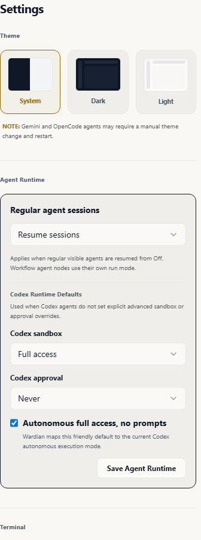
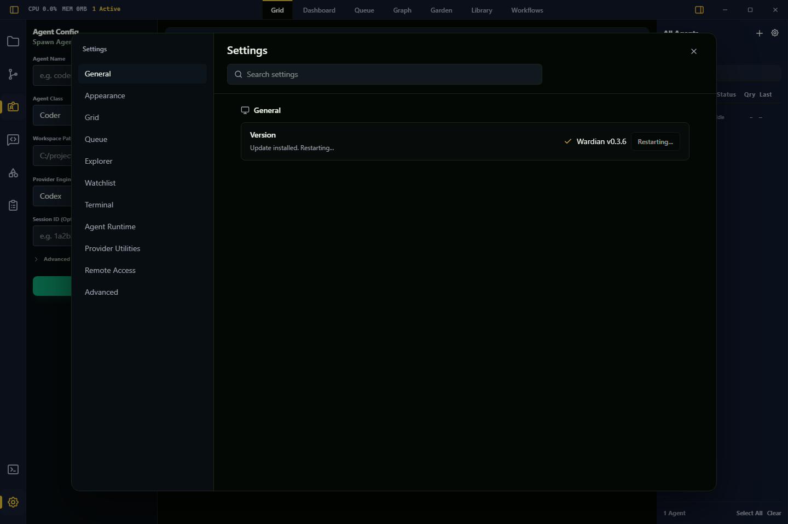
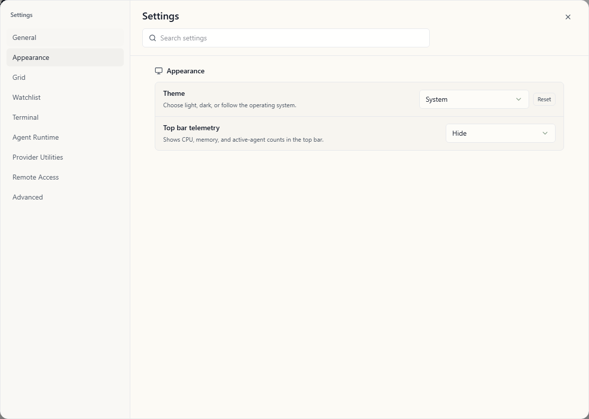

# Settings

Settings controls Wardian's global app preferences, display behavior, terminal
defaults, Explorer behavior, watchlist behavior, provider defaults, and provider
maintenance utilities.

Open Settings from the gear icon on the left icon rail. It opens as a
near-full-screen app modal and does not change the currently selected sidebar
pane or main workspace view.

## Storage

Settings in this screen are global. Wardian stores durable settings under
`<WARDIAN_HOME>/settings/`. These files store sparse user overrides, not the
entire resolved settings object. Missing fields inherit Wardian's current
computed defaults for the app and operating system.

- `settings/app.json`: app preferences such as theme, top bar telemetry
  visibility, Grid card display, Watchlist new agent position, terminal font
  size, terminal font family, Explorer opening behavior, and Gemini auto-patch.
- `settings/shell.json`: runtime preferences such as shell selection, default
  provider, regular agent session policy, and Codex runtime defaults.

Project, workspace, agent-class, and per-agent settings scopes are not part of
the current Settings screen.

## Navigation and Search

The Settings modal has category navigation and a search field. Search matches
setting labels, short descriptions, and related keywords.

Categories:

- **General**: app version and update status.
- **Appearance**: app theme and top bar telemetry visibility.
- **Grid**: display mode for agent cards in the main Grid view.
- **Queue**: queue event desktop and sound notification rules.
- **Explorer**: file click behavior and the external app or editor used by the
  Explorer.
- **Watchlist**: roster behavior for newly spawned agents.
- **Terminal**: terminal font and shell defaults.
- **Agent Runtime**: default provider, regular agent session behavior, and
  provider-specific runtime defaults such as the Codex subsection.
- **Provider Utilities**: provider-specific maintenance actions such as Gemini
  patching.
- **Remote Access**: phone pairing, local gateway configuration, paired
  devices, and setup diagnostics for Tailscale HTTPS access.
- **Advanced**: settings file and diagnostics information.

Each row includes a short detail line. For example, the default provider row
notes that **Auto** prefers Claude when available.

## Updates

The General category shows the currently running Wardian version, such as
`Wardian v0.3.6`.

Wardian checks for updates silently when Settings loads. If no newer stable
release is available, Settings shows that Wardian is up to date. If a newer
release is available, use **Install update** to fetch and install it from
inside the app.

Wardian does not install updates before you choose **Install update**. After
installation completes, Wardian relaunches into the updated version.

On Windows, Wardian may close before the installer window appears. This is
expected: the updater waits for the running app process to exit before starting
the installer so the executable can be replaced cleanly.

On Windows, if Settings says the install location cannot be verified, run the
latest Wardian installer manually once so the updater, registry install path,
and shortcuts point to the same app copy.

Update checks are available only in official installed release builds. Dev
builds and local source-built binaries show the running Wardian version, but
Settings disables update checks so local builds are not replaced by public
release installers.

If update checks fail:

- verify internet access to GitHub Releases
- try **Check Now**
- install the latest release manually if the running build predates in-app
  update support

## Appearance

Theme options:

- **System**
- **Dark**
- **Light**

Wardian applies the selected mode to the app UI and syncs the OpenCode theme
preference through backend settings.

The **Top bar telemetry** control shows or hides the CPU, memory, and active
agent count cluster beside the left sidebar toggle. It does not disable telemetry
collection or remove telemetry from Dashboard, Grid, Graph, or Watchlist views.

Official installed stable release builds hide top bar telemetry by default.
Development builds, prerelease builds, and unmarked local source-built release
binaries show it by default.

## Grid

The **Grid card display** control sets the global display mode for cards in the
main Grid view:

- **Terminal** shows the provider terminal/TUI, including raw keyboard control,
  approvals, and raw output.
- **Chat** shows normalized transcript and activity events for scanning multiple
  agents, plus a compact prompt composer and clickable approval choices when
  Wardian recognizes an action-required prompt.

Use Terminal mode when you need raw TUI controls, provider-specific keybindings,
or detailed terminal behavior. Individual Grid cards can still be switched
between Terminal and Chat from the card header without changing this default.

## Explorer

The **File click action** control sets what happens when you click a file in the
Explorer sidebar:

- **Preview in Wardian** opens Wardian's read-only preview modal. This is the
  default.
- **Open in external app** opens the file through the configured external editor
  preference.

Folders always expand or collapse when clicked.

The **External editor** control sets what happens when you choose **Open in
External App** from the Explorer right-click menu and when you click file paths
in terminal output:

- **System default app** uses the operating system's registered app for the
  selected file or folder. This is Wardian's default because it respects file
  type associations and works without extra editor setup.
- **VS Code (code command)** launches the `code` command-line entry point with
  the selected path.
- **Custom executable** launches the configured executable with the selected
  path as its argument.

If VS Code does not open, Wardian shows the launch error in Explorer. Verify the
`code` command is available on Wardian's app process PATH or use Custom
executable to point directly at your editor.

Terminal URLs open as URLs. Terminal file paths use this External editor
preference so agent terminals and the bottom user terminal match Explorer's
external-open behavior. Terminal file paths are validated before they become
clickable, which keeps command names such as `/model` from being treated as
files unless they resolve to a real target.

## Watchlist

The **New agent position** control sets where newly spawned visible agents land
in the right-side roster:

- **Top** preserves the existing behavior and puts the newly spawned agent at
  the front of the global roster order.
- **Bottom** appends the newly spawned agent to the end of the global roster
  order.

This setting applies to new visible agents spawned from the Agent Config pane.
It does not re-sort existing agents on startup, reinterpret manual drag order,
or override clone/team placement behavior.

## Terminal

Terminal settings control the embedded terminal display and the shell used for
shell-hosted commands:

- **Terminal font size** applies immediately to embedded agent terminals.
- **Terminal font family** can use the platform default or a selected monospace
  font. The default option names the font Wardian currently resolves.
- **Integrated terminal shell** can use Wardian's resolved default shell, a
  discovered shell, or Custom. The default option names the shell Wardian
  currently resolves.

Runtime shell changes affect future terminal launches and shell-hosted workflow
commands.

## Agent Runtime

**Default provider** controls the provider Wardian preselects when starting a
new visible agent. **Auto** prefers Claude when available and falls back to the
first installed supported provider.

**Regular agent sessions** controls how normal visible agents behave when
resumed from `Off`:

- **Resume sessions**
- **Start fresh**

Workflow Agent nodes use their own node-level run mode and do not inherit this
global regular-agent setting.

The **Codex** subsection contains Codex-specific runtime defaults. These apply
when Codex agents do not set explicit advanced sandbox or approval overrides.
Wardian's default Codex policy is workspace write access with approval prompts
and autonomous mode off.

## Provider Utilities

The Gemini patch controls help Gemini discover Wardian skills:

- **Auto-patch Gemini CLI**
- **Run Patch Now**

Changing Gemini patch settings does not affect Claude, Codex, Antigravity, or
OpenCode behavior.

## Troubleshooting

- Use **Advanced > Settings files** to open `<WARDIAN_HOME>/settings/` or copy
  the folder path for inspection, backup, or manual recovery.
- If shell options are empty, verify shell binaries are installed and visible in
  your OS PATH.
- If provider options are disabled elsewhere in Wardian, install the provider
  CLI and make sure Wardian can see it on the app process PATH. See
  [Provider Readiness](./provider-readiness.md).
- If Grid chat mode is empty, switch to Terminal mode to inspect the raw
  provider session and confirm the agent has emitted transcript data.
- If newly spawned agents are not where you expect, check **Watchlist > New
  agent position** and any active manual roster order.
- If resume behavior is not what you expect, verify both the global runtime
  policy and any per-agent override.
- If Gemini skills are missing, run the patch manually and restart the app
  session.

## Important Limits

- Settings are global only in the current implementation.
- Watchlist new agent position affects explicit new spawns only; existing agent
  order, clones, teams, and custom watchlist entries keep their own ordering
  rules.
- Shell and runtime policy changes affect future launches and resumes; they do
  not reconfigure an already-running provider process.
- Grid chat mode handles standard text prompts and recognized approval choices.
  Terminal mode is still required for raw TUI controls and provider approval
  screens that need direct terminal interaction.
- Workflow Agent nodes have their own execution mode and do not simply inherit
  the regular-agent resume default.
- Provider utilities are provider-specific.

## Related Links

- [UI Overview](./ui-overview.md)
- [Getting Started](./getting-started.md)
- [Provider Readiness](./provider-readiness.md)
- [Provider Runtimes](../providers.md)
