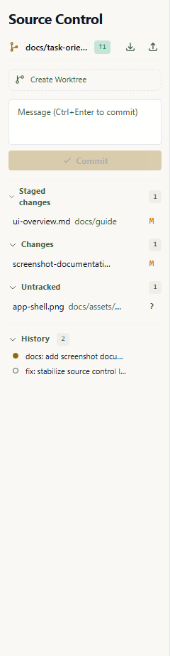

# Source Control

Wardian's Source Control tab lets you work with Git directly from the sidebar for the currently selected agent workspace.



## Scope and Context

- The panel is available when exactly one agent is selected.
- Operations run in that agent's resolved working directory.
- If the folder is not a Git repository, the panel shows a clear "Not a Git Repository" state with the affected workspace path, a reveal action, **Initialize Repository** to run `git init`, and **Clone Repository...** to clone a repository into that workspace.

## Branch Bar

At the top, Wardian shows:

- current branch name
- ahead/behind indicators
- checkout, fetch, pull, and push actions

This is a quick sync layer for checking divergence and moving changes without leaving the app. Use **Checkout to...** to switch to another local branch in the selected workspace, or choose **Create Branch...** from that menu to create and check out a new local branch. Use **Fetch** to update remote-tracking refs without merging. If the selected branch has not been published yet, the push action publishes it to `origin` and sets the upstream branch.

The overflow action menu is grouped into **Branch**, **Sync**, **View**, and
**Stash** submenus so secondary actions stay available without crowding the
Source Control title row.

Use the **Stash** submenu for common stash operations. **Stash Changes**
parks tracked changes, **Stash Changes Including Untracked** also includes new
untracked files, **Stash Staged** parks only staged changes while leaving
unstaged edits in the workspace, **Apply Latest Stash** applies the latest
stash while keeping it in the stash list, **Apply Stash...** lets you choose a
specific stash to apply while keeping it in the stash list, and **Pop Latest
Stash** applies the latest stash back onto the selected workspace and drops it
from the stash list. **Pop Stash...** lets you choose the stash entry to apply
and remove.
Use **View Stash...** to choose a stash entry and inspect its patch in the diff
viewer without applying it.
Use **Drop Stash...** to choose and remove one stash entry after confirming the
destructive action.
Use **Drop All Stashes...** to clear every stash entry for the selected
workspace after confirming the destructive action.

When Wardian is refreshing Git status or running source-control operations, the Source Control rail icon shows activity and the panel keeps the current file list visible with a live progress row.

Use the refresh control in the branch bar to reload both working-tree status and history on demand.

## File Sections

The panel groups files into:

- **Merge Changes** (unresolved conflict states)
- **Staged Changes**
- **Changes** (unstaged tracked files)
- **Untracked**

Nested paths render as an expandable tree by default. Use **Use Tree View** or
**Use List View** in the Source Control overflow menu's **View** submenu to
switch presentation;
Wardian remembers the choice for each repository root.

Within each section, files are ordered for scanability by default: conflict
states first, modified/copied/type-changed files next, then ordinary
added/deleted/renamed/untracked files by path. Use **Sort by Path**, **Sort by
Name**, or **Sort by Status** in the Source Control overflow menu's **View**
submenu to choose the resource ordering. Wardian remembers the sort mode for
each repository root. Tree mode keeps directories grouped while applying the
selected ordering inside each folder.

Available actions include:

- stage / unstage
- stage tracked changes / stage untracked changes / unstage staged changes
- discard tracked edits and untracked resources
- open file diff
- open files in the configured external editor
- reveal files in the Explorer view

Right-click a group header for the matching batch action. Wardian scopes those
actions to the group you clicked, so staging **Changes** does not also stage
**Untracked** files. The **Changes** and **Untracked** groups also expose
**Discard All Tracked Changes** and **Discard All Untracked Changes** for
cleaning the selected resource group after confirmation. The same discard
actions appear as inline header buttons beside the stage-all controls.

Group header menus also include VS Code-style diff actions. Use **Open Staged
Changes**, **Open Changes**, or **Open Untracked Changes** to inspect a combined
diff for only that resource group.

In tree mode, right-click a folder to act only on files under that folder. This
matches VS Code's folder-level Source Control menus for staging, unstaging, or
discarding a directory without touching sibling changes. Use **Add to
.gitignore** on an untracked or changed folder to append that folder pattern to
the repository `.gitignore` and refresh Source Control.

Clicking a file opens an inline diff modal with colored additions, deletions,
and hunk markers. Untracked files show a new-file diff so you can inspect them
before staging. Working-tree file diffs include **Stage Changes**, and staged
file diffs include **Unstage Changes**, so you can act on the file you are
reviewing without returning to the resource list. Individual hunk headers also
include **Stage Hunk** or **Unstage Hunk** for applying only that hunk to the
index.

Right-click a file and choose **Open File** to launch it through Wardian's
configured external editor, or **Reveal in Explorer View** to inspect its
workspace location. Choose **Open File (HEAD)** to inspect the committed
version of a changed file without changing the working tree. On unstaged file
resources, choose **Add to .gitignore** to append that file path to the
repository `.gitignore`. Staged files also include **Compare with Workspace**
to inspect how the working-tree file differs from the staged index version.

## Commit Flow

Use the commit box to enter a message, then commit:

- placeholder: `Message on <branch> (Ctrl+Enter to commit)`
- primary action: **Commit** when files have changes, **Publish Branch** when a clean branch has no upstream, or **Sync Changes** when a clean branch is ahead or behind
- shortcut: `Ctrl+Enter` (or `Cmd+Enter` on macOS)

The commit action is enabled when:

- there is a commit message, and
- at least one file is staged or unstaged

If there are only unstaged changes, Wardian stages them before creating the commit.

Use the `More Actions` chevron beside the commit button for commit variants. `Commit Staged` commits only staged files, while `Commit All` stages remaining unstaged files before committing. `Commit (Signed Off)` creates the normal commit while appending Git's DCO `Signed-off-by` trailer, `Commit Staged (Signed Off)` appends the same trailer while committing only staged files, and `Commit All (Signed Off)` stages every pending change before adding that trailer. `Commit (Signed Off, No Verify)` adds the same DCO trailer while bypassing local hooks, `Commit Staged (Signed Off, No Verify)` does so for only staged files, and `Commit All (Signed Off, No Verify)` stages every pending change first. `Commit Empty` creates a marker commit from a clean repository when the commit box has a message, and `Commit Empty (No Verify)` does the same while bypassing hooks. `Commit (No Verify)` creates the commit with `--no-verify` for cases where local hooks should be bypassed, `Commit Staged (No Verify)` bypasses hooks for only staged changes, and `Commit All (No Verify)` stages every pending change before bypassing hooks. `Commit (Amend)` rewrites the latest commit with the current message and staged content when history has loaded, `Commit (Amend, No Verify)` rewrites it while bypassing hooks, `Commit Staged (Amend)` folds only already-staged changes into the latest commit, `Commit Staged (Amend, No Verify)` combines staged-only amend behavior with hook bypassing, `Commit All (Amend)` stages all pending changes first, then rewrites the latest commit, and `Commit All (Amend, No Verify)` does the same while bypassing hooks. Wardian remembers the last selected staged/all variant and promotes it to the next primary commit action.

The same menu includes **Undo Last Commit** after history has loaded. Wardian
asks for confirmation, moves `HEAD` back one commit, keeps the undone changes in
the working tree, and restores the undone commit message into the commit box.
When a rebase is in progress, the same menu includes **Abort Rebase** to run
`git rebase --abort` and refresh the panel.

Wardian shows an advisory warning when the commit subject line is longer than 50 characters or a body line is longer than 72 characters. The warning does not block the commit.

## History Graph

The History section shows recent commits for the selected workspace as compact graph rows. Rows use fixed swimlane spacing, highlight the current `HEAD`, show branch/upstream labels when Git reports them, and keep the commit subject, short hash, author, and date visible for quick scanning. When the selected branch has remote divergence, the graph adds dashed **Outgoing Changes** and **Incoming Changes** markers with commit counts so the branch shape and sync direction are visible before syncing. Expand a commit row to inspect the files changed by that commit without leaving the Source Control panel. Expanded changes default to a collapsible folder tree and can be switched to a flat full-path list from the graph controls.

Use the graph controls to switch between auto refs, all refs, current branch, and upstream filters, switch expanded changes between tree and list mode, then switch between detailed and tiny density. Wardian remembers the chosen ref filter, change view mode, density, and expanded commit rows for each selected repository root, and the collapse control closes all expanded commits in the current graph.

## Worktree Mode

Source Control also exposes worktree actions:

- `Create Worktree` opens an inline name field, then creates a worktree for that agent
- available shared worktrees can be joined from the same action area
- removing worktree returns the agent to main workspace behavior

When enabled, Wardian creates a named worktree beside the source checkout under `<source-checkout>.wt/<worktree-name>`, creates a matching `wardian/<worktree-name>` branch, shares supported build caches with the source checkout, and moves the agent runtime to that path with a fresh provider session. For example, a source checkout at `<absolute-workspace-path>/Wardian` creates Wardian-managed worktrees under `<absolute-workspace-path>/Wardian.wt/`. Joining an existing shared worktree assigns the same worktree path to another agent and also starts that agent fresh in the shared path.

For Rust workspaces, Wardian sets `CARGO_TARGET_DIR` for provider runtimes in worktree mode so builds reuse the source checkout's `target` directory even when the repository has a tracked `.cargo/config.toml`. Wardian still writes a generated Cargo config only when a worktree does not already contain one. Node `node_modules` and Python `.venv` caches continue to be linked back to the source checkout when those caches exist.

Wardian-created worktrees are real Git worktrees. They are created through `git worktree add`, so they appear in `git worktree list` for the source checkout.

Wardian also discovers Git worktrees that already belong to a known source workspace, even when they were created outside Wardian. Discovered worktrees with no assigned agent appear as joinable shared worktrees. Unassigned worktrees under `<source-checkout>.wt/` can also be deleted from the same list; legacy Wardian worktrees under `<wardian-home>/agents/<session-id>/worktrees/` remain recognized and deletable. Wardian asks for confirmation, removes Wardian-generated cache redirects, and then runs a non-force `git worktree remove`, so dirty or otherwise unsafe removals fail with Git's error.

If a target worktree folder already exists but Git does not recognize it as a worktree for the source checkout, Wardian refuses to assign it. Create it with `git worktree add` or remove the folder and let Wardian create it.

Removing a Wardian assignment does not delete the physical worktree. Wardian's delete action is separate and only applies to unassigned Git-registered worktrees under Wardian-managed worktree roots. External worktrees remain joinable but use manual Git deletion, for example `git worktree remove <absolute-worktree-path>`, after no agent is using that path.

The same agent worktree controls are available from the CLI when the desktop app is running for the same `WARDIAN_HOME`:

```bash
wardian agent worktree list
wardian agent worktree enable <agent-name-or-id> --name <worktree-name>
wardian agent worktree join <agent-name-or-id> --worktree <absolute-worktree-path-or-id>
wardian agent worktree disable <agent-name-or-id>
```

## Safety Notes

- Discard is destructive; Wardian asks for confirmation.
- Git operations are executed with non-interactive credential prompts disabled to avoid blocking UI flows.
- Provider resume is workspace-path-bound. Worktree moves use a fresh provider session, not `--resume` from the new path.
- Removing a worktree assignment does not delete the physical worktree; use the separate delete action only after no agent is assigned.
- If pull/push fails, check local credentials and remote permissions in your terminal environment.

## Related References

- [Explorer](./explorer.md)
- [Watchlists](./watchlists.md)
- [Queue](./queue.md)
