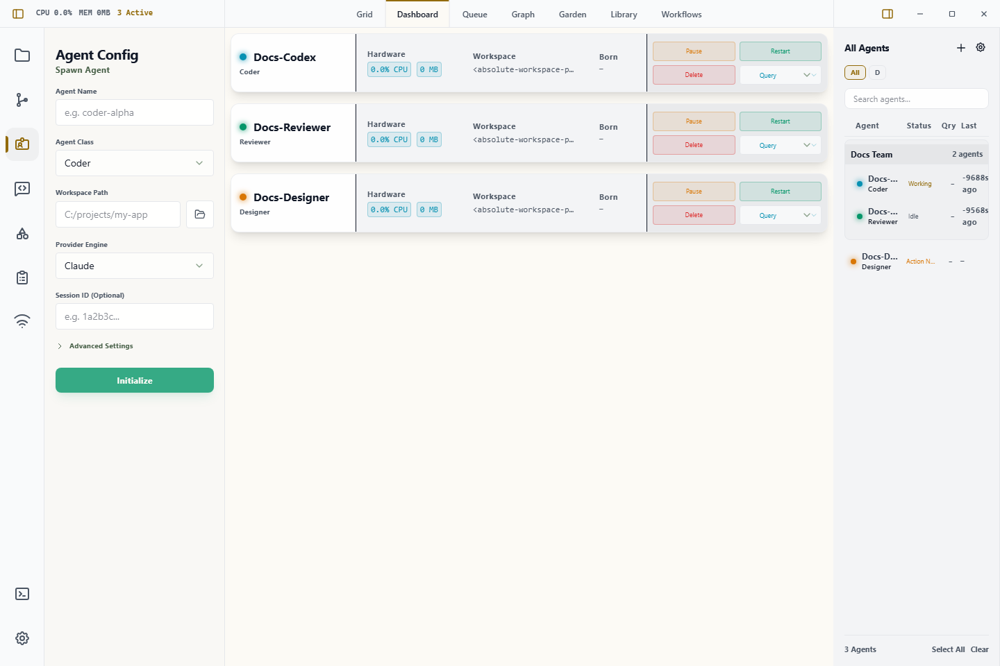

# User Interface Overview

Wardian features a high-fidelity, professional interface designed for dense information monitoring and rapid multi-agent orchestration. The layout is optimized for a "Integrated Agent Environment" experience, inspired by productivity tools like Obsidian and VS Code.

## 🧱 The Layout Architecture

### 1. Unified Top Bar

The fixed header at the top of the application acts as the global navigation and system telemetry hub.

- **Left**: Workspace branding and sidebar toggle controls.
- **Center (View Switcher)**: Quickly toggle between primary workspace modes:
  - **GRID**: The primary terminal workspace for live agent interaction.
  - **DASHBOARD**: A summary view of system health and active agent status.
  - **LIBRARY**: Management center for Prompts, Skills, and Agent Classes.
  - **WORKFLOWS**: Visual canvas for building automated agent sequences.
  - **QUEUE / GRAPH / GARDEN**: Specialized visualizations for high-fidelity orchestration.
- **Right (Telemetry)**: Real-time monitoring of aggregate **CPU**, **Memory**, and **Active Agent** count.

### 2. Left Sidebar (Control & Context)

The Left Sidebar provides the "Context" for your work. It consists of:

- **Navigation Rail**: Vertical icon strip to switch between sidebar tabs:
  - **Explorer**: Browse the physical files of the selected agent or the Wardian home.
  - **Source Control**: Stage, diff, commit, sync, and manage worktree mode for the selected agent workspace.
  - **Agent Configuration**: Quick settings for spawning and tuning agents.
  - **Command**: Broadcast text and run starred quick prompts against selected agents.
  - **Settings**: System-wide preferences, theme engine, and the default runtime shell used by agents and shell-based workflows.
- **Content Pane**: Displays the detailed menu or tree for the active rail icon.

### 3. Right Sidebar (The Roster)

The **Agent Watchlist** is your persistent high-fidelity roster for monitoring all active agent instances.

- **Status Indicators**: Instant visual feedback on agent states (Idle, Processing, Action Needed, Error).
- **Thought Stream**: A real-time glimpse into the agent's internal monologue and current task progress.
- **Watchlists**: Organize agents into logical groups (e.g., "Dev Team", "Security Audit") for easier oversight.

### Agent Cloning

Use the single-agent roster context menu to create Fresh, Profile, or Custom clones. Clicking **Clone** directly starts a Fresh Clone immediately. The **Fresh Clone** submenu option keeps visible setup and starts a clean provider session. **Profile Clone** also keeps agent-local profile files and instance skills. **Custom Clone** opens a modal where you can change the clone name, provider engine, agent class, workspace path, and choose which eligible agent-local files and instance skills to keep.

## 🖱️ Interaction Patterns

### "Physical-First" Navigation

Wardian mirrors your local file system. Most items in the **Library** or **Explorer** correspond to physical files on your disk (`~/.wardian/`), ensuring your work is transparent and portable.

### Contextual Awareness

The interface is reactive. Selecting an agent in the **Roster** (Right Sidebar) will automatically re-root the **Explorer** (Left Sidebar) to that agent's specific working directory.

### Terminal Continuity

Wardian preserves terminal state across grid remounts so interactive TUIs, including Codex, keep their visible screen and scrollback more faithfully when panes are resized, reordered, or reattached. The terminal layer also forwards xterm's raw binary mouse-report input to the PTY so alternate-screen TUIs can handle wheel-driven in-app scrolling the same way they do in native terminals.

### Keyboard Shortcuts

- **Ctrl + Tab**: Cycle through main View Modes.
- **Ctrl + Shift + Tab**: Cycle through main View Modes in reverse.
- **Ctrl + B**: Toggle the Left Sidebar visibility.

## Related Guides

- [Command Panel](./command-panel.md)
- [Source Control](./source-control.md)
- [Settings](./settings.md)
