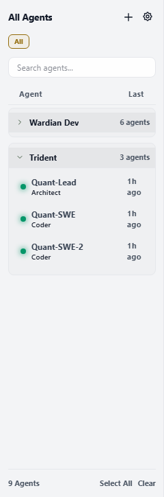

# Monitoring with Watchlists

The **Agent Watchlist** (Right Sidebar) is your primary high-fidelity tool for monitoring the health, activity, and thoughts of your agent swarm.

Use it when you need persistent awareness of all agents while working in any Workbench surface or auxiliary tool.

## When to Use It

- Select one or more agents before using Command, Library prompt runs, Explorer, or Source Control.
- Group agents by project, workstream, role, or review lane.
- Spot agents that are idle, processing, blocked, off, or errored without opening every terminal.
- Open a specific agent session in the current Workbench pane or to its side.

## Basic Automation

1. Spawn agents from [Getting Started](./getting-started.md) or the left Agent Configuration tab.
2. Click a roster row to reveal that agent in the active Dashboard, Graph, Garden, or Agents surface. On other surfaces, the click opens or focuses Agents. Ctrl/Cmd-click and Shift-click adjust selection without navigating.
3. Sort or filter the list when the swarm grows.
4. Create watchlists or teams for repeated groups.
5. Use **Open** to focus or open an agent session in the active pane, or **Open to Side** to create a neighboring pane. Use the remaining context actions for lifecycle controls.

## Selection and Navigation

The roster has separate click and context-action paths:

- Plain-click a row to select and reveal that agent in the active supported Workbench surface. Dashboard scrolls to its row, Graph inspects its node, and Garden enters its agent record. An active Agents surface focuses its card. If the active surface cannot show the agent, Agents is the fallback.
- Ctrl/Cmd-click or Shift-click rows to adjust the selection for Explorer, Source Control, Command, Library prompt runs, and other auxiliary tools without navigating.
- Use **Open** when you want an agent-session tab in the active pane.
- Use **Open to Side** when you want the session beside the current surface.

Clicking a row does not replace a Dashboard, Graph, or Garden surface. Opening an agent session remains an explicit context action and does not change which agents a multi-target Command operation will use.

## Real-Time Monitoring

### Status Indicators
Every agent in the watchlist has a distinct status light:
- **Emerald (Idle)**: Ready for a new task.
- **Cyan (Processing)**: Currently executing or thinking.
- **Amber (Action Needed)**: Waiting for user confirmation or a tool prompt.
- **Gray (Off)**: Session is paused or hibernating.
- **Red (Error)**: Encountered a fatal process error.

### Live Thought Bubbles
Wardian captures the agent's internal telemetry and displays it as a "Thought Bubble" next to the agent's name. This allows you to see what the agent is currently working on without reading the full terminal log.

## Customizable Columns

Click the **gear icon** (⚙) in the watchlist header to open the column picker. Each column can be toggled on or off independently:

| Column | Default | Description |
|---|---|---|
| Status | Off | Current agent status label |
| Query Count | Off | Number of prompts sent this session |
| Uptime | Off | Time since the agent process started |
| Provider / Model | Off | Provider name and model identifier |
| Last Queried | On | Time elapsed since the last user prompt was sent |

### Sorting
Click any column header to sort by that column. The first sort on **Last** is descending so the most recently queried agent appears first; other columns start ascending. Clicking the active header again cycles through the opposite direction → unsorted. The **Agent** column header sorts alphabetically by name. Sorting applies on top of your custom watchlist order; drag-to-reorder still works when no sort is active.

### Persistence
Column visibility and sort state are saved to `<wardian-home>/watchlists/prefs.json` and restored on next launch. The Last Queried value is sourced from the latest user prompt timestamp in the interaction ledger or provider transcript (including current Antigravity SQLite conversations), so it is not reset when the app restarts. Provider-generated context, local commands, and interruption records are excluded from the user-prompt timestamp. Existing saved column preferences remain unchanged; the defaults apply to new preference files.

New visible agents normally appear at the top of the roster. Change
**Settings > Watchlist > New agent position** to place agents spawned from the
app or with `wardian agent spawn` at the bottom instead. This setting affects
explicit new spawns only; existing roster order, manual drag order, clone
placement, teams, and custom watchlist entries keep their own ordering rules.

The CLI can inspect and update persisted watchlist and team state without starting the desktop app:

```bash
wardian team list
wardian team show <team-name-or-id>
wardian team create <name> --agent <name-or-uuid> [--agent <name-or-uuid>...]
wardian team rename <team-name-or-id> <new-name>
wardian team add <team-name-or-id> <agent-name-or-uuid> [...]
wardian team remove <team-name-or-id> <agent-name-or-uuid> [...]
wardian team split <team-name-or-id> --name <new-team-name> --agent <name-or-uuid> [...]
wardian team delete <team-name-or-id>
wardian watchlist list
wardian watchlist show <watchlist-name-or-id>
wardian watchlist create <name>
wardian watchlist rename <watchlist-name-or-id> <new-name>
wardian watchlist add-team <watchlist-name-or-id> <team-name-or-id>
wardian watchlist remove-team <watchlist-name-or-id> <team-name-or-id>
wardian watchlist add-agent <watchlist-name-or-id> <agent-name-or-uuid>
wardian watchlist remove-agent <watchlist-name-or-id> <agent-name-or-uuid>
wardian watchlist delete <watchlist-name-or-id>
```

These commands use the same `<wardian-home>/watchlists/index.json` file as the GUI. Reads accept both the current v2 state shape with global teams and legacy flat watchlist arrays. Writes normalize the file to canonical v2 JSON, seed team communication edges into `topology.json` when team membership creates new pairs, and notify a running desktop app for the same `WARDIAN_HOME` so the roster reloads. Messaging targets one exact agent separately through `wardian message send` or `wardian message followup`; watchlist membership does not broadcast messages.

## Organizing with Watchlists
As your swarm grows, a single list becomes difficult to manage. Wardian allows you to group agents into custom **Watchlists**.

### Creating a Watchlist
1. Click the **+** icon at the top of the Right Sidebar.
2. Give your list a name (e.g., "Frontend Ops").
3. Your new list will appear as a tab or filter in the roster.

### Managing Agents
- **Reordering Lists**: Drag custom watchlist tabs left or right to reorder them. The **All** tab stays fixed as the first view.
- **Reordering**: Drag and drop agent cards within a watchlist to prioritize your view. A press only becomes a drag once the pointer moves, so clicking a row still selects and reveals the agent. Holding a dragged row over the top or bottom edge of the roster scrolls the list, so you can move an agent to a position that is currently out of view without letting go.
- **Filtering**: Click a watchlist tab to focus only on that group of agents.
- **Bulk Selection**: Use `Ctrl+Click` on Windows/Linux or `Cmd+Click` on macOS to select multiple agents within a watchlist for broadcast commands.
- **Bulk Context Menu**: If you right-click inside the current multi-selection, the menu applies to the whole selection. Bulk delete shows one confirmation dialog for the full selected set instead of prompting once per agent.

### Collapsing Teams
Click the chevron in a team header to hide or reveal that team's members. The team header stays visible with its member count, and context-menu actions still apply to the full team. Desktop collapse state is scoped to the current watchlist view, saved to `<wardian-home>/watchlists/prefs.json`, and restored after Wardian restarts. Collapsing a team in one custom list does not collapse the same team in another list, and an Off member does not change the saved state.



Teams are also Wardian's project/workstream grouping concept. They are useful
when a line of work spans more than one workspace or folder, or when one
workspace contains several parallel efforts. Watchlists decide what is visible
and targetable now; teams describe the durable work context those agents are
cooperating inside.

Cloning a team member preserves every team that contains the source, placing
the clone immediately after the source in each team. The backend also seeds the
corresponding Graph relationships before the roster refreshes, so the grouped
watchlist and communication topology stay aligned even when a clone is made
through the CLI or another control surface.
Watchlist mutations are serialized across the app and CLI, and index writes
are atomic. A failed topology save rolls the membership write back so the two
durable stores do not drift.

## Session and Lifecycle Actions

Use an agent's open menu to choose the presentation action separately from lifecycle controls:

- **Open**: focus an existing agent-session surface or open it in the active pane.
- **Open to Side**: focus an existing session or open it in a neighboring pane.

Hover over an agent in the roster or use its context menu for runtime controls:
- **Pause / Start Session**: Suspend the PTY process to save CPU, then start it again.
- **Restart Session**: Re-spawn the provider while retaining the agent, habitat, and saved history.
- **New Session**: Create a new provider context while retaining the Wardian agent, habitat, and saved history.
- **Delete Agent**: Permanently remove the Wardian agent, habitat, and saved history; project files remain.

Closing an agent-session tab is not a lifecycle action. It detaches that presentation while the agent and PTY continue running. Use lifecycle controls only when you intend to affect the runtime.

## Important Limits

- The roster is the targeting surface for many tools. Check selection before broadcasting or running prompts.
- CLI team and watchlist commands mutate persisted state directly; use an isolated `WARDIAN_HOME` for tests and scripts that should not affect your normal roster.
- Status and thought snippets are compact summaries. Open an agent session, use [Agents](./agents-overview.md), or use the CLI watch command for detailed output.

## Related Links

- [Workbench](./workbench.md)
- [Agents](./agents-overview.md)
- [Dashboard](./dashboard.md)
- [Command Panel](./command-panel.md)
- [Wardian CLI](./cli.md)
