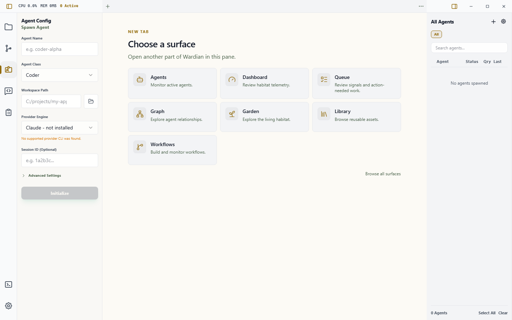

# Workbench

The Workbench is Wardian's main workspace. Every app surface opens as a tab, and panes let you keep several surfaces visible at the same time. Opening Queue, Dashboard, Library, Workflows, Graph, Garden, Agents, or an agent session no longer replaces a global page.

Use the Workbench when you want to keep context in place: an agent terminal beside Queue, Agents beside Source Control, or a workflow beside the agents running it.

## Open a Surface

An empty pane is a surface launcher. Choose a core surface directly from its icon, title, and description, reopen recent work, or select **Browse all surfaces** for resource-backed choices such as Agent Session.

There are three common entry points:

- Press `Ctrl+P` on Windows/Linux or `Cmd+P` on macOS for **Quick Open**.
- Select the **+** button in a pane to open a **New Tab**, or choose a tool in an empty pane's launcher.
- Press `Ctrl+Shift+P` / `Cmd+Shift+P` for the searchable command palette.

By default, a pane's **+** button appends and focuses an ordinary **New Tab** in that pane. The tab contains the full visual surface launcher. Choosing a card replaces New Tab in place, preserving its pane and tab position; choosing an already-open singleton closes New Tab and focuses the existing tab. Choose **Browse all surfaces** to continue that same replacement through the compact searchable list.

To make **+** open the searchable list directly, open **Settings > Appearance**, find **New tab button**, and select **Searchable list**. Select **New Tab** to restore the default. This preference changes only **+**: **Quick Open** always opens the searchable list.

In the searchable list, select a surface name to open it in the captured pane, or press `Ctrl+Enter` on Windows/Linux or `Cmd+Enter` on macOS to open it to the side. There is no separate visible **Open to Side** button in the picker. A surface that is already open as a singleton, such as Dashboard or Queue, is focused instead of duplicated.

The **Agent Session** choice needs one selected agent in the right roster. For a faster agent-specific path, use the roster actions described in [Watchlists](./watchlists.md).

## Work with Tabs and Panes

Each pane has its own tab strip and active surface. Every tab includes a compact type icon shared with the surface chooser, so different tools and agent sessions remain recognizable when titles are truncated. Top-edge strips form the window chrome; strips in downward splits remain local. The **+** sits immediately after the tabs, while **…** remains at the far edge.

Surfaces respond to the size of their own pane. In compact splits, toolbars wrap and inspectors or run drawers overlay their local canvas; they do not use the full application window as their layout boundary.

- Select a tab to bring that surface forward.
- Drag a tab within its strip to reorder it.
- Use the close button on the active tab, or reveal it by hovering another tab, to close that presentation.
- Drop a tab in the center of another pane to move it there.
- Drop a tab at a pane's edge to create a 50/50 split. The half-pane preview appears only when both resulting panes can remain usable; undersized destinations retain center-drop movement but do not advertise or commit an impossible edge split.
- Right-click a tab to close it, split it right or down, or move it to an adjacent pane.
- Open the pane's **…** menu for **Zoom pane** / **Restore pane**, **Split pane right**, **Split pane down**, **Merge into previous pane** / **Merge into next pane**, and **Close pane**. Dirty surfaces ask before they close.
- Use the command palette or keyboard shortcuts when you prefer not to use a context menu.

**Zoom pane** temporarily expands one pane to the Workbench area. It does not change the saved split tree or maximize the application window. Choose **Restore pane** to return to the multi-pane layout.

When a move or close removes the last tab from a non-final pane, Wardian collapses that pane automatically and expands its sibling into the released space. The final pane is never removed; if its last tab closes, it remains in place and shows the Home surface chooser.

## Files Previews

Explorer file opens use normal Workbench tabs. A single click opens one
transient Files preview in the current pane; selecting another file replaces
that preview. Double-click, `Enter`, the Explorer **Open** action, or opening to
the side makes the tab permanent. A permanent tab participates in ordinary
close history and restore. A transient preview does not.

The foundation previews validated text and Markdown, images, and PDFs. It does
not yet provide Draft, Changes, comments, approval, artifact versions, or live
HTML/SVG. Unsupported and oversized resources stay local to their tab and offer
metadata, Retry, **Open With**, or Reveal rather than failing the Workbench.
Ordinary saves and atomic editor saves refresh through the same stable revision
stream. If a file is temporarily unreadable or keeps changing during a scan,
its tab shows one local unavailable state and automatically recovers when the
source stabilizes.

Files is intentionally absent from the New Surface launcher in this slice.
Open files from Explorer; the launcher will become available only when the
artifact review and isolated active-content contracts are complete. A restored
file tab is resolved again by the Rust backend against current agent primary
and additional directory grants, or an exact live native-picker grant. Layout
state never confers filesystem authority. If two spellings resolve to the same
file, normal opens focus one canonical tab; an explicit **Open to Side** keeps
the intentional second presentation.

PDF text search is deliberately bounded so a very large document cannot lock
the Workbench. It searches at most 128 pages or for two seconds per query and
labels partial results with the number of pages inspected.

Image and PDF previews use short-lived immutable snapshots. A preview therefore
keeps serving the exact revision it opened even if the source changes or is
deleted; the next revision opens a new snapshot. Wardian automatically reclaims
the snapshot and renderer lease at the ticket deadline, including when a pane
abandons the preview without sending a later request.

## Reopen and Reset

Closing a surface adds it to the recently closed history. Press `Ctrl+Shift+T` / `Cmd+Shift+T`, choose **Reopen Closed Surface** in the command palette, or use the **Reopen** action on an empty pane's Home state. Wardian restores the most recently closed presentation first.

Choose **Reset Workbench** from the command palette when the saved layout is unusable or you want the default layout again. Reset is a guarded operation: dirty surfaces can prevent it, and the Workbench is temporarily unavailable while the durable reset completes.

Wardian saves the tab order, pane tree, active tabs, split sizes, and supported per-surface state. It restores that document at the next launch. If the primary document is invalid, Wardian can recover from its backup. A newer, unknown, or unavailable surface is kept as a placeholder instead of silently dropping its stored state.

If Wardian cannot safely load the layout, it enters **Workbench safe mode**. Safe mode renders a conservative single-pane projection while preserving the durable document so it can be recovered, exported, replaced, or reset deliberately.

## Agent Sessions and Terminal Ownership

An agent session surface is a presentation of a live agent runtime. Closing its tab detaches that presentation; it does **not** pause, clear, delete, or kill the agent. Use the roster or agent lifecycle controls when you intend to change the runtime itself.

The same terminal can appear in more than one desktop or remote presentation. The header reports **Owner**, **Mirror**, or **Connecting**:

- **Owner** can send terminal input and determines the canonical terminal geometry.
- **Mirror** follows the same output and is read-only until explicitly activated.
- **Connecting** is waiting for the terminal broker.

Click inside a terminal, or focus it and press `Enter` or `Space`, to explicitly request interaction ownership for that presentation. Keyboard focus alone does not steal ownership. Short switches away from Agents keep its budgeted terminals warm but hidden and unable to accept input. Returning reuses those renderers; if Wardian had to reclaim one to stay within resource limits, it remains hidden until its backend, snapshot, and final fitted geometry are ready.

## Left Rail and Right Roster

The left icon rail controls auxiliary tools: Explorer, Source Control, Agent Configuration, Command, Workflows, the user terminal, and Settings. It never switches the active Workbench surface. A rail item can open or focus its collapsible side pane, and a tool in that pane may explicitly request a Workbench surface.

The right roster has two separate jobs:

- Selecting agents sets the target for Explorer, Source Control, Command, and other auxiliary tools.
- The roster's **Open** and **Open to Side** actions create or focus agent-session surfaces.

Selecting an agent does not silently replace the active Workbench tab.

## Keyboard Reference

`Ctrl` below means `Cmd` on macOS.

| Action | Shortcut |
|---|---|
| Quick Open | `Ctrl+P` |
| Command palette | `Ctrl+Shift+P` |
| Open Surface | `Ctrl+Shift+O` |
| Close active surface | `Ctrl+W` |
| Reopen closed surface | `Ctrl+Shift+T` |
| Previous / next tab | `Ctrl+[` / `Ctrl+]` |
| Previous / next pane | `Ctrl+Shift+[` / `Ctrl+Shift+]` |
| Traverse panes | `Shift+F6` / `F6` |
| Split right / down | `Ctrl+Alt+Right` / `Ctrl+Alt+Down` |
| Move tab to previous / next pane | `Alt+Shift+Left` / `Alt+Shift+Right` |
| Toggle pane zoom | `Alt+Shift+Z` |
| Focus left dock / right roster | `Ctrl+Alt+L` / `Ctrl+Alt+R` |
| Focus Workbench | `Ctrl+0` |

Workbench shortcuts do not intercept normal typing inside text fields or terminal-owned key combinations. `F6` pane traversal remains available for keyboard navigation.

## Related Guides

- [Agents](./agents-overview.md)
- [Watchlists](./watchlists.md)
- [Queue](./queue.md)
- [Command Panel](./command-panel.md)
