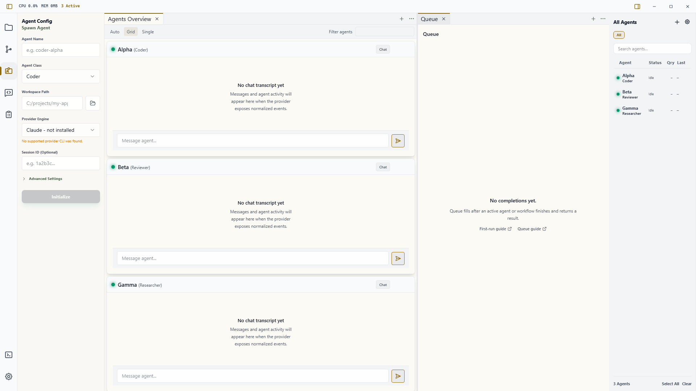

# Workbench

The Workbench is Wardian's main workspace. Every app surface opens as a tab, and panes let you keep several surfaces visible at the same time. Opening Queue, Dashboard, Library, Workflows, Graph, Garden, Agents Overview, or an agent session no longer replaces a global page.

Use the Workbench when you want to keep context in place: an agent terminal beside Queue, an Overview beside Source Control, or a workflow beside the agents running it.

## Open a Surface

There are three common entry points:

- Press `Ctrl+P` on Windows/Linux or `Cmd+P` on macOS for **Quick Open**.
- Select the **+** button in a pane. An empty pane also shows a **Home** state with **Open Surface**.
- Press `Ctrl+Shift+P` / `Cmd+Shift+P` for the searchable command palette.

The surface picker is a compact searchable list. Select a surface name to open it in the current pane, or press `Ctrl+Enter` / `Cmd+Enter` on the selected result to open it to the side. There is no separate visible “Open to Side” button in the picker. A surface that is already open as a singleton, such as Dashboard or Queue, is focused instead of duplicated.

The **Agent Session** choice needs one selected agent in the right roster. For a faster agent-specific path, use the roster actions described in [Watchlists](./watchlists.md).

## Work with Tabs and Panes

Each pane has its own tab strip and active surface. The only fixed pane-header controls are **+** and **…**.

- Select a tab to bring that surface forward.
- Drag a tab within its strip to reorder it.
- Use the close button on the active tab, or reveal it by hovering another tab, to close that presentation.
- Drag a tab into another pane to move it there.
- Drop a tab at a pane's edge to create a split and place it there.
- Right-click a tab to close it, split it right or down, or move it to an adjacent pane.
- Open the pane's **…** menu for **Zoom pane** / **Restore pane**, **Split pane right**, **Split pane down**, **Merge into previous pane** / **Merge into next pane**, and **Close pane**. Dirty surfaces ask before they close.
- Use the command palette or keyboard shortcuts when you prefer not to use a context menu.

**Zoom pane** temporarily expands one pane to the Workbench area. It does not change the saved split tree or maximize the application window. Choose **Restore pane** to return to the multi-pane layout.

## Reopen and Reset

Closing a surface adds it to the recently closed history. Press `Ctrl+Shift+T` / `Cmd+Shift+T`, choose **Reopen Closed Surface** in the command palette, or use the **Reopen** action on an empty pane's Home state. Wardian restores the most recently closed presentation first.

Choose **Reset Workbench** from the command palette when the saved layout is unusable or you want the default layout again. Reset is a guarded operation: dirty surfaces can prevent it, and the Workbench is temporarily unavailable while the durable reset completes.

Wardian saves the tab order, pane tree, active tabs, split sizes, and supported per-surface state. It restores that document at the next launch. If the primary document is invalid, Wardian can recover from its backup. A newer, unknown, or unavailable surface is kept as a placeholder instead of silently dropping its stored state.

If Wardian cannot safely load the layout, it enters **Workbench safe mode**. Safe mode renders a conservative single-pane projection while preserving the durable document so it can be recovered, exported, replaced, or reset deliberately.

## Agent Sessions and Terminal Ownership

An agent session surface is a presentation of a live agent runtime. Closing its tab detaches that presentation; it does **not** pause, clear, delete, or kill the agent. Use the roster or agent lifecycle controls when you intend to change the runtime itself.

The same terminal can appear in more than one desktop or remote presentation. The header reports **Owner**, **Mirror**, or **Connecting**:

- **Owner** can send terminal input and determines the canonical terminal geometry.
- **Mirror** follows the same output and is read-only until explicitly activated.
- **Connecting** is waiting for the terminal broker.

Click inside a terminal, or focus it and press `Enter` or `Space`, to explicitly activate that presentation. Keyboard focus alone does not steal ownership. If Wardian has reclaimed an off-screen renderer to stay within resource limits, select **Activate terminal renderer** to reconstruct it from the retained terminal snapshot.

## Left Rail and Right Roster

The left icon rail controls auxiliary tools: Explorer, Source Control, Agent Configuration, Command, Workflows, the user terminal, and Settings. It never switches the active Workbench surface. A rail item can open or focus its collapsible side pane, and a tool in that pane may explicitly request a Workbench surface.

The right roster has two separate jobs:

- Selecting agents sets the target for Explorer, Source Control, Command, and other auxiliary tools.
- The roster's **Open** and **Open to Side** actions create or focus agent-session surfaces.

Selecting an agent does not silently replace the active Workbench tab.

## Keyboard Reference

`Ctrl` below means `Cmd` on macOS.

| Action | Shortcut |
|---|---|
| Quick Open | `Ctrl+P` |
| Command palette | `Ctrl+Shift+P` |
| Open Surface | `Ctrl+Shift+O` |
| Close active surface | `Ctrl+W` |
| Reopen closed surface | `Ctrl+Shift+T` |
| Previous / next tab | `Ctrl+[` / `Ctrl+]` |
| Previous / next pane | `Ctrl+Shift+[` / `Ctrl+Shift+]` |
| Traverse panes | `Shift+F6` / `F6` |
| Split right / down | `Ctrl+Alt+Right` / `Ctrl+Alt+Down` |
| Move tab to previous / next pane | `Alt+Shift+Left` / `Alt+Shift+Right` |
| Toggle pane zoom | `Alt+Shift+Z` |
| Focus left dock / right roster | `Ctrl+Alt+L` / `Ctrl+Alt+R` |
| Focus Workbench | `Ctrl+0` |

Workbench shortcuts do not intercept normal typing inside text fields or terminal-owned key combinations. `F6` pane traversal remains available for keyboard navigation.

## Related Guides

- [Agents Overview](./agents-overview.md)
- [Watchlists](./watchlists.md)
- [Queue](./queue.md)
- [Command Panel](./command-panel.md)
