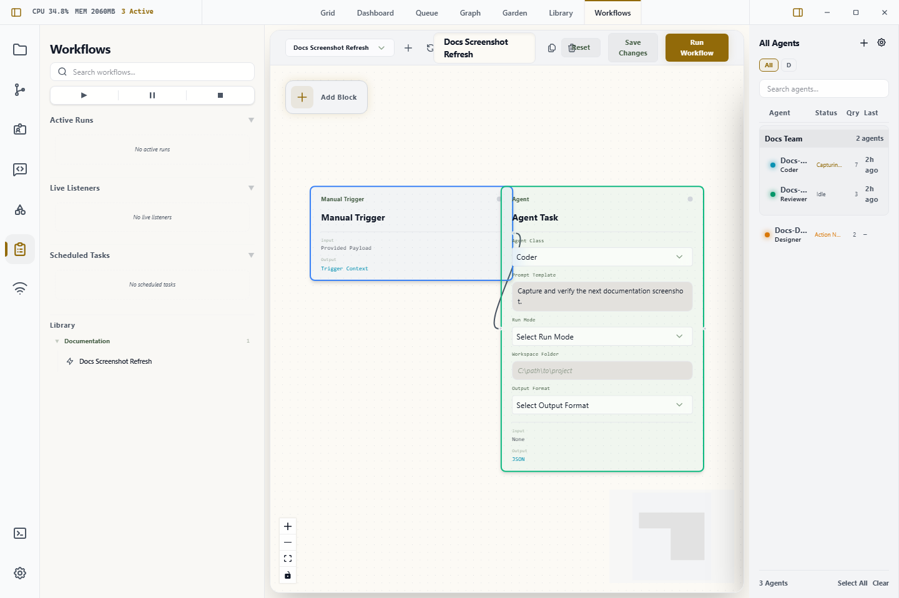
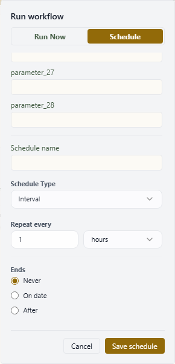

# Workflow View

The Workflow view is Wardian's canvas for building and testing automations.

Use this page as a quick manual for the view itself. For the full workflow reference, start at [Workflows](../workflows/index.md).

Use it when a repeated multi-step agent process needs a saved visual flow instead of a one-off prompt or broadcast.



## When to Use It

- Chain multiple agent, command, wait, or branch steps.
- Reuse a process that should run manually, on a schedule, or from a listener trigger.
- Inspect upstream values before passing them into later nodes.
- Compare workflow outcomes in [Queue](./queue.md).

## What You Can Do Here

- open an existing workflow
- create a new workflow
- add nodes from the block library
- wire nodes together on the canvas
- edit node settings
- save changes
- launch the workflow according to its trigger type

## Main Areas

- **Edit**: build the graph, add nodes, wire edges, edit node settings, and inspect upstream values.
- **Observe**: inspect a selected run's graph state, event timeline, node outputs, and approval controls.
- **Monitor**: manage scheduled workflow invokers and open active or recent runs.
- **Left workflow rail**: glance at active runs and upcoming schedules, then open Monitor when you need full controls.

## Running From This View

The **Run** button opens a launch dialog for the current blueprint. Use **Run now** for an immediate run, or switch to **Schedule** to create a persisted schedule with the same provider, workspace, and input parameters.

Manual input parameters appear in the dialog when the blueprint's entry trigger defines an input schema.
When a workflow has many input parameters or schedule controls, the dialog stays within the Workflows view and scrolls the form body so the action buttons remain reachable.



## Running From The CLI

`wardian workflow exec <path>` launches a live workflow through the running
Wardian app. Use the same `WARDIAN_HOME` for the app and CLI so both processes
share the control endpoint and run logs.
Pass `--workspace <absolute-workspace-path>` when headless workflow tasks should
run against a specific project checkout.

Bash:

```bash
export WARDIAN_HOME="$PWD/.tmp/wardian-workflow"
wardian workflow exec "$WARDIAN_HOME/library/workflows/autoreview.md"
wardian workflow exec "$WARDIAN_HOME/library/workflows/autoreview.md" \
  --workspace "<absolute-workspace-path>" \
  --input '{"target":"PR #123","max_cycles":1}'
```

PowerShell:

```powershell
$env:WARDIAN_HOME = "$PWD\.tmp\wardian-workflow"
wardian workflow exec "$env:WARDIAN_HOME\library\workflows\autoreview.md"
wardian workflow exec "$env:WARDIAN_HOME\library\workflows\autoreview.md" `
  --workspace "<absolute-workspace-path>" `
  --input '{"target":"PR #123","max_cycles":1}'
```

The live/default path requires the app because active-agent routing, PTY input,
workflow shell/script execution, and workflow task reply tracking are app-owned.
The `mock` executor exists only for workflow-engine fixture tests.

## Monitoring Workflow Activity

Monitor shows a unified activity feed for workflow schedules and runs. Use the
tabs to switch between all activity, items needing attention, running work,
scheduled work, and history.

The top counters call out due-soon schedules and attention states. Schedule
rows expose the current Monitor actions:

- **Pause** or **Resume** changes whether the schedule fires on its cadence.
- **Run now** launches the scheduled invoker immediately.
- **Edit** reopens the schedule form.

Active and recent runs appear in the same feed so you can jump directly into
Observe. Older history is paged separately to keep the main feed focused on the
latest run per blueprint. History rows lead with the run time, keep workflow
identity separate from status, and show schedule cadence plus assignment labels
when the run came from a schedule.

## Important Limits

- The visual view is for building and launching workflows. Detailed node semantics live in the workflow reference.
- Real provider behavior still depends on the selected agent class, provider CLI, workspace, and runtime settings.
- Scheduled and listener workflows require the app runtime to be available when they are expected to run.
- Queue records final workflow outcomes, not every intermediate node state.

## Related Links

- [Getting Started](./getting-started.md)
- [Workflows](../workflows/index.md)
- [Building Workflows](../workflows/building-workflows.md)
- [Triggers](../workflows/triggers.md)
- [Scheduled Runs](../workflows/scheduled-runs.md)
- [Node Reference](../workflows/node-reference.md)
