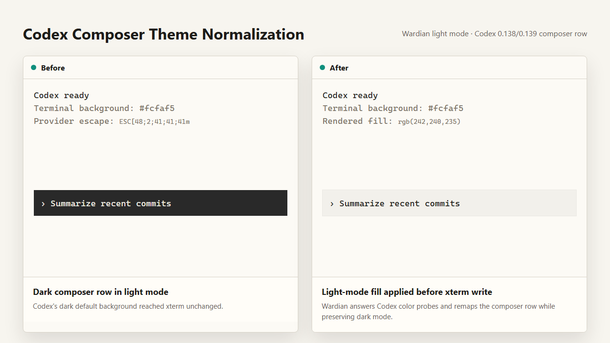

# Codex Terminal Theme Probes

## Context

Codex CLI 0.138.0 changed the Windows TUI startup path enough that Wardian light-mode sessions could render the Codex composer row with a dark `ESC[48;2;41;41;41m` background. The problem persisted in Codex 0.139.0 and was visible even for newly spawned agents.

Wardian already has terminal capability planning for providers that probe terminal behavior, but the frontend rendered the raw PTY stream instead of the planner-normalized stream. That meant Codex-specific color handling could be calculated and still not affect what xterm displayed.

## Decision

Wardian treats Codex as a narrow terminal-theme integration instead of giving it the full capability response surface used by providers that need broader terminal emulation replies. Codex receives light/dark and color probe answers, while cursor-position, device-status, keyboard, resize, focus, and DECRQM replies remain limited to providers that already require them.

The terminal render path now writes the planner-normalized PTY chunk to xterm. In Wardian light mode, Codex's dark composer background escape is remapped to a light fill derived from the active terminal background before xterm renders it. Dark mode preserves Codex's original dark composer background.

## Consequences

- Codex 0.138.0 and 0.139.0 composer rows follow Wardian light mode instead of staying black.
- Existing provider-specific terminal capability behavior stays scoped; Codex does not receive unrelated terminal control replies.
- Backend/native agent startup stores the frontend's effective terminal theme so early Codex color probes can be answered before the frontend terminal settles.
